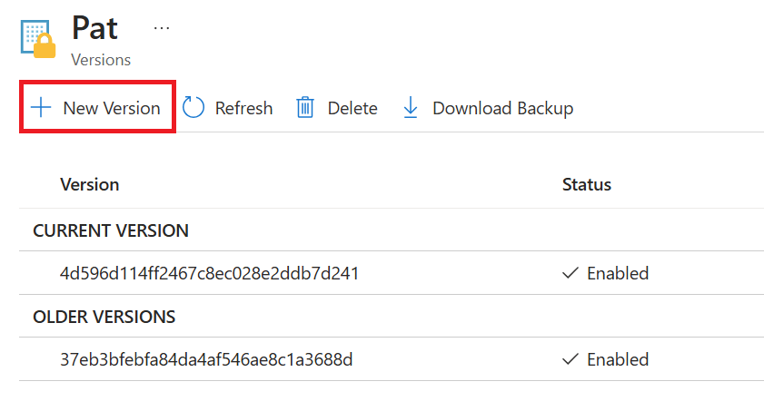
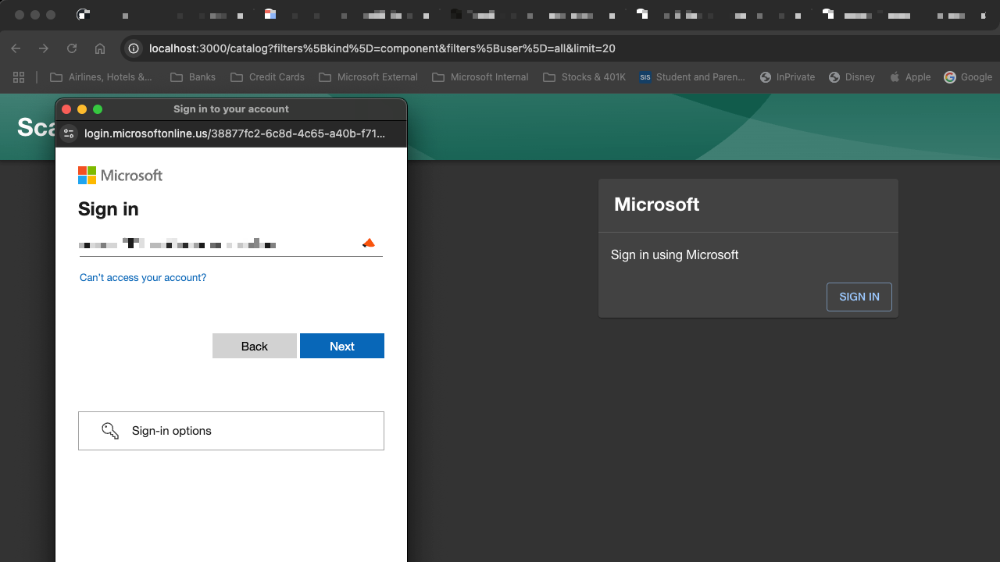

# Product Hands-on Lab - Platform engineering with Backstage

Welcome to this Platform engineering with Backstage Workshop. At its core, platform engineering is about constructing a solid and adaptable groundwork that simplifies and accelerates the development, deployment, and operation of software applications. The goal is to abstract the complexity inherent in managing infrastructure and operational concerns, enabling dev teams to focus on crafting code that adds direct value to the mission.

In order to comprehend real-world situations, you will be testing with serveral different toos and services in several labs. You will be able to learn how to deploy and manage Azure resources, as well as how to use Azure services to build and deploy applications with the help of AKS, GitHub and Backstage. Don't worry; you will be walked through the entire procedure in this step-by-step lab.

You will receive guidance on how to do each step throughout this workshop. You will be able to test your knowledge and skills by completing the labs.
Before seeing the solutions listed under the provided resources and links, it is advised to look at the solutions placed under the '📚 Toggle solution' panel.

<div class="task" data-title="Task">

> You will find the instructions and expected configurations for each Lab step in these yellow **TASK** boxes. Inputs and parameters to select will be defined, all the rest can remain as default as it has no impact on the scenario.

</div>

This lab leverages the [GitOps Bridge Pattern](https://github.com/gitops-bridge-dev/gitops-bridge?tab=readme-ov-file). The following diagram shows the high-level architecture of the solution from [platformengineering.org](https://platformengineering.org/):


The tools in this lab to build out your Integrated Development Platform (IDP) include:

- [GitHub](http://github.com) (as your Git repo)
- [Backstage](https://backstage.io/) (as your self-service portal)
- [ArgoCD](https://argoproj.github.io/cd/) (as your Platform Orchestrator)
- [Argo Workflows](https://argoproj.github.io/workflows/) (to trigger post deployment tasks)
- [Crossplane]() (to provision Azure/GitHub resources)
- [Azure Kubernetes Service (AKS)]() (as your Control Plane cluster)
- [Azure Key Vault]() (to store secrets)
- [Azure Container Registry]() (to store container images)

<div class="tip" data-title="Tip">

> All tools in this lab are opinionated and used to show how to build out an IDP. You can use other tools to build out your IDP.

</div>

If you follow all instructions, you should have your own IDP running by the end of this lab!

## Pre-requisites

Before starting this lab, be sure to set your Azure environment :

- An Azure Subscription with the **Owner** role to create and manage the labs' resources and deploy the infrastructure as code
- Register the Azure providers on your Azure Subscription if not done yet: `Microsoft.ContainerService`,
`Microsoft.Network`,
`Microsoft.Storage`,
`Microsoft.Compute`,
`Microsoft.AppPlatform`,
`Microsoft.App`,
`Microsoft.KeyVault`,

To be able to do the lab content you will also need:

- Basic understanding of Azure resources which includes Azure Kubernetes Service (AKS), Azure Container Registry (ACR), Azure Key Vault.
- Basic understanding of Terraform and how to deploy resources using Terraform.
- Basic understanding of GitHub and how to create a GitHub App.
- Basic understanding of Backstage and how to deploy and configure Backstage.
- Basic understanding of Docker and how to create a Docker image.
- Basic understanding of Kubernetes and how to deploy applications to Kubernetes with ArgoCD and Crossplane.
- A [Github account][github-account] (Free, Team or Enterprise)
- Create a [fork][repo-fork] of the repository from the main branch to help you keep track of your potential changes

2 development options are available:
  - 🥈 **Preferred method** : Local Devcontainer
  - 🥉 Local Dev Environment with all the prerequisites detailed below

<div class="tip" data-title="Tips">

> To focus on the main purpose of the lab, we encourage the usage of devcontainers as they abstract the dev environment configuration, and avoid potential local dependencies conflict.
> You could decide to run everything without relying on a devcontainer : To do so, make sure you install all the prerequisites detailed below.

</div>

### 🥈 : Using a local Devcontainer

This repo comes with a Devcontainer configuration that will let you open a fully configured dev environment from your local Visual Studio Code, while still being completely isolated from the rest of your local machine configuration : No more dependency conflict.
Here are the required tools to do so :

- [Git client](https://git-scm.com/downloads)
- [Docker Desktop][docker-desktop] running
- [Visual Studio Code][vs-code] installed

Start by cloning the Hands-on Lab [Platform engineering with BackStage repo][repo-clone] you just forked on your local Machine and open the local folder in Visual Studio Code.
Once you have cloned the repository locally, make sure Docker Desktop is up and running and open the cloned repository in Visual Studio Code.  

You will be prompted to open the project in a Dev Container. Click on `Reopen in Container`.

If you are not prompted by Visual Studio Code, you can open the command palette (`Ctrl + Shift + P`) and search for `Reopen in Container` and select it: 


### 🥉 : Using your own local environment

The following tools and access will be necessary to run the lab in good conditions on a local environment :  

- [Git client][git-client]
- [Visual Studio Code][vs-code] installed (you will use Dev Containers)
- [Azure CLI][az-cli-install] installed on your machine
- [Terraform][terraform-install] installed, this will be used for deploying the resources on Azure

Once you have set up your local environment, you can clone the Hands-on Lab Platform engineering with BackStage repo you just forked on your machine, and open the local folder in Visual Studio Code and head to the next step.

## 🔑 Sign in to Azure

<div class="task" data-title="Task">

> - Log into your Azure subscription in your environment using Azure CLI and on the [Azure Portal][az-portal] using your credentials.

</div>

<details>

<summary>📚 Toggle solution</summary>

```bash
# Login to Azure : 
# --tenant : Optional | In case your Azure account has access to multiple tenants

# Option 1 : Local Environment or Dev Container
az login --tenant <yourtenantid or domain.com>
# Option 2 : Github Codespace : you might need to specify --use-device-code parameter to ease the az cli authentication process
az login --use-device-code --tenant <yourtenantid or domain.com>

# Display your account details
az account show
# Select your Azure subscription
az account set --subscription <subscription-id>

# Register the following Azure providers if they are not already

# Azure Key Vault
az provider register --namespace 'Microsoft.KeyVault'
# Azure Container Registry
az provider register --namespace 'Microsoft.ContainerRegistry'
# Azure Kubernetes Service
az provider register --namespace 'Microsoft.ContainerService'
# Azure App Service
az provider register --namespace 'Microsoft.App'
# Azure App Service Environment
az provider register --namespace 'Microsoft.AppPlatform'
# Azure Storage
az provider register --namespace 'Microsoft.Storage'
# Azure Network
az provider register --namespace 'Microsoft.Network'
```

</details>

## Create a GitHub PAT

To be able to use GitHub in the lab, you will need to create a GitHub Personal Access Token (PAT) with the following scopes:

- `repo` (Full control of private repositories)
- `workflow` (Update GitHub Action workflow files)
- `read:org` (Read-only access to organization, teams, and membership)
- `write:org` (Read and write access to organization membership, organization projects, and team membership)
- `admin:org` (Read and write access to organization membership, organization projects, and team membership)
- `admin:public
_key` (Full control of user public keys)
- `admin:repo_hook` (Full control of repository hooks)
- `admin:org_hook` (Full control of organization hooks)

In GitHub, in the top right corner, click on your profile image, and then select Settings. On the left sidebar, select Developer settings > Personal access tokens > Fine-grained tokens, select Generate new token.

On the New fine-grained personal access token page, provide the following information:

Set a descriptive name for the token, an expiration date to 30 days, and select the following permissions:

In Repository access select All repositories, then expand Repository permissions, and for Contents, from the Access list, select Read Only.

Then click on Generate token. If you need more information on this mechanism you can refer to the official documentation.

Now, open the resource group deployed previously (it's name should start with *"rg-lab-we-hol"*) and open the Key Vault. In the **Secrets** tab, you will find a secret named `Pat`, click on it and then select **New Version** and update the value with your GitHub PAT:



[az-cli-install]: https://learn.microsoft.com/en-us/cli/azure/install-azure-cli
[az-portal]: https://portal.azure.com
[docker-desktop]: https://www.docker.com/products/docker-desktop/
[git-client]: https://git-scm.com/downloads
[github-account]: https://github.com/join
[repo-fork]: https://github.com/azurenoops/pe-backstage-azure-workshop/fork
[repo-clone]: https://github.com/azurenoops/pe-backstage-azure-workshop.git
[vs-code]: https://code.visualstudio.com/
[terraform-install]: https://learn.hashicorp.com/tutorials/terraform/install-cli

---

# Lab 1 - Backstage as your IDP

In this lab, we will initialize the standalone local Backstage app for the moment. [Backstage.io](https://backstage.io/) is a platform to build custom IDP (Internal Developer Portal). Spotify created it to give developers a single pane of glass to manage, develop, and explore the internal software ecosystem.

Out of the box, Backstage includes:

- **Backstage Software Catalog** for managing all your software (microservices, libraries, data pipelines, websites, ML models, etc.)
- **Backstage Software Templates** for quickly spinning up new projects and standardizing your tooling with your organization’s best practices
- **Backstage TechDocs** for making it easy to create, maintain, find, and use technical documentation, using a “docs-like-code” approach
- **Backstage Kubernetes** helps monitor all our service’s deployments at a glance, even across clusters.
- **Backstage Search** is a universal search for backstage instances that can search against documentation, software templates, software catalogs, and APIs.
- Plus, a growing ecosystem of open-source plugins that further expand Backstage’s customizability and functionality

In the later labs, we will add an external database to it and deploy it to Azure on the Control Plane cluster. As well as, do some configurarion to make it work with Azure and GitHub.

## Step 1 - Validate Prereqs

To get started, you will need to validate you have the following tools:

- [Node.js](https://nodejs.org/en/download/) (LTS version)
- [Yarn](https://yarnpkg.com/getting-started/install)
- [Docker](https://www.docker.com/get-started)
- [Git](https://git-scm.com/downloads)

Now that you cloned the repo, we can set up quickly with your own Backstage project you can create a Backstage App. We will run Backstage locally and configure the app.

A Backstage App is a monorepo setup with `lerna` that includes everything you need to run Backstage in your own environment.

## Step 2 - Create a Backstage App

To install the Backstage app, you need to run create-app from the @backstage package in the npm package registry. You can use npx for this, which, like npm, comes installed with Node.js.

<div class="task" data-title="Task">

> If the Backstage cli is not installed, you can install it by running the following command, If the cli is already installed, you can skip this step.

</div>

<details>

<summary>📚 Toggle solution</summary>

```shell
npm install -g @backstage/cli
```

</details>

When you get a prompt, you can choose to install the latest version of the Backstage cli. You can also choose to install a specific version by running the following command:

<details>

<summary>📚 Toggle solution</summary>

```shell
Need to install the following packages:
@backstage/create-app@0.5.24
Ok to proceed? (y) 
```

Type `y` and hit enter to install the latest version of the Backstage cli.

</details>

</div>

<div class="task" data-title="Task">

> Now, in the PowerShell (pwsh) terminal in VSCode, run the following command:

</div>

<details>

<summary>📚 Toggle solution</summary>

```shell
npx @backstage/create-app@latest
```

</details>


The wizard will ask you for the name of the app. Here you can enter the name of your Backstage application, which will also be the name of the directory. The default is backstage, which is fine for the purposes of the lab.


<div class="tip" data-title="Tip">

> The name is used for the folder name, so enter a name friendly to folders or a Git repository — perhaps lowercase with dash separators. We’ll configure the application name that appears in the UI separately later.

</div>

This is the output of the command:

```shell
Creating the app...

 Checking if the directory is available:
  checking      backstage ✔ 

 Creating a temporary app directory:

 Preparing files:
  copying       .dockerignore ✔ 
  copying       .eslintignore ✔ 
  templating    .eslintrc.js.hbs ✔ 
  templating    .gitignore.hbs ✔ 
  copying       .prettierignore ✔ 
  copying       README.md ✔ 
  copying       app-config.local.yaml ✔ 
  copying       app-config.production.yaml ✔ 
  templating    app-config.yaml.hbs ✔ 
  templating    backstage.json.hbs ✔ 
  templating    catalog-info.yaml.hbs ✔ 
  copying       lerna.json ✔ 
  templating    package.json.hbs ✔ 
  copying       playwright.config.ts ✔ 
  copying       tsconfig.json ✔ 
  copying       yarn.lock ✔ 
  copying       README.md ✔ 
  copying       entities.yaml ✔ 
  copying       org.yaml ✔ 
  copying       template.yaml ✔ 
  copying       catalog-info.yaml ✔ 
  copying       index.js ✔ 
  copying       package.json ✔ 
  copying       README.md ✔ 
  templating    .eslintrc.js.hbs ✔ 
  copying       Dockerfile ✔ 
  copying       README.md ✔ 
  templating    package.json.hbs ✔ 
  copying       index.test.ts ✔ 
  copying       index.ts ✔ 
  copying       types.ts ✔ 
  copying       app.ts ✔ 
  copying       auth.ts ✔ 
  copying       catalog.ts ✔ 
  copying       proxy.ts ✔ 
  copying       scaffolder.ts ✔ 
  templating    search.ts.hbs ✔ 
  copying       techdocs.ts ✔ 
  copying       .eslintignore ✔ 
  templating    .eslintrc.js.hbs ✔ 
  templating    package.json.hbs ✔ 
  copying       android-chrome-192x192.png ✔ 
  copying       apple-touch-icon.png ✔ 
  copying       favicon-16x16.png ✔ 
  copying       favicon-32x32.png ✔ 
  copying       favicon.ico ✔ 
  copying       index.html ✔ 
  copying       manifest.json ✔ 
  copying       robots.txt ✔ 
  copying       safari-pinned-tab.svg ✔ 
  copying       app.test.ts ✔ 
  copying       App.test.tsx ✔ 
  copying       App.tsx ✔ 
  copying       apis.ts ✔ 
  copying       index.tsx ✔ 
  copying       setupTests.ts ✔ 
  copying       LogoFull.tsx ✔ 
  copying       LogoIcon.tsx ✔ 
  copying       Root.tsx ✔ 
  copying       index.ts ✔ 
  copying       EntityPage.tsx ✔ 
  copying       SearchPage.tsx ✔ 

 Moving to final location:
  moving        backstage ✔ 

 Installing dependencies:
  determining   yarn version ✔ 
  executing     yarn install ✔ 
  executing     yarn tsc ✔ 

🥇  Successfully created backstage


 All set! Now you might want to:
  Run the app: cd backstage && yarn dev
  Set up the software catalog: https://backstage.io/docs/features/software-catalog/configuration
  Add authentication: https://backstage.io/docs/auth/
```

This will create a new Backstage app in a folder called `backstage` in your root project directory with the same name, copy several files, and run yarn install to install any dependencies for the project.

The create-app script will go through a few steps of creating the directory, copying files, then building the Backstage app. The last step installs package dependencies and compiles the app, so this may take a few minutes. You should now have a new directory called `backstage` in your root directory, which contains following files and
folders:

```shell
backstage/
├── README.md
├── app-config.local.yaml
├── app-config.production.yaml
├── app-config.yaml
├── backstage.json
├── catalog-info.yaml
├── dist-types
│   ├── packages
│   └── tsconfig.tsbuildinfo
├── examples
│   ├── entities.yaml
│   ├── org.yaml
│   └── template
├── lerna.json
├── package.json
├── packages
│   ├── README.md
│   ├── app
│   └── backend
├── playwright.config.ts
├── plugins
│   └── README.md
├── tsconfig.json
└── yarn.lock
```

* **app-config.yaml**: Main configuration file for the app.
* **catalog-info.yaml**: Catalog Entities descriptors.
* **lerna.json**: Contains information about workspaces and other lerna configuration needed for the monorepo setup.
* **package.json**: Root package.json for the project. Note: Be sure that you don't add any npm dependencies here as
  they
  probably should be installed in the intended workspace rather than in the root.
* **packages/**: Lerna leaf packages or "workspaces". Everything here is going to be a separate package, managed by
  lerna.
* **packages/app/**: An fully functioning Backstage frontend app, that acts as a good starting point for you to get to
  know
  Backstage.
* **packages/backend/**: The backend for Backstage. This is where you can add your own backend logic.

## Step 3 - Run the App

As soon as the app is created, start by running the app.

<div class="task" data-title="Task">

>Run the app by typing `cd backstage & yarn dev`

</div>

<details>

<summary>📚 Toggle solution</summary>

```shell
cd backstage && yarn dev
```

</details>

This may take a little while. When successful, the message webpack compiled successfully will appear in your terminal.

```shell
########### Output of the command ################
➜ cd backstage && yarn dev
yarn run v1.22.19
$ concurrently "yarn start" "yarn start-backend"
$ yarn workspace backend start
$ yarn workspace app start
$ backstage-cli package start
$ backstage-cli package start
[0] Loaded config from app-config.yaml
[0] <i> [webpack-dev-server] Project is running at:
[0] <i> [webpack-dev-server] Loopback: http://localhost:3000/, http://[::1]:3000/
[0] <i> [webpack-dev-server] Content not from webpack is served from '/Users/susovanpanja/work/medium/backstage/athena/packages/app/public' directory
[0] <i> [webpack-dev-server] 404s will fallback to '/index.html'
[0] <i> [webpack-dev-middleware] wait until bundle finished: /

... # Redacted full log
```

The yarn dev command will run both the frontend and backend as separate processes (named [0] and [1]) in the same
window. When the command finishes running, it should open up a browser window displaying your app. If not, you can open
a browser and directly navigate to the frontend at `http://localhost:3000`.

In a standard installation, Backstage doesn’t use any kind of authentication. Instead, a guest identity is created, and all users share this identity. This means that anyone with access to the URL of your installation can go in and make changes. And because all users share the same identity, it’s impossible to know who made those changes and why.


When you click `Enter`, It should open up a new tab in the browser and should look like this (it will take some time to load the UI):


The application is prefilled with demo data, so you can start exploring right away.

## Step 4 - Configure the App

Let's have a look on some of the values in the different files and change them to your needs. The main Backstage configuration file, `app-config.yaml` in the root directory of your Backstage app. Backstage also supports environment-specific configuration overrides, by way of an `app-config.<environment>.yaml` file such as `app-config.local.yaml`.

<div class="task" data-title="Task">

> Open the `app-config.local.yaml` file in the root directory of your Backstage app (create if it doesn't exist), and change the organization name to a name of your choice.

</div>

<details>
<summary>📚 Toggle solution</summary>


```yaml
organization:
  name: <your organization name>
```

</details>

<div class="tip" data-title="Tips">

> The default .gitignore file created with the app excludes *.local.yaml from source control for you, so you can add passwords or tokens directly into the app-config.local.yaml.

</div>

Because we are still in the development mode, any changes to the `app-config.yaml` file will be reflected in the app as soon as you save the file. You can see the changes in the browser window.

<div class="warning" data-title="Warning">

> If you do not see the changes in the browser window, try to refresh the page.

</div>

### Add Azure Entra ID Authentication

There are multiple authentication providers available for you to use with Backstage. For this tutorial we choose to use the Microsoft Entra ID plugin. This plugin allows you to authenticate users using Microsoft Entra ID.

### Configure App Registration on Azure

To add Microsoft Entra ID authentication to Backstage, you must create an App Registration in Azure Active Directory. This App Registration will be used to authenticate users using Microsoft Entra ID.

Depending on how locked down your company is, you may need a directory administrator to do some or all of these instructions.

Go to [Azure Portal > App registrations](https://portal.azure.com/#view/Microsoft_AAD_RegisteredApps/ApplicationsListBlade) and find your existing app registration, or create a new one. If you have an existing App Registration for Backstage, use that rather than create a new one.

On your app registration's overview page, add a new Web platform configuration, with the configuration:

- Redirect URI: https://your-backstage.com/api/auth/microsoft/handler/frame (for local dev, typically http://localhost:7007/api/auth/microsoft/handler/frame)
- Front-channel logout Url: blank
- Implicit grant and hybrid flows: All unchecked

On the API permissions tab, click on Add Permission, then add the following Delegated permission for the Microsoft Graph API.

- email
- offline_access
- openid
- profile
- User.Read

Optional custom scopes of the Microsoft Graph API defined in the app-config.yaml file.
Your company may require you to grant admin consent for these permissions. Even if your company doesn't require admin consent, you may wish to do so as it means users don't need to individually consent the first time they access backstage. To grant admin consent, a directory admin will need to come to this page and click on the Grant admin consent for COMPANY NAME button.

<div class="tip" data-title="Tips">

> If you're using an existing app registration, and backstage already has a client secret, you can re-use that. If not, go to the Certificates & Secrets page, then the Client secrets tab and create a new client secret. Make a note of this value as you'll need it in the next section.

</div>

### Add the credentials to the configuration

Backstage allows you to define configuration as code using the `app-config.local.yaml` file. This file contains all the configuration settings for your Backstage app, including the organization name, the app title, and the backend URL.

<div class="task" data-title="Task">

> Open `app-config.local.yaml` we've created earlier. In the `Auth` configuration, add the below configuration and replace the values with the Client ID and the Client Secret from the App Registration.

</div>

<details>
<summary>📚 Toggle solution</summary>

```yaml
auth:
  environment: development
  providers:
    microsoft:
      development:
        clientId: <AZURE_CLIENT_ID> # found on App Registration > Overview
        clientSecret:  <AZURE_CLIENT_SECRET> # found on App Registration > Certificates & secrets
        tenantId: <AZURE_TENANT_ID> # found on App Registration > Overview
        domainHint: <AZURE_TENANT_ID> # typically the same as tenantId
        signIn:
          resolvers:
            # See https://backstage.io/docs/auth/microsoft/provider#resolvers for more resolvers
            - resolver: userIdMatchingUserEntityAnnotation
```

</details>

Backstage will re-read the configuration. If there's no errors, that's great! We can continue with the last part of the configuration.

<div class="tip" data-title="Tips">

> You can define configuration settings for different environments by creating separate configuration files for each environment. For example, you can create an `app-config.local.yaml` file for local development and an `app-config.production.yaml` file for production.

</div>

The Microsoft provider is a structure with three mandatory configuration keys:

- **clientId:** Application (client) ID, found on App Registration > Overview
- **clientSecret:** Secret, found on App Registration > Certificates & secrets
- **tenantId:** Directory (tenant) ID, found on App Registration > Overview
- **domainHint (optional):** Typically the same as tenantId. Leave blank if your app - registration is multi tenant. When specified, this reduces login friction for - users with accounts in multiple tenants by automatically filtering away accounts from other tenants. For more details, see Home Realm Discovery
- **additionalScopes (optional):** List of scopes for the App Registration, to be requested in addition to the required ones.
- **skipUserProfile (optional):** If true, skips loading the user profile even if the User.Read scope is present. This is a performance optimization during login and can be used with resolvers that only needs the email address in spec.profile.email obtained when the email OAuth2 scope is present.

This provider includes several resolvers out of the box that you can use:

- **emailMatchingUserEntityProfileEmail:** Matches the email address from the auth provider with the User entity that has a matching spec.profile.email. If no match is found it will throw a NotFoundError.
- **emailLocalPartMatchingUserEntityName:** Matches the local part of the email address from the auth provider with the User entity that has a matching name. If no match is found it will throw a NotFoundError.
- e**mailMatchingUserEntityAnnotation:** Matches the email address from the auth provider with the User entity where the value of the microsoft.com/email annotation matches. If no match is found it will throw a NotFoundError.
- **userIdMatchingUserEntityAnnotation:** Matches the user profile ID from the auth provider with the User entity where the value of the graph.microsoft.com/user-id annotation matches. This resolver is recommended to resolve users without an email in their profile. If no match is found it will throw a NotFoundError.

### Add Backend Integration

To add the backend integration to the Backstage app, you will need to install the `@backstage/plugin-auth-backend-module-microsoft-provider` package. This package provides the backend integration for Microsoft Entra ID.

<div class="task" data-title="Task">

> To install the package, run the following command from the root directory of your Backstage app.

</div>

<details>
<summary>📚 Toggle solution</summary>

```shell
yarn --cwd packages/backend add @backstage/plugin-auth-backend-module-microsoft-provider
```

</details>

<div class="task" data-title="Task">

> Then we will need to this line in **packages/backend/src/index.ts**.

</div>

<details>
<summary>📚 Toggle solution</summary>

```typescript
backend.add(import('@backstage/plugin-auth-backend-module-microsoft-provider'));
```
</details>

### Add Frontend Integration

To add the frontend integration to the Backstage app, you will need to add a Signin Page. This page will allow users to sign in to the app using Microsoft Entra ID.

Sign-in is configured by providing a custom SignInPage app component. It will be rendered before any other routes in the app and is responsible for providing the identity of the current user. The SignInPage can render any number of pages and components, or just blank space with logic running in the background.

In the end, however, it must provide a valid Backstage user identity through the onSignInSuccess callback prop, at which point the rest of the app is rendered.

<div class="tip" data-title="Tips">

> This next step is where you will do some coding. You will need to add the SignInPage to the app.

</div>

<div class="task" data-title="Task">

> We will need to add this line in **packages/app/src/App.tsx** in the `components` section.

</div>

<details>
<summary>📚 Toggle solution</summary>

```typescript
// This is going in the imports section
import { microsoftAuthApiRef } from '@backstage/core-plugin-api';
import { SignInPage } from '@backstage/core-components';

// This is going in the components section
const app = createApp({
 components: {
    SignInPage: props => (
      <SignInPage
        {...props}
        auto
        provider={{
          id: 'microsoft-auth-provider',
          title: 'Microsoft',
          message: 'Sign in using Microsoft',
          apiRef: microsoftAuthApiRef,
        }}
      />
    ),
  },
  // ..
});
```

</details>

## Step 5 - Adding Entra ID Organizational Data

The Azure provider can also be configured to fetch organizational data from Azure Entra ID. This data can be used to filter the users that are allowed to sign in to Backstage.

This can be done by adding the **@backstage/plugin-catalog-backend-module-msgraph** package to your backend.

### Backend Installation

The package is not installed by default, therefore you have to add **@backstage/plugin-catalog-backend-module-msgraph** to your backend package.

<div class="task" data-title="Task">

> Run the following command from your **Backstage root directory**.

</div>

<details>
<summary>📚 Toggle solution</summary>

```typescript
yarn --cwd packages/backend add @backstage/plugin-catalog-backend-module-msgraph
```

</details>

<div class="task" data-title="Task">

> Next add the basic configuration to the **app-config.yaml** file.

</div>

<details>
<summary>📚 Toggle solution</summary>

```yaml
catalog:
  providers:
    microsoftGraphOrg:
      default:
        tenantId: ${AZURE_TENANT_ID}
        user:
          filter: accountEnabled eq true and userType eq 'member'
        group:
          filter: >
            securityEnabled eq false
            and mailEnabled eq true
            and groupTypes/any(c:c+eq+'Unified')
        schedule:
          frequency: PT1H
          timeout: PT50M
```

</details>

<div class="tip" data-title="Tips">

> For large organizations, this plugin can take a long time, so be careful setting low frequency / timeouts and importing a large amount of users / groups for the first try.

<div>

<div class="task" data-title="Task">

> Finally, update your backend by adding to **packages/backend/src/index.ts**  following line.

</div>

<details>
<summary>📚 Toggle solution</summary>

```typescript
backend.add(import('@backstage/plugin-catalog-backend-module-msgraph'));
```

</details>

### Validate Entra ID Login

Now, that you have added the Microsoft Entra ID authentication to your Backstage app, you can validate the app by running the app.

<div class="task" data-title="Task">

> Run the following command from your **Backstage root directory**:

</div>

<details>
<summary>📚 Toggle solution</summary>

```shell
yarn dev
```

</details>

<div class="task" data-title="Task">

> Then open a browser and navigate to `http://localhost:3000`.

</div>

You should see the Backstage app with the Microsoft Entra ID authentication.


You have completed the first lab. You have created a new Backstage app, explored the app, added Entra ID authentication, and set up the local development environment.

In the later parts of this lab series, we will be :

- Deploying the Control Plane cluster on Azure Kubernetes Service (AKS)
- Configuring tech-docs and integrating our documents with Backstage (using docker).

---

# Lab 2 - Deploy Control Plane cluster on Azure

In this lab, we will deploy the Control Plane cluster on Azure Kubernetes Service (AKS). We will use Terraform to define the infrastructure as code for the deployment of Backstage on Azure.

## Step 1 - Validate you Pre-requisites

## Step 2 - Provision the Control Plane Cluster

With the repository that you cloned in Lab 1, it comes with a pre-defined Terraform code and configuration. The code is located in the `terraform/aks` folder. The Terraform files contains all resources you need, including an AKS cluster, Crossplane, and ArgoCD.

<div class="task" data-title="Task">

> To provision the Control Plane cluster, run the following command from your **Backstage root directory**:

</div>

<details>

<summary>📚 Toggle solution</summary>

```shell
cd terraform/aks
```

</details>

<div class="task" data-title="Task">

> Then run the following command to initialize Terraform:

</div>

<details>

<summary>📚 Toggle solution</summary>

```shell
terraform init
```

</details>

<div class="task" data-title="Task">

> Then run the following command to validate the Terraform configuration:

</div>

<details>

<summary>📚 Toggle solution</summary>

```shell
terraform validate
```

</details>

<div class="task" data-title="Task">

> Then run the following command to plan the Terraform configuration:

</div>

<details>

<summary>📚 Toggle solution</summary>

```shell
terraform plan -var gitops_addons_org=https://github.com/azurenoops -var infrastructure_provider=crossplane 
```

</details>

<div class="task" data-title="Task">

> Then run the following command to apply the Terraform configuration:

</div>

<details>

<summary>📚 Toggle solution</summary>

```shell
terraform apply --auto-approve
```

</details>

<div class="tip" data-title="Tips">

> Note: This control plane uses the `Application of Applications` pattern using GitOps and Crossplane. The `gitops/bootstrap/control-plane/addons` directory contains the ArgoCD application configuration for the addons.

</div>

Terraform completed installing the AKS cluster, installing ArgoCD, and configuring ArgoCD to install applications under the `gitops/bootstrap/control-plane/addons` directory from the git repo.


Now that the AKS cluster is provisioned, you can access the ArgoCD UI to manage the applications deployed on the cluster. This will show you the status of the applications deployed on the cluster and allow you to manage the applications.

## Step 3 - Validate the Cluster is working

To access the AKS cluster, you need to set the KUBECONFIG environment variable to point to the kubeconfig file generated by Terraform.

<div class="task" data-title="Task">

> To set the KUBECONFIG environment variable, run the following command:

</div>

<details>

<summary>📚 Toggle solution</summary>

```shell
export KUBECONFIG=<your_path_to_this_repo>/pe-backstage-azure-workshop/terraform//aks/kubeconfig
echo $KUBECONFIG
```

</details>

To run the following commands, you will need to have the a bash shell installed on your machine. If you are using Windows, you can use the Windows Subsystem for Linux (WSL) to run the commands.

<div class="task" data-title="Task">
 
> To validate that the cluster is working, you can run the following command to get the list of pods running on the cluster

</div>

<details>

<summary>📚 Toggle solution</summary>

```shell
kubectl get pods --all-namespaces
```
You should see the following pods running on the cluster:

```shell
NAMESPACE           NAME                                                              READY   STATUS    RESTARTS          AGE
argo-events         argo-events-controller-manager-654f58ccbb-r6z4p                   1/1     Running   0                 46h
argo-rollouts       argo-rollouts-69566b6478-ljn89                                    1/1     Running   0                 46h
argo-rollouts       argo-rollouts-69566b6478-sxr96                                    1/1     Running   0                 46h
argo-workflows      argo-workflows-server-c7cdc656c-ccg5w                             1/1     Running   0                 46h
argo-workflows      argo-workflows-workflow-controller-98d946f85-4vmzg                1/1     Running   0                 46h
argocd              argo-cd-argocd-application-controller-0                           1/1     Running   0                 46h
argocd              argo-cd-argocd-applicationset-controller-677fd74987-7rxw7         1/1     Running   0                 46h
argocd              argo-cd-argocd-dex-server-85f5db5458-sldwc                        1/1     Running   0                 46h
argocd              argo-cd-argocd-notifications-controller-6cf884fb7f-g4j4s          1/1     Running   0                 46h
argocd              argo-cd-argocd-redis-6c766746d8-s8smm                             1/1     Running   0                 46h
argocd              argo-cd-argocd-repo-server-7c96b84946-c9t7d                       1/1     Running   0                 46h
argocd              argo-cd-argocd-server-78498f46f6-f8944                            1/1     Running   0                 46h
crossplane-system   crossplane-6b5b8f9549-pf2qd                                       1/1     Running   0                 20h
crossplane-system   crossplane-rbac-manager-bcddfb7-ljzqj                             1/1     Running   0                 20h
crossplane-system   helm-provider-b4cc4c2c8db3-5764597587-vzkjj                       1/1     Running   0                 46h
crossplane-system   kubernetes-provider-63506a3443e0-555885778d-2mdfm                 1/1     Running   0                 46h
crossplane-system   provider-azure-authorization-f895924437f1-79d9475b6c-69l4j        1/1     Running   0                 46h
crossplane-system   provider-azure-compute-7e421911713b-f89ff4bcd-z4sg6               1/1     Running   0                 46h
crossplane-system   provider-azure-containerregistry-cc0ea28bc72c-5bc6c598df-rcv5v    1/1     Running   0                 46h
crossplane-system   provider-azure-containerservice-ff556ea47e39-6d7c5d5496-vkzll     1/1     Running   0                 46h
crossplane-system   provider-azure-insights-fccb10339123-8578d6b4cf-qkn7b             1/1     Running   0                 46h
crossplane-system   provider-azure-keyvault-ecb17f6d99ee-df474c649-g6rmv              1/1     Running   0                 46h
crossplane-system   provider-azure-managedidentity-2eb78f1d31af-78df94999-7l4nh       1/1     Running   0                 46h
crossplane-system   provider-azure-network-f8cbea533640-5555858556-dfn8k              1/1     Running   0                 46h
crossplane-system   provider-azure-operationalinsights-93f88e54a392-5766bc9754r7wwn   1/1     Running   0                 46h
crossplane-system   provider-azure-resources-b3fb49bf7242-566d5796d6-hbr5w            1/1     Running   0                 46h
crossplane-system   provider-azure-storage-054d1eea44b0-7c9bb4f8d8-gj7ft              1/1     Running   0                 46h
crossplane-system   upbound-provider-family-azure-dde405d96fb8-69b848f6ff-dzsdd       1/1     Running   0                 46h
kube-system         ama-metrics-7c58b86db7-htqmt                                      2/2     Running   160 (8m17s ago)   46h
kube-system         ama-metrics-7c58b86db7-zw6fq                                      2/2     Running   160 (8m17s ago)   46h
kube-system         ama-metrics-ksm-5bd68b9c-5tdpv                                    1/1     Running   0                 46h
kube-system         ama-metrics-node-4mtvs                                            2/2     Running   158 (3m32s ago)   46h
kube-system         ama-metrics-operator-targets-78794c6db8-w8hpt                     2/2     Running   2 (46h ago)       46h
kube-system         azure-ip-masq-agent-mknql                                         1/1     Running   0                 20h
kube-system         azure-npm-hg4jf                                                   1/1     Running   0                 46h
kube-system         azure-wi-webhook-controller-manager-566c779d5c-5ghf5              1/1     Running   0                 46h
kube-system         azure-wi-webhook-controller-manager-566c779d5c-hb8sc              1/1     Running   0                 46h
kube-system         cloud-node-manager-rxg9c                                          1/1     Running   0                 46h
kube-system         coredns-659fcb469c-mbp82                                          1/1     Running   0                 20h
kube-system         coredns-659fcb469c-pqk4p                                          1/1     Running   0                 20h
kube-system         coredns-autoscaler-5d468f7bb5-ppvk2                               1/1     Running   0                 46h
kube-system         csi-azuredisk-node-dfw7s                                          3/3     Running   0                 20h
kube-system         csi-azurefile-node-w84ph                                          3/3     Running   0                 20h
kube-system         konnectivity-agent-698c9ffbb8-r672k                               1/1     Running   0                 46h
kube-system         konnectivity-agent-698c9ffbb8-sxgmp                               1/1     Running   0                 46h
kube-system         kube-proxy-z6ldd                                                  1/1     Running   0                 46h
kube-system         metrics-server-5dfc656944-m5pqd                                   2/2     Running   0                 46h
kube-system         metrics-server-5dfc656944-rm2md                                   2/2     Running   0                 46h
kube-system         retina-agent-pw88n                                                1/1     Running   0                 46h
```

</details>

## Step 4 - Accessing the Control Plane Cluster and ArgoCD UI

To access the Control Plane cluster, We will use kubectl to access the cluster. You can use the following commands to get the initial admin password, the IP address of the ArgoCD web interface and forward the port to access the ArgoCD UI.

<div class="task" data-title="Task">

> Then you can run the following command to get the initial admin password of the ArgoCD web interface.

</div>

<details>

<summary>📚 Toggle solution</summary>

```shell
kubectl get secrets argocd-initial-admin-secret -n argocd --template="{{index .data.password | base64decode}}"
```

</details>

<div class="tip" data-title="Tip">

> Make sure you copy the password and save it somewhere. You will need it to log in to the ArgoCD UI.

</div>

When you run the above command, you will get the initial admin password for the ArgoCD UI. You can use this password to log in to the ArgoCD UI.

<div class="task" data-title="Task">

> Then run the following command to get the IP address of the ArgoCD web interface.

</div>

<details>

<summary>📚 Toggle solution</summary>

```shell
kubectl get svc -n argocd argo-cd-argocd-server
```

</details>

It may take a few minutes for the LoadBalancer to create a public IP for the ArgoCD UI after the Terraform apply. In case something goes wrong and you don't find a public IP, 

<div class="task" data-title="Task">

> Connect to the ArgoCD server doing a port forward with kubectl and access the UI on https://localhost:8080.

</div>

<details>

<summary>📚 Toggle solution</summary>

```shell
kubectl port-forward svc/argocd-server -n argocd 8080:443
```

</details>

You can now access the ArgoCD UI using the IP address and the initial admin password. You can use the following URL to access the ArgoCD UI:

```shell
https://localhost:8080
```

<div class="tip" data-title="Tips">

> Note: The username for the ArgoCD UI login is `admin`

</div>


Now that you logged in to the ArgoCD UI using the initial admin password. You should see the ArgoCD UI with the list of applications deployed on the cluster.


<div class="tip" data-title="Tips">

> Note: You can ignore the warnings related to deprecated attributes and invalid kubeconfig path.

</div>

Now that you have access to the ArgoCD UI, you can manage the applications deployed on the cluster. Next, let's build out paved path templates to be used in Backstage.

---

# Lab 3 - Building Paved Paths with Backstage

In this lab, we will discuss how to implement paved paths in Backstage. Paved paths are predefined paths that provide a set of best practices and configurations for specific types of applications.

Paved paths can be used to create new projects based on predefined templates. These templates can include configuration files, code snippets, and other resources that help developers get started quickly with a new project.

## Step 1 - Add GitHub Catalog Integration

The GitHub integration has a discovery provider for discovering catalog entities within a GitHub organization. The provider will crawl the GitHub organization and register entities matching the configured path. This can be useful as an alternative to static locations or manually adding things to the catalog. This is the preferred method for ingesting entities into the catalog.

 This can be done by adding the **@backstage/plugin-catalog-backend-module-github** package to your backend.

### Installation

The package is not installed by default, therefore you have to add **@backstage/plugin-catalog-backend-module-github** to your backend package.

Run the following command from your **Backstage root directory**:

```typescript
yarn --cwd packages/backend add @backstage/plugin-catalog-backend-module-github
```

Next add the basic configuration to the **app-config.yaml** file:

```yaml
catalog:
  providers:
    github:
      # the provider ID can be any camelCase string
      providerId:
        organization: '<Your Org Name>' # string
        catalogPath: '/catalog-info.yaml' # string
        filters:
          branch: 'main' # string
          repository: '.*' # Regex
        schedule: # same options as in SchedulerServiceTaskScheduleDefinition
          # supports cron, ISO duration, "human duration" as used in code
          frequency: { minutes: 30 }
          # supports ISO duration, "human duration" as used in code
          timeout: { minutes: 3 }
      customProviderId:
        organization: 'new-org' # string
        catalogPath: '/custom/path/catalog-info.yaml' # string
        filters: # optional filters
          branch: 'develop' # optional string
          repository: '.*' # optional Regex
      wildcardProviderId:
        organization: 'new-org' # string
        catalogPath: '/groups/**/*.yaml' # this will search all folders for files that end in .yaml
        filters: # optional filters
          branch: 'develop' # optional string
          repository: '.*' # optional Regex
      topicProviderId:
        organization: 'backstage' # string
        catalogPath: '/catalog-info.yaml' # string
        filters:
          branch: 'main' # string
          repository: '.*' # Regex
          topic: 'backstage-exclude' # optional string
      topicFilterProviderId:
        organization: 'backstage' # string
        catalogPath: '/catalog-info.yaml' # string
        filters:
          branch: 'main' # string
          repository: '.*' # Regex
          topic:
            include: ['backstage-include'] # optional array of strings
            exclude: ['experiments'] # optional array of strings
      validateLocationsExist:
        organization: 'backstage' # string
        catalogPath: '/catalog-info.yaml' # string
        filters:
          branch: 'main' # string
          repository: '.*' # Regex
        validateLocationsExist: true # optional boolean
      visibilityProviderId:
        organization: 'backstage' # string
        catalogPath: '/catalog-info.yaml' # string
        filters:
          visibility:
            - public
            - internal
      enterpriseProviderId:
        host: ghe.example.net
        organization: 'backstage' # string
        catalogPath: '/catalog-info.yaml' # string
```

<div class="task" data-title="Task">

> For large organizations, this plugin can take a long time, so be careful setting low frequency / timeouts and importing a large amount of users / groups for the first try.

> The configuration above is a basic configuration for the Microsoft Graph API. You can find more information about the configuration in the [Backstage documentation](https://backstage.io/docs/features/software-catalog/catalog-integrations#microsoft-graph).

</div>

Finally, updated your backend by adding the following line in **packages/backend/src/index.ts**:

```typescript
backend.add(import('@backstage/plugin-catalog-backend-module-github'));
```

## Add GitHub Integration to Backstage

 


## Implementing Paved Paths in Backstage

In Backstage, paved paths can be implemented using the scaffolder plugin. The scaffolder plugin allows you to create templates for different types of applications and generate new projects based on those templates.

To implement paved paths in Backstage, you can create a new template in the `examples/template` directory. The template should include all the necessary configuration and best practices for a specific type of application.

You can then use the scaffolder plugin to generate new projects based on the template. The scaffolder plugin will create a new project in the `packages` directory with all the necessary configuration and best practices.

---

# Lab 4 - Everything as Code

In this lab, we will show you how to use Everything as Code in Backstage. **Everything as Code** is a concept that allows you to define your infrastructure, configuration, and application code in a declarative way using code.

We will be doing a couple of things in this lab:

1. Define Infrastructure as Code for deployment of Backstage on Azure
2. Define Configuration as Code for the management of Backstage configuration
3. Define Documentation as Code for the management of Backstage documentation

## Step 1 - Deploying Backstage to AKS with Infrastructure as Code

In this step, we will define the infrastructure as code for the deployment of Backstage on Azure. We will use Terraform to define the infrastructure as code.

We will use the docker file that comes with the Backstage app to create a Docker image and deploy it to Azure. We will then create a Kubernetes cluster on Azure and deploy the Docker image to the cluster.

### Create a New VS Code Project

Create a new VS Code project in the root directory of your Backstage project.

Add the following files to the project to start defining the infrastructure as code:

- `main.tf`: The main Terraform configuration file
- `variables.tf`: The Terraform variables file
- `outputs.tf`: The Terraform outputs file

### Create a Terraform Configuration File

Create a new Terraform configuration file named `main.tf` in the root directory of your Backstage project. Add the following code to the file:

```hcl
provider "azurerm" {
  features {}
}

resource "azurerm_resource_group" "example" {
  name     = "example-resources"
  location = "East US"
}
```

This code defines an Azure resource group named `example-resources` in the `East US` region.

---

# Lab 5 - Applying Governance via Policy as Code

## Introduction

In this lab, you will explore adding governance to the control plane via Azure Policy, a service in Azure that you use to create, assign and manage policies. These policies enforce different rules and effects over your resources, so those resources stay compliant with your corporate standards and service level agreements.

There are few key concepts to understand before you start with the lab:

- The first object to create when working with Azure Policies, is a **Policy Definition**. It expresses what to evaluate and what action to take. For example, you could have a policy definition that restricts the regions available for resources.

- Some **Policy Definitions** are built-in and you can also create custom policies. The built-in policies are provided by Azure, and you can't modify them. Custom policies are created by you, and you can define the conditions under which they are enforced.

- Once you have a policy definition, you can assign it to a specific scope. The scope of a **Policy Assignment** can be a management group, a subscription, a resource group, or a resource. When you assign a policy, it starts to evaluate resources in the scope. Of course, you can exclude specific child scopes from the evaluation.

- When a policy is assigned, it's enforced. If a resource is not compliant with the policy, the policy's defined effect is applied. The effect could be to deny the request, audit the request, append a field to the request, or deploy a resource.

- In some cases, you might want to exempt a resource from a policy assignment. You can do this by creating a **Policy Exemption**. An exemption is a way to exclude a specific resource from a policy's evaluation.

In the Azure Portal, there are dedicated resource groups for each participant based on the participant number.

In your resource group, you will find:

- A virtual network
- An Azure Resource Manager template spec that deploys a network security group with few inbound rules. (you can ignore it for now)

---

# Lab 6 - Self-Service Infrastructure

---

# Closing the workshop

Once you're done with this lab you can delete the resource group you created at the beginning.

To do so, click on `delete resource group` in the Azure Portal to delete all the resources and audio content at once. The following Az-Cli command can also be used to delete the resource group :

```bash
# Delete the resource group with all the resources
az group delete --name <resource-group>
```

Also, for security purpose, remove the unused GitHub PAT token in your GitHub account.

---