# Product Hands-on Lab - Platform engineering with Backstage and Azure Kubernetes Service

Welcome to this Platform engineering with Backstage and Azure Kubernetes Service Workshop. At its core, platform engineering is about constructing a solid and adaptable groundwork that simplifies and accelerates the development, deployment, and operation of software applications. The goal is to abstract the complexity inherent in managing infrastructure and operational concerns, enabling dev teams to focus on crafting code that adds direct value to the developers.

In order to comprehend real-world situations, you will be testing with serveral different toos and services in several labs. You will be able to learn how to deploy and manage Azure resources, as well as how to use Azure services to build and deploy applications with the help of AKS, GitHub and Backstage. Don't worry; you will be walked through the entire procedure in this step-by-step lab.

This lab leverages the [GitOps Bridge Pattern](https://github.com/gitops-bridge-dev/gitops-bridge?tab=readme-ov-file). The following diagram shows the high-level architecture of the solution from [platformengineering.org](https://platformengineering.org/):


The tools in this lab to build out your Integrated Development Platform (IDP) include:

- [GitHub][GitHub] (as your Git repo)
- [Backstage](https://backstage.io/) (as your self-service portal)
- [ArgoCD](https://argoproj.github.io/cd/) (as your Platform Orchestrator)
- [Argo Workflows](https://argoproj.github.io/workflows/) (to trigger post deployment tasks)
- [Crossplane](https://crossplane.io/)(to provision Azure/GitHub resources)
- [Azure Kubernetes Service (AKS)](http://azure.microsoft.com/services/kubernetes-service/) (as your Control Plane cluster)
- [Azure Key Vault](https://azure.microsoft.com/en-us/services/key-vault/) (to store secrets)
- [Azure Container Registry](https://azure.microsoft.com/en-us/services/container-registry/) (to store container images)

<div class="tip" data-title="Tip">

> All tools in this lab are opinionated and used to show how to build out an Internal Development Platform (IDP). You can use other tools to build out your Internal Development Platform (IDP).

</div>

If you follow all instructions, you should have your own Internal Development Platform (IDP) running by the end of this lab!

## Pre-requisites

Before starting this lab, be sure to set your Azure environment :

- An Azure Subscription with the **Owner** role to create and manage the labs' resources and deploy the infrastructure as code
- Register the Azure providers on your Azure Subscription if not done yet: `Microsoft.ContainerService`,
`Microsoft.Network`,
`Microsoft.Storage`,
`Microsoft.Compute`,
`Microsoft.AppPlatform`,
`Microsoft.App`,
`Microsoft.KeyVault`,

<div class="tip" data-title="Tip">

> **NOTE:** If you are using a Microsoft Azure Government subscription, you will need check if the following providers exist in your subscription:
> - Microsoft.AppPlatform

</div>

To be able to do the lab content you will also need:

- Basic understanding of Azure resources which includes Azure Kubernetes Service (AKS), Azure Container Registry (ACR), Azure Key Vault.
- Basic understanding of Terraform and how to deploy resources using Terraform.
- Basic understanding of GitHub and how to create a GitHub App.
- Basic understanding of Backstage and how to deploy and configure Backstage.
- Basic understanding of Docker and how to create a Docker image.
- Basic understanding of Kubernetes and how to deploy applications to Kubernetes with ArgoCD and Crossplane.
- A [Github account][github-account] (Free, Team or Enterprise)
- Create a [fork][repo-fork] of the repository from the main branch to help you keep track of your potential changes

2 development options are available:

1. **Preferred method** : Local Devcontainer
2. Local Dev Environment with all the prerequisites detailed below

<div class="tip" data-title="Tips">

> To focus on the main purpose of the lab, we encourage the usage of devcontainers as they abstract the dev environment configuration, and avoid potential local dependencies conflict.
> You could decide to run everything without relying on a devcontainer : To do so, make sure you install all the prerequisites detailed below.

</div>

### 🥈 : Using a local Devcontainer

This repo comes with a Devcontainer configuration that will let you open a fully configured dev environment from your local Visual Studio Code, while still being completely isolated from the rest of your local machine configuration : No more dependency conflict.
Here are the required tools to do so :

- [Git client](https://git-scm.com/downloads)
- [Docker Desktop][docker-desktop] running
- [Visual Studio Code][vs-code] installed

After you forked the repo, start by cloning the Hands-on Lab [Platform Engineering with BackStage repo][repo-clone] you just forked on your local Machine and open the local folder in Visual Studio Code.
Once you have cloned the repository locally, make sure Docker Desktop is up and running and open the cloned repository in Visual Studio Code.  

You will be prompted to open the project in a Dev Container. Click on `Reopen in Container`.

If you are not prompted by Visual Studio Code, you can open the command palette (`Ctrl + Shift + P`) and search for `Reopen in Container` and select it:


### 🥉 : Using your own local environment

The following tools and access will be necessary to run the lab in good conditions on a local environment :  

- [Git client][git-client]
- [Visual Studio Code][vs-code] installed (you will use Dev Containers)
- [Azure CLI][az-cli-install] installed on your machine
- [Terraform][terraform-install] installed, this will be used for deploying the resources on Azure

Once you have set up your local environment, and after you forked the repo, you can clone the Hands-on Lab [Platform Engineering with BackStage repo][repo-clone] on your machine, and open the local folder in Visual Studio Code and head to the next step.

## 🔑 Sign in to Azure

<div class="task" data-title="Task">

> - Log into your Azure subscription using your pre-configured environment using Azure CLI and on the [Azure Portal][az-portal] using your credentials.

</div>

```bash
# Login to Azure : 

# Cloud setting : Optional | In case your Azure account has access to multiple clouds
# Azure Commercial
az cloud set --name AzureCloud
# Azure Government
az cloud set --name AzureUSGovernment

# Local Environment or Dev Container --tenant : Optional | In case your Azure account has access to multiple tenants
az login --tenant <yourtenantid or domain.com>

# Display your account details
az account show
# Select your Azure subscription
az account set --subscription <subscription-id>

# Register the following Azure providers if they are not already

# Azure Key Vault
az provider register --namespace 'Microsoft.KeyVault'
# Azure Container Registry
az provider register --namespace 'Microsoft.ContainerRegistry'
# Azure Kubernetes Service
az provider register --namespace 'Microsoft.ContainerService'
# Azure App Service
az provider register --namespace 'Microsoft.App'
# Azure App Service Environment
az provider register --namespace 'Microsoft.AppPlatform'
# Azure Storage
az provider register --namespace 'Microsoft.Storage'
# Azure Network
az provider register --namespace 'Microsoft.Network'
```

## Create a GitHub Organization

To be able to use GitHub in the lab, you will need to create a GitHub organization.

<div class="tip" data-title="Tip">

> Your team can collaborate on GitHub by using an organization account. Each person that uses GitHub signs into a user account. Multiple user accounts can collaborate on shared projects by joining the same organization account, which owns the repositories. A subset of these user accounts can be given the role of organization owner, which allows those people to granularly manage access to the organization’s resources using sophisticated security and administrative features.

</div>

To create a GitHub organization, follow these steps:

1. Go to GitHub and sign in to your account.
2. In the top right corner of the page, click on your profile picture, and then click on Your organizations.
3. In the top right corner of the page, click on the New organization button.
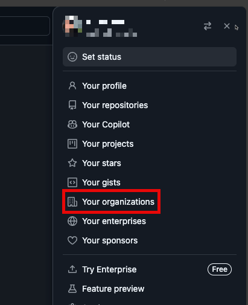
4. Fill in the following fields:
   - **Organization name:** `Backstage-<your-github-username>`
   - **Billing plan:** Free

5. Click on the **Create organization** button.

### Add People to the Organization

Now that you have created the organization, you will need to add yourself as a member of the organization. After the organization is created, you will be taken to the organization settings page. Here, you will see the **Organization name** and **Organization URL**. Copy these values and save them for later.

1. In the toolbar of the organization, click on **People**.
2. In the **People** section, click on the **Invite member** button.
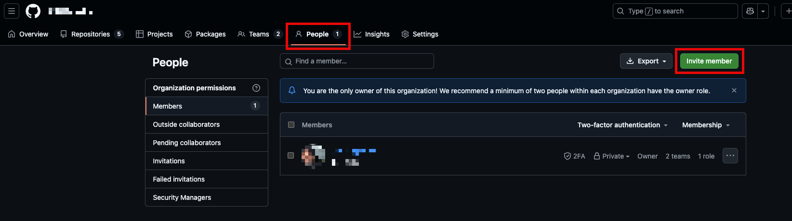
3. Fill in the following fields:
   - **Email address:** <your email address>
   - **Role:** Owner
4. Click on the **Invite** button.
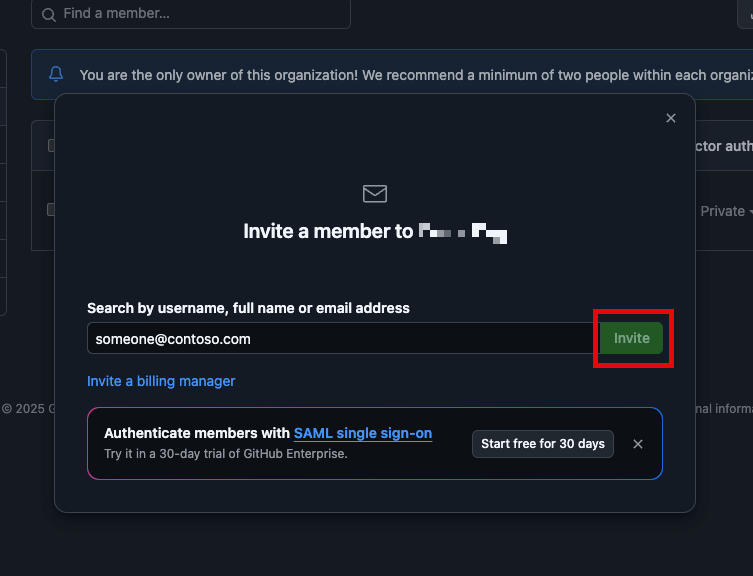

### Create a Team in the Organization

Finally, you will need to create a team in the organization.

1. In the left sidebar, click on **Teams**.
2. In the **Teams** section, click on the **New Team** button.
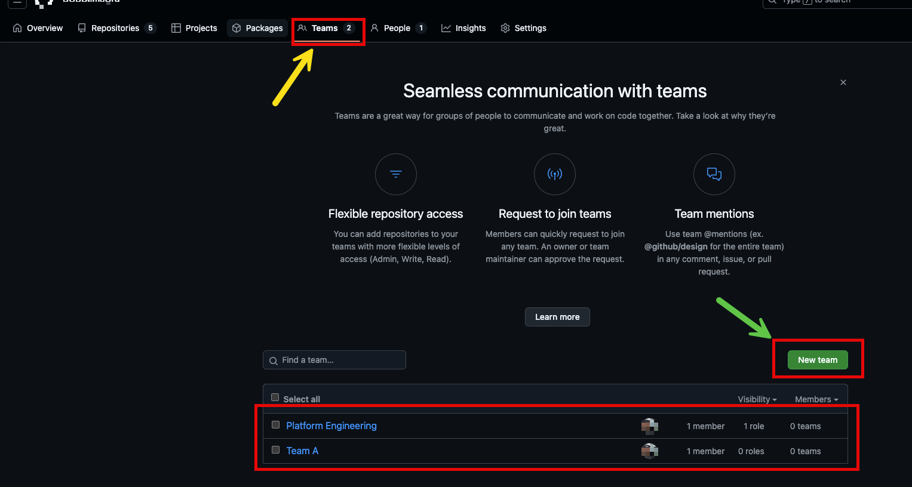
3. Fill in the following fields in the **Create a team** form:
   - **Team name:** Platform Engineering
   - **Description:** Platform Engineering team  
   - **Visibility:** Visible
   - **Team notifications:** Enabled
4. Click on the **Create Team** button.
5. Add yourself as a member of the team.
5. Fill in the following fields in the **Create a team** form:
   - **Team name:** Team A
   - **Description:** Team A  
   - **Visibility:** Visible
   - **Team notifications:** Enabled
6. Click on the **Create Team** button.
7. Add yourself as a member of the team.

<div class="tip" data-title="Tip">

> You can create multiple teams in the organization. Each team can have its own set of repositories and permissions.

</div>

We have now created a GitHub organization and a team in the organization. We will use this organization and team to manage our GitHub resources.  

## Create a GitHub App

To be able to use GitHub in the lab, you must create either a GitHub App or an OAuth App from the GitHub [developer settings](https://github.com/settings/developers). We will use the `backstage-cli` to create a GitHub App. This gives us a way to automate some of the work required to create a GitHub app.

#### Using the CLI (public GitHub only)

To create an OAuth App on GitHub in your Organization, follow these steps:

You can use the backstage-cli to create a GitHub App using a manifest file that we provide. This gives us a way to automate some of the work required to create a GitHub app.

```shell
yarn backstage-cli create-github-app <github org>
```

This command will guide you through the process of creating a GitHub App.

<div class="tip" data-title="Tip">

> You can also create a GitHub App using the GitHub UI. This is a good option if you are not comfortable using the command line.

</div>

<div class="task" data-title="Task">
 
> You will be asked to provide the following information:
</div>

```shell
Select 'A' for all permissions.
```


A new window will open in your browser where you can create the GitHub App.

<div class="tip" data-title="Tip">

> You will get a login prompt. Log in to your GitHub account.

</div>

<div class="task" data-title="Task">
 
> Fill in the form with the following values:
</div>

```shell
GitHub App name: Backstage-'<'your org name'>'
```


Once you've gone through the CLI command, it should produce a YAML file in the root of the project which you can then use as an include in your `github-app-config.yaml`.

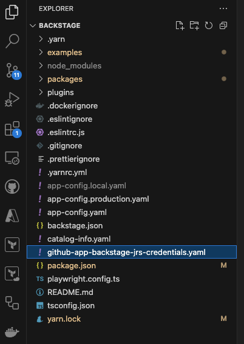

#### Export the GitHub variables

<div class="task" data-title="Task">

> Open the `github-app-config.yaml` file in the root directory of your Backstage app, and export variables using the BASH cmd prompt.

</div>

```shell
export "GITHUB_APP_ID=<your-github-app-id>"
export "GITHUB_APP_ID=<your-github-app-id>" 
export "GITHUB_CLIENT_ID=<your-github-client-id>"
export "GITHUB_CLIENT_SECRET=<your-github-client-secret>"
export "GITHUB_WEBHOOK_SECRET =<your-github-webhook-secret>"
export "GITHUB_APP_PRIVATE_KEY=<your-github-app-private-key>" 
```

<div class="task" data-title="Task">

> You can delete the `github-app-config.yaml` file.

</div>

### Configuring GitHub App permissions

Next, we need to conmfigure permissions on our GitHub App. The GitHub App permissions can be configured in the GitHub App settings. Which is located at `https://github.com/organizations/{ORG}/settings/apps/{APP_NAME}/permissions` or clicking on the `Permissions & events` tab in the GitHub App settings.

<div class="task" data-title="Task">

> In the GitHub App settings, click on the `App Settings` button at the top right corner of the page.

</div>

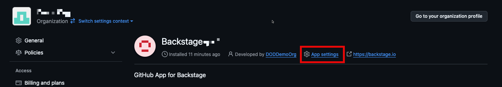

First we need to configure the homepage and callback URL for the GitHub App.

<div class="task" data-title="Task">

> In the GitHub App settings, click on the `General` tab, and add the following values:

- Homepage URL: `http://localhost:3000`
- Callback URL: `http://localhost:7007/api/auth/github/handler/frame`
- Save the changes.

</div>

<div class="task" data-title="Task">

> In the GitHub App settings, click on the `Permissions & events` tab.

</div>

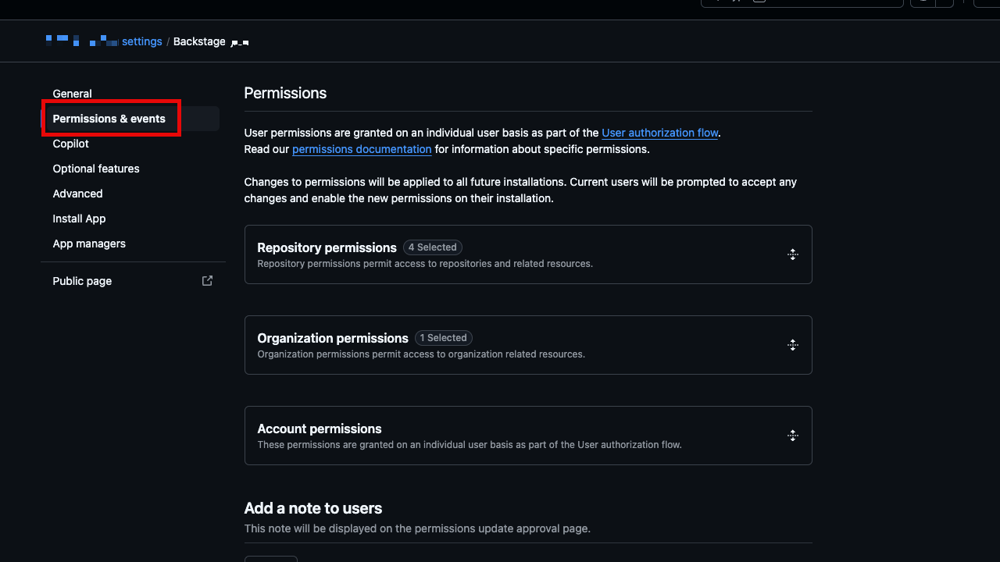

<div class="task" data-title="Task">

> Add the permissions required for the GitHub App to work with Backstage are:

</div>

**Repository permissions:**

- **Administration:** Read & write (for creating repositories)
- **Contents:** Read & write
- **Commit statuses:** Read-only
- **Metadata:** Read-only
- **Pull requests:** Read & write
- **Issues:** Read & write
- **Workflows:** Read & write
- **Variables:** Read & write
- **Secrets:** Read & write
- **Environments:** Read & write

**Organization permissions:**

- **Members:** Read-only

**Account permissions:**

- **Profile:** Read & write

## Create a GitHub PAT

To be able to use GitHub in the lab, you will need to create a GitHub Personal Access Token (PAT) with the following scopes:

- `repo` (Full control of private repositories)
- `workflow` (Update GitHub Action workflow files)
- `read:org` (Read-only access to organization, teams, and membership)
- `write:org` (Read and write access to organization membership, organization projects, and team membership)
- `admin:org` (Read and write access to organization membership, organization projects, and team membership)

In GitHub, in the top right corner, click on your profile image, and then select Settings. On the left sidebar, select Developer settings > Personal access tokens > Fine-grained tokens, select Generate new token.


On the New fine-grained personal access token page, provide the following information:

Set a descriptive name for the token, an expiration date to 30 days, and select the following permissions:

In Repository access select All repositories, then expand Repository permissions, and for Contents, from the Access list, select Read Only.

Then click on Generate token. If you need more information on this mechanism you can refer to the official documentation.

### Add the GitHub PAT to your environment

<div class="task" data-title="Task">

> We need to export the GitHub PAT to your environment. The following command will add the GitHub PAT to your environment variables.

</div>

```shell
export "GITHUB_TOKEN=<your-github-pat>"
```

[az-portal]: https://portal.azure.com
[github-account]: https://github.com/join
[repo-fork]: https://github.com/azurenoops/pe-backstage-azure-workshop/fork
[repo-clone]: https://github.com/azurenoops/pe-backstage-azure-workshop.git
[vs-code]: https://code.visualstudio.com/
[GitHub]: http://github.com
[docker-desktop]: https://www.docker.com/products/docker-desktop/

---

# Lab 1 - Backstage as your Internal Development Portal

In this lab, we will initialize the standalone local Backstage app for the moment. [Backstage.io](https://backstage.io/) is a platform to build custom `IDP (Internal Developer Portal)`. Spotify created it to give developers a single pane of glass to manage, develop, and explore the internal software ecosystem. This lab will take approximately `60 minutes` to complete.

Out of the box, Backstage includes:

- **Backstage Software Catalog** for managing all your software (microservices, libraries, data pipelines, websites, ML models, etc.)
- **Backstage Software Templates** for quickly spinning up new projects and standardizing your tooling with your organization’s best practices
- **Backstage TechDocs** for making it easy to create, maintain, find, and use technical documentation, using a “docs-like-code” approach
- **Backstage Kubernetes** helps monitor all our service’s deployments at a glance, even across clusters.
- **Backstage Search** is a universal search for backstage instances that can search against documentation, software templates, software catalogs, and APIs.
- Plus, a growing ecosystem of open-source plugins that further expand Backstage’s customizability and functionality

In the later labs, we will add an external database to it and deploy it to Azure on the Control Plane cluster. As well as, do some configurarion to make it work with Azure and GitHub.

## Step 1 - Validate your Pre-requisites

To get started, you will need to validate you have the following tools:

- [Node.js][nodejs] (LTS version)
- [Yarn][yarn]
- [Docker][docker-desktop]
- [Git][git-client]

[yarn]: https://yarnpkg.com/getting-started/install
[nodejs]: https://nodejs.org/en/download/
[docker-desktop]: https://www.docker.com/products/docker-desktop/
[git-client]: https://git-scm.com/downloads

Now that you cloned the repo, we can set up quickly with your own Backstage project you can create a Backstage App. We will run Backstage locally and configure the app.

A Backstage App is a monorepo setup with `lerna` that includes everything you need to run Backstage in your own environment.

## Step 2 - View the Backstage App

Take a look at the directory structure of your Backstage app.

<div class="task" data-title="Task">

> Open the `backstage` directory in VSCode.

</div>

This is what the directory structure should look like in VSCode:


## Step 3 - Configure Backstage

Let's have a look on some of the values in the different files and change them to your needs. The main Backstage configuration file, **`app-config.yaml`** in the root directory of your `Backstage` app. `Backstage` also supports environment-specific configuration overrides, by way of an **`app-config.<environment>.yaml`** file such as **`app-config.local.yaml`** for local developement.

### Change the Organization Name

<div class="task" data-title="Task">

> Open the **`app-config.local.yaml`** file in the root directory of your Backstage app (create if it doesn't exist), and change the organization name to a name of your choice.
</div>

```yaml
organization:
  name: <your organization name>
```

<div class="tip" data-title="Tips">

> The default .gitignore file created with the app excludes *.local.yaml from source control for you, so you can add passwords or tokens directly into the app-config.local.yaml.

</div>

Because we are still in the development mode, any changes to the **`app-config.local.yaml`** file will be reflected in the app as soon as you save the file. You can see the changes in the browser window.

<div class="warning" data-title="Warning">

> If you do not see the changes in the browser window, try to refresh the page.

</div>

### Update GitHub Org Data in Backstage

Next, we will update the entities.yaml file in the examples directory to include the GitHub Org data.

<div class="task" data-title="Task">

> Open the `examples/org.yaml` file in the root directory of your Backstage app, and add the following configuration to the `org.yaml` file.

</div>

```yaml
# https://backstage.io/docs/features/software-catalog/descriptor-format#kind-user
apiVersion: backstage.io/v1alpha1
kind: User
metadata:
  name: <your-github-username>
spec:
  memberOf: [Platform Engineering]
---
```

## Step 4 - Run Backstage

Start by running the app.

<div class="task" data-title="Task">

>Run the app by typing `yarn install` & `yarn dev`

</div>

```shell
yarn install
yarn dev
```

This may take a little while. When successful, the message webpack compiled successfully will appear in your terminal.

```shell
########### Output of the command ################
➜ cd backstage && yarn dev
yarn run v1.22.19
$ concurrently "yarn start" "yarn start-backend"
$ yarn workspace backend start
$ yarn workspace app start
$ backstage-cli package start
$ backstage-cli package start
[0] Loaded config from app-config.yaml
[0] <i> [webpack-dev-server] Project is running at:
[0] <i> [webpack-dev-server] Loopback: http://localhost:3000/, http://[::1]:3000/
[0] <i> [webpack-dev-server] Content not from webpack is served from '/Users/susovanpanja/work/medium/backstage/athena/packages/app/public' directory
[0] <i> [webpack-dev-server] 404s will fallback to '/index.html'
[0] <i> [webpack-dev-middleware] wait until bundle finished: /

... # Redacted full log
```

The yarn dev command will run both the frontend and backend as separate processes (named [0] and [1]) in the same
window. When the command finishes running, it should open up a browser window displaying your app. If not, you can open
a browser and directly navigate to the frontend at `http://localhost:3000`.

This will start the Backstage app and open a new tab in your browser. Accept the permissions and you should be redirected to the Backstage app.


After the accepting the permissions, you should see the Backstage home page with the GitHub Org data.


## Step 5 - Push changes to GitHub

Now that you have run Backstage successfully, you can push the code to GitHub. This is a good practice to follow when working with source code. Normally, we don't want to push changes directly to the main branch but for the purpose of this lab, we will push the changes directly to the main branch.

<div class="task" data-title="Task">

> Uncomment the following lines in the `.gitignore` file. This will ignore the `app-config.local.yaml` file. This is so that we don't push the file to GitHub.

```yaml
# Local configuration files
# *.local.yaml
```

<div class="task" data-title="Task">

> Go to `Source Control` tab in VSCode.

</div>

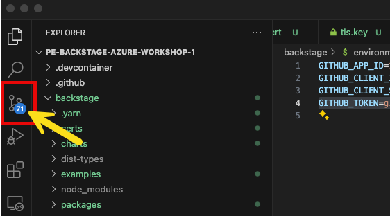

<div class="task" data-title="Task">

> Right click on the `Changes` and click on `Stage All Changes`.

</div>

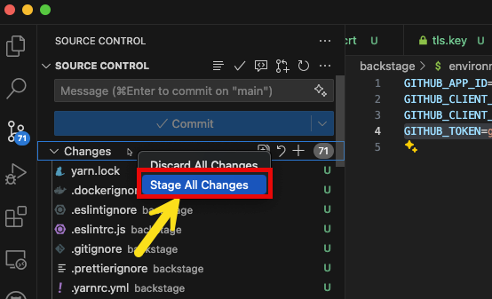

<div class="task" data-title="Task">

> Then add in a commit message and click on `Commit`.
</div>

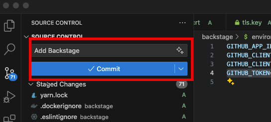

<div class="task" data-title="Task">

> Then click on the `Stage Changes` to push the changes to GitHub.
</div>

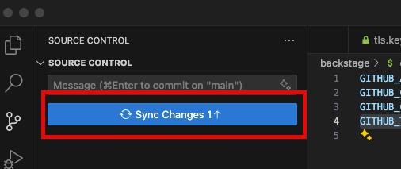

You have completed the first lab. You have now a new Backstage app, configured the app, and enabled GitHub authentication to Backstage. You have also enabled GitHub Org data to Backstage.

In the next lab, we will focus on Day 1 operations, deploying the Control Plane on Azure Kubernetes Service (AKS) using Terraform.

---

# Lab 2 - Deploy Control Plane on Azure

Mastering both Day 1 and Day 2 operations is crucial for platform, and DevOps engineer team to ensure smooth operations in platform engineering.

Day 1 operations involve the initial setup and configuration of the platform, while Day 2 operations focus on maintenance, updates, responding to incidents, and scaling. We will focus on Day 1 operations in this lab. Setting up the Control Plane cluster on Azure Kubernetes Service (AKS) using Terraform. The Platform Engineering team is responsible for both Day 1 and Day 2 operations of the platform.

To introduce you to the components, the following diagram shows the architecture of the Control Plane cluster. This lab will take approximately 40 minutes to complete.


## Step 1 - Validate your Pre-requisites

To get started, you will need to validate you have the following tools:

- [Terraform][terraform-install]
- [Azure CLI][az-cli-install]
- [kubectl][kubectl-install]
- [Helm][helm-install]

[az-cli-install]: https://learn.microsoft.com/en-us/cli/azure/install-azure-cli
[terraform-install]: https://learn.hashicorp.com/tutorials/terraform/install-cli
[kubectl-install]: https://kubernetes.io/docs/tasks/tools/install-kubectl-linux/
[helm-install]: https://helm.sh/docs/intro/install/

## Step 2 - Provision the Control Plane

In this step, we will provision the Control Plane with Azure Kubernetes Service (AKS), ACR and various addons such as Crossplane, and ArgoCD using Terraform. The Control Plane is the foundation of the platform and is used to manage the day 2 operations of the platform. Since we are provisoning the Control Plane, this is Day 1 operations. In later labs, we will focus on Day 2 operations.

With the lab repository that you cloned in Lab 1, it comes with a pre-defined Terraform code and configuration. The code is located in the `support/lab2/terraform/control-plane` folder. The Terraform files contains all resources you need, including an AKS cluster, ACR, Crossplane, and ArgoCD.

<div class="tip" data-title="Tip">

> To run the following commands, you will need to have the a bash shell installed on your machine. If you are using Windows, you can use the Windows Subsystem for Linux (WSL) to run the commands.

</div>

<div class="task" data-title="Task">

> To provision the Control Plane, run the following command from your **Backstage root directory**:

</div>

```shell
cd support/lab2/terraform/control-plane
```

<div class="task" data-title="Task">

> Set your azure region to `eastus` by updating the variable in the `variables.tf` file located in the `support/lab2/terraform/control-plane` folder.
</div>

```shell
variable "location" {
  description = "Specifies the the location for the Azure resources."
  type        = string
  default     = "eastus"
}
```

<div class="tip" data-title="Tip">

> If you are in the **Azure Government** region, you can set the region to `usgovvirginia`.
</div>

<div class="task" data-title="Task">

> Update the resource group name in the `locals.tf` file located in the `support/lab2/terraform/control-plane` folder with your initials.
</div>

```shell
locals {
  ---taken out for brevity---

  resource_group_name = "${var.resource_group_name}-<your intitals>"
  acr_name = "${var.acr_name}<your intitals>"

  ---taken out for brevity---
}
```

<div class="task" data-title="Task">

> Then run the following command to initialize Terraform:

</div>

```shell
terraform init
```

<div class="task" data-title="Task">

> Then run the following command to validate the Terraform configuration:

</div>

```shell
terraform validate
```

<div class="task" data-title="Task">

> Then run the following command to apply the Terraform configuration:

</div>

```shell
terraform apply -var gitops_addons_org=https://github.com/azurenoops -var infrastructure_provider=crossplane --auto-approve
```

<div class="warning" data-title="Warning">

>Note: You can ignore the warnings related to deprecated attributes and invalid kubeconfig path.

</div>

<div class="tip" data-title="Tips">

> Note: This control plane uses the `Application of Applications` pattern using GitOps and Crossplane. The `gitops/bootstrap/control-plane/addons` directory contains the ArgoCD application configuration for the addons.

</div>

Terraform completed installing the AKS cluster, installing ArgoCD, and configuring ArgoCD to install applications under the `gitops/bootstrap/control-plane/addons` directory from the git repo.


Now that the AKS cluster is provisioned, you can access the ArgoCD UI to manage the applications deployed on the cluster. This will show you the status of the applications deployed on the cluster and allow you to manage the applications.

## Step 3 - Validate the Cluster is working

Let's validate that the cluster is working. To access the AKS cluster, you need to set the KUBECONFIG environment variable to point to the kubeconfig file generated by Terraform. But first. we need make sure we can get to the AKS cluster.

As the result, you should see the `kubeconfig` file generated by Terraform in the `support/lab2/terraform/control-plane` folder. We will use this file to access the AKS cluster. Let's validate that the cluster is working.

<div class="task" data-title="Task">

> Run the following command to access the AKS cluster:
</div>

```shell
az aks browse --resource-group <your resource group> --name <your aks cluster name>
```

This command will open the Kubernetes dashboard in your browser.

<div class="task" data-title="Task">

> Run the following commands to set the KUBECONFIG environment variable to point to the kubeconfig file generated by Terraform.

</div>

```shell
export KUBECONFIG=<path to file>/kubeconfig
```

<div class="tip" data-title="Tip">

> Remember to replace `<path to file>` with the full path to the `kubeconfig` file generated by Terraform.

</div>

To validate that the cluster is working, you can run the following command to get the list of pods running on the cluster.

<div class="task" data-title="Task">

> Run the following command.

</div>

```shell
kubectl get pods --all-namespaces
```

You should see the following pods running on the cluster:

```shell
NAMESPACE           NAME                                                              READY   STATUS    RESTARTS          AGE
argo-events         argo-events-controller-manager-654f58ccbb-r6z4p                   1/1     Running   0                 46h
argo-rollouts       argo-rollouts-69566b6478-ljn89                                    1/1     Running   0                 46h
argo-rollouts       argo-rollouts-69566b6478-sxr96                                    1/1     Running   0                 46h
argo-workflows      argo-workflows-server-c7cdc656c-ccg5w                             1/1     Running   0                 46h
argo-workflows      argo-workflows-workflow-controller-98d946f85-4vmzg                1/1     Running   0                 46h
argocd              argo-cd-argocd-application-controller-0                           1/1     Running   0                 46h
argocd              argo-cd-argocd-applicationset-controller-677fd74987-7rxw7         1/1     Running   0                 46h
argocd              argo-cd-argocd-dex-server-85f5db5458-sldwc                        1/1     Running   0                 46h
argocd              argo-cd-argocd-notifications-controller-6cf884fb7f-g4j4s          1/1     Running   0                 46h
argocd              argo-cd-argocd-redis-6c766746d8-s8smm                             1/1     Running   0                 46h
argocd              argo-cd-argocd-repo-server-7c96b84946-c9t7d                       1/1     Running   0                 46h
argocd              argo-cd-argocd-server-78498f46f6-f8944                            1/1     Running   0                 46h
crossplane-system   crossplane-6b5b8f9549-pf2qd                                       1/1     Running   0                 20h
crossplane-system   crossplane-rbac-manager-bcddfb7-ljzqj                             1/1     Running   0                 20h
crossplane-system   helm-provider-b4cc4c2c8db3-5764597587-vzkjj                       1/1     Running   0                 46h
crossplane-system   kubernetes-provider-63506a3443e0-555885778d-2mdfm                 1/1     Running   0                 46h
crossplane-system   provider-azure-authorization-f895924437f1-79d9475b6c-69l4j        1/1     Running   0                 46h
crossplane-system   provider-azure-compute-7e421911713b-f89ff4bcd-z4sg6               1/1     Running   0                 46h
crossplane-system   provider-azure-containerregistry-cc0ea28bc72c-5bc6c598df-rcv5v    1/1     Running   0                 46h
crossplane-system   provider-azure-containerservice-ff556ea47e39-6d7c5d5496-vkzll     1/1     Running   0                 46h
crossplane-system   provider-azure-insights-fccb10339123-8578d6b4cf-qkn7b             1/1     Running   0                 46h
crossplane-system   provider-azure-keyvault-ecb17f6d99ee-df474c649-g6rmv              1/1     Running   0                 46h
crossplane-system   provider-azure-managedidentity-2eb78f1d31af-78df94999-7l4nh       1/1     Running   0                 46h
crossplane-system   provider-azure-network-f8cbea533640-5555858556-dfn8k              1/1     Running   0                 46h
crossplane-system   provider-azure-operationalinsights-93f88e54a392-5766bc9754r7wwn   1/1     Running   0                 46h
crossplane-system   provider-azure-resources-b3fb49bf7242-566d5796d6-hbr5w            1/1     Running   0                 46h
crossplane-system   provider-azure-storage-054d1eea44b0-7c9bb4f8d8-gj7ft              1/1     Running   0                 46h
crossplane-system   upbound-provider-family-azure-dde405d96fb8-69b848f6ff-dzsdd       1/1     Running   0                 46h
kube-system         ama-metrics-7c58b86db7-htqmt                                      2/2     Running   160 (8m17s ago)   46h
kube-system         ama-metrics-7c58b86db7-zw6fq                                      2/2     Running   160 (8m17s ago)   46h
kube-system         ama-metrics-ksm-5bd68b9c-5tdpv                                    1/1     Running   0                 46h
kube-system         ama-metrics-node-4mtvs                                            2/2     Running   158 (3m32s ago)   46h
kube-system         ama-metrics-operator-targets-78794c6db8-w8hpt                     2/2     Running   2 (46h ago)       46h
kube-system         azure-ip-masq-agent-mknql                                         1/1     Running   0                 20h
kube-system         azure-npm-hg4jf                                                   1/1     Running   0                 46h
kube-system         azure-wi-webhook-controller-manager-566c779d5c-5ghf5              1/1     Running   0                 46h
kube-system         azure-wi-webhook-controller-manager-566c779d5c-hb8sc              1/1     Running   0                 46h
kube-system         cloud-node-manager-rxg9c                                          1/1     Running   0                 46h
kube-system         coredns-659fcb469c-mbp82                                          1/1     Running   0                 20h
kube-system         coredns-659fcb469c-pqk4p                                          1/1     Running   0                 20h
kube-system         coredns-autoscaler-5d468f7bb5-ppvk2                               1/1     Running   0                 46h
kube-system         csi-azuredisk-node-dfw7s                                          3/3     Running   0                 20h
kube-system         csi-azurefile-node-w84ph                                          3/3     Running   0                 20h
kube-system         konnectivity-agent-698c9ffbb8-r672k                               1/1     Running   0                 46h
kube-system         konnectivity-agent-698c9ffbb8-sxgmp                               1/1     Running   0                 46h
kube-system         kube-proxy-z6ldd                                                  1/1     Running   0                 46h
kube-system         metrics-server-5dfc656944-m5pqd                                   2/2     Running   0                 46h
kube-system         metrics-server-5dfc656944-rm2md                                   2/2     Running   0                 46h
kube-system         retina-agent-pw88n                                                1/1     Running   0                 46h
```

If you see the pods running, then the cluster is working. Next, we will access the ArgoCD UI to manage the applications deployed on the cluster.

## Step 4 - Accessing the Control Plane Cluster and ArgoCD UI

To access the Control Plane cluster, you will need to configure the kubectl context to point to the AKS cluster.

<div class="task" data-title="Task">

> Then run the following command to get the IP address of the ArgoCD web interface:
</div>

```shell
kubectl get svc -n argocd argo-cd-argocd-server
```

You should see the following output:

```shell
NAME                     TYPE           CLUSTER-IP     EXTERNAL-IP     PORT(S)        AGE
argo-cd-argocd-server   ClusterIP      10.0.89.227     <none>          8081/TCP         38m
```

<div class="warning" data-title="Warning">

> As you can see, the External IP has not been assigned yet. It may take a few minutes for the LoadBalancer to create a public IP for the ArgoCD UI after the Terraform apply. We will need to list the services again to get the public IP, if it is not assigned yet, we will need to assign it manually.
</div>

<div class="task" data-title="Task">

> To check the resources created, you can run the following command. Again, be sure to use the namespace name you created is `argocd`.
</div>

```shell
kubectl get all -n argocd
```

You should see the following output:

```shell
NAME                                                              READY   STATUS    RESTARTS          AGE
pod/argo-cd-argocd-application-controller-0                     1/1     Running   0          38m
pod/argo-cd-argocd-applicationset-controller-677fd74987-m22gn   1/1     Running   0          38m
pod/argo-cd-argocd-dex-server-85f5db5458-kqv9s                  1/1     Running   0          38m
pod/argo-cd-argocd-notifications-controller-6cf884fb7f-pljhc    1/1     Running   0          38m
pod/argo-cd-argocd-redis-6c766746d8-8k2lj                       1/1     Running   0          38m
pod/argo-cd-argocd-repo-server-7c96b84946-xqrnz                 1/1     Running   0          38m
pod/argo-cd-argocd-server-78498f46f6-qrfs9                      1/1     Running   0          38m

NAME                                               TYPE           CLUSTER-IP    EXTERNAL-IP     PORT(S)                      AGE
service/argo-cd-argocd-applicationset-controller   ClusterIP      10.0.180.20   <none>          7000/TCP                     38m
service/argo-cd-argocd-dex-server                  ClusterIP      10.0.142.54   <none>          5556/TCP,5557/TCP            38m
service/argo-cd-argocd-redis                       ClusterIP      10.0.90.173   <none>          6379/TCP                     38m
service/argo-cd-argocd-repo-server                 ClusterIP      10.0.89.227   <none>          8081/TCP                     38m
service/argo-cd-argocd-server                      ClusterIP      10.0.85.130   <none>          80:31650/TCP,443:30158/TCP   38m

NAME                                                       READY   UP-TO-DATE   AVAILABLE   AGE
deployment.apps/argo-cd-argocd-applicationset-controller   1/1     1            1           38m
deployment.apps/argo-cd-argocd-dex-server                  1/1     1            1           38m
deployment.apps/argo-cd-argocd-notifications-controller    1/1     1            1           38m
deployment.apps/argo-cd-argocd-redis                       1/1     1            1           38m
deployment.apps/argo-cd-argocd-repo-server                 1/1     1            1           38m
deployment.apps/argo-cd-argocd-server                      1/1     1            1           38m

NAME                                                                  DESIRED   CURRENT   READY   AGE
replicaset.apps/argo-cd-argocd-applicationset-controller-677fd74987   1         1         1       38m
replicaset.apps/argo-cd-argocd-dex-server-85f5db5458                  1         1         1       38m
replicaset.apps/argo-cd-argocd-notifications-controller-6cf884fb7f    1         1         1       38m
replicaset.apps/argo-cd-argocd-redis-6c766746d8                       1         1         1       38m
replicaset.apps/argo-cd-argocd-repo-server-7c96b84946                 1         1         1       38m
replicaset.apps/argo-cd-argocd-server-78498f46f6                      1         1         1       38m

NAME                                                     READY   AGE
statefulset.apps/argo-cd-argocd-application-controller   1/1     38m
```

As you can see, the `Argo CD API server service(service/argo-cd-argocd-server)` is not exposed by default; this means it is configured with a Cluster IP and not a Load Balancer. To access the API server you will have to do the following:

- Expose the API server with a Load Balancer
- Use the kubectl proxy command to access the API server
- Use the kubectl port-forward command to access the API server

To expose the API server with a Load Balancer, you can run the following command:

```shell
kubectl patch svc argo-cd-argocd-server -n argocd -p '{"spec": {"type": "LoadBalancer"}}'
```

<div class="tip" data-title="Tips">

> Note: It will take a few minutes for the LoadBalancer to append an external IP to the service. If you want to check the status of the service, you can run the following command again.

```shell
kubectl get all -n argocd
```
</div>

<div class="task" data-title="Task">

> Run the following command to get the initial admin password of the ArgoCD web interface:
</div>

```shell
kubectl get secrets argocd-initial-admin-secret -n argocd --template="{{index .data.password | base64decode}}"
```

<div class="tip" data-title="Tip">

> Make sure you copy the password and save it somewhere. You will need it to log in to the ArgoCD UI.

</div>

<div class="task" data-title="Task">

> Now let's use the kubectl port-forward command to access the API server:

</div>

```shell
kubectl port-forward svc/argo-cd-argocd-server -n argocd 8080:443
```

You should see the following output:

```shell
Forwarding from 127.0.0.1:8080 -> 8080
Forwarding from [::1]:8080 -> 8080
```

You can now access the ArgoCD UI using the following URL:

```shell
http://localhost:8080
```

<div class="tip" data-title="Tips">

> Note: The username for the ArgoCD UI login is `admin`. You can use the initial admin password to log in to the ArgoCD UI.

</div>

You can now access the ArgoCD UI using url and you will see the ArgoCD login page. You can now access the ArgoCD UI using the `admin` username and the initial `admin` password.


Once you log in to the ArgoCD UI, you will see the ArgoCD dashboard.


Now that you have access to the ArgoCD UI, you can manage the applications deployed on the cluster.

Let's add our local instance of Backstage to ArgoCD and the Control Plane cluster.

## Step 5 - Build the Backstage Dockerfile

In this step, we will build the Backstage Dockerfile and deploy backstage components to Azure. The Dockerfile is used to build the Docker image for our local instance of Backstage app. First we need to tighten up our `app-config.yaml` file to update our `app.baseUrl` so it will be ready to deploy our application outside of our local environment. This is to avoid CORS policy issues once deployed on AKS.

<div class="task" data-title="Task">

> Open the `app-config.yaml` file in the root directory of your Backstage app, and add the following configuration to the `app-config.yaml` file.

```yaml
# On Line 1 in app-config.yaml
app:
  title: Scaffolded Backstage App
  baseUrl: http://localhost:7007

organization:
  name: <Your Org Name>

backend:
  # Used for enabling authentication, secret is shared by all backend plugins
  # See https://backstage.io/docs/auth/service-to-service-auth for
  # information on the format
  # auth:
  #   keys:
  #     - secret: ${BACKEND_SECRET}
  baseUrl: http://localhost:7007
  listen:
    port: 7007
    # Uncomment the following host directive to bind to specific interfaces
    # host: 127.0.0.1
  csp:
    connect-src: ["'self'", 'http:', 'https:']
    # Content-Security-Policy directives follow the Helmet format: https://helmetjs.github.io/#reference
    # Default Helmet Content-Security-Policy values can be removed by setting the key to false
  cors:
    origin: http://localhost:7007
    methods: [GET, HEAD, PATCH, POST, PUT, DELETE]
    credentials: true
    Access-Control-Allow-Origin: '*'
  https:
    certificate:
      type: 'pem'
      key:
          $file: /etc/tls/tls.key  #When running a YARN build you will need to make this resolve to the correct path in this case add a . however that will need to change when you build the image for the actual mount point. Alternativley create a local app-config with this removed to run YARN builds.
      cert: 
          $file: /etc/tls/tls.crt

# On Line 42 in app-config.yaml
database:
    client: pg
    connection:
      host: ${POSTGRES_HOST}
      port: ${POSTGRES_PORT}
      user: ${POSTGRES_USER}
      password: ${POSTGRES_PASSWORD}
      database: ${POSTGRES_DB}
      ssl:
        require: true
        rejectUnauthorized: false

# On Line 65 in app-config.yaml
auth:
  environment: development
  providers:
    github:
      development:
        clientId: ${GITHUB_CLIENT_ID}
        clientSecret: ${GITHUB_CLIENT_SECRET}
        ## uncomment if using GitHub Enterprise
        # enterpriseInstanceUrl: ${GITHUB_ENTERPRISE_INSTANCE_URL}
        ## uncomment to set lifespan of user session
        # sessionDuration: { hours: 24 } # supports `ms` library format (e.g. '24h', '2 days'), ISO duration, "human duration" as used in code
        signIn:
          resolvers:
            # See https://backstage.io/docs/auth/github/provider#resolvers for more resolvers
            - resolver: usernameMatchingUserEntityName

# On Line 75 in app-config.yaml
catalog:
  import:
    entityFilename: catalog-info.yaml
    pullRequestBranchName: backstage-integration
  rules:
    - allow: [Component, System, API, Resource, Location]
  locations:
    # Local example data, file locations are relative to the backend process, typically `packages/backend`
    - type: file
      target: ../../examples/entities.yaml

    # Local example template
    - type: file
      target: ../../examples/template/template.yaml
      rules:
        - allow: [Template]

    # Local example organizational data
    - type: file
      target: ../../examples/org.yaml
      rules:
        - allow: [User, Group]
  useUrlReadersSearch: true
```

</div>

Next, we need to update `locals.tf` with the following configuration:

```shell
# On Line 5 in support/lab2/terraform/backstage/locals.tf
locals {
  ---taken out for brevity---

  resource_group_name = "${var.resource_group_name}-<your intitals>"

  ---taken out for brevity---
}
```

Now we are ready to deploy Backstage components to the Azure.

<div class="task" data-title="Task">

> To add Backstage to Azure, run the following command from your **Terraform Backstage root directory** in the **bash** terminal.
</div>

```shell
cd support/lab2/terraform/backstage
```

<div class="task" data-title="Task">

> Set your azure region to `eastus` by updating the variable in the `variables.tf` file located in the `support/lab2/terraform/backstage` folder.
</div>

```shell
variable "location" {
  description = "Specifies the the location for the Azure resources."
  type        = string
  default     = "eastus"
}
```

<div class="tip" data-title="Tip">

> If you are in the **Azure Government** region, you can set the region to `usgovvirginia`. Also, remember to run export the `ARM_ENVIRONMENT` environment variable to point to the Azure Government environment.

```shell
export ARM_ENVIRONMENT=USGovernment
```

</div>

<div class="task" data-title="Task">

> Then run the following command to initialize Terraform:
</div>

```shell
terraform init
```

<div class="task" data-title="Task">

> Then run the following command to validate the Terraform configuration:
</div>

```shell
terraform validate
```

<div class="task" data-title="Task">

> Then run the following command to plan the Terraform configuration:

```shell
terraform apply -var github_token=<your github token> -var aks_resource_group=<your aks resource group> -var aks_node_resource_group=<your aks node resource group> -var aks_name=<your aks name> -var kubconfig_path=<your kubconfig path> -var helm_release=false --auto-approve
```

<div class="tip" data-title="Tip">

> NOTE: Since we need to input values to the helm release, we will set the `helm_release` to **false**. This will allow us to deploy the Backstage components (i.e. Postgres Db) to the Azure without deploying the Helm chart to the AKS cluster.

</div>

After the Terraform apply is complete, you should see the following output:

```shell
Apply complete! Resources: 10 added, 0 changed, 0 destroyed.

Outputs:

postgres_db_name = "backstage_plugin_catalog"
postgres_host = "backstage-postgresql-server.postgres.database.usgovcloudapi.net"
postgres_password = <sensitive> # can be found in the variables.tf file
postgres_username = "psqladminun"
```

Next, we need to button up Backstage to be ready for deployment. We can add the Postgres client to our application with the following configuration:

```yaml
# From your Backstage root directory
yarn --cwd packages/backend add pg
```

Now, is to add our database config to our application. To do this we need to open `app-config.yaml` and add our **PostgreSQL** configuration in the root directory of our Backstage app using the credentials from the previous steps.

```yaml
# On Line 42 in app-config.yaml
backend:
  database:
    # config options: https://node-postgres.com/apis/client <---- Add all lines below here
    client: pg
    connection:
      host: ${POSTGRES_HOST}
      port: ${POSTGRES_PORT}
      user: ${POSTGRES_USER}
      password: ${POSTGRES_PASSWORD}
```

<div class="task" data-title="Task">

> For the sake of this lab we will pass our user and password in as hard coded values to our yaml file. This is not advisable in production. Please use your accepted application config method if deploying into production. To do this we need to open `app-config.yaml` and add our **PostgreSQL** configuration in the root directory of our Backstage app using the credentials from the previous steps.

```shell
HOST=backstage-postgresql-server.postgres.database.usgovcloudapi.net >> ${POSTGRES_HOST} # In place of
PORT=5432 >> ${POSTGRES_PORT} # In place of
USER=psqladminun >> ${POSTGRES_USER} # In place of
PASSWORD=<your postgres password> >> ${POSTGRES_PASSWORD} # In place of
```

</div>

We now need to copy the folder `charts/backstage` from the `misc` folder to the `backstage` root folder.

<div class="task" data-title="Task">

> Create folders `charts/backstage` in the `backstage` root folder.
</div>

```shell
mkdir -p charts/backstage
```

<div class="task" data-title="Task">

> To move the folder, run the following command from your **root directory**:
</div>

```shell
cp -R misc/charts/backstage backstage/charts/backstage  
```

We now need to copy tls.crt and tls.key from the `support/lab2/terraform/backstage` folder to the `backstage/certs/tls` root folder.

<div class="task" data-title="Task">

> Now, from our backstage root folder `support/lab2/terraform/backstage` we need to run the following commands

</div>

<div class="task" data-title="Task">

> Create folders `certs/tls` in the `backstage` root folder.
</div>

```shell
mkdir -p certs/tls
```

<div class="task" data-title="Task">

> To copy contents the folder, run the following command from your **root directory**:
</div>

```shell
cp -R support/lab2/terraform/backstage/tls.crt backstage/certs/tls
cp -R support/lab2/terraform/backstage/tls.key backstage/certs/tls
```

We will be doing a host build to save some time. We'll build the backend on our host whether thats local or a CI pipeline and then we will build our docker image. 


<div class="task" data-title="Task">

> To start with from our backstage root folder we need to run the following commands:

```shell
yarn install --immutable

# tsc outputs type definitions to dist-types/ in the repo root, which are then consumed by the build
yarn tsc

# Build the backend, which bundles it all up into the packages/backend/dist folder.
yarn build:backend
```

</div>

Once the host build is complete, We now need to inspect the Dockerfile to make sure it is set up correctly.

The Dockerfile is located in the `packages/backend` folder of your Backstage app.

The dockerfile is below:

```dockerfile
# This dockerfile builds an image for the backend package.
# It should be executed with the root of the repo as docker context.

FROM node:20-bookworm-slim

# Set Python interpreter for `node-gyp` to use
ENV PYTHON=/usr/bin/python3

# Install isolate-vm dependencies, these are needed by the @backstage/plugin-scaffolder-backend.
RUN --mount=type=cache,target=/var/cache/apt,sharing=locked \
    --mount=type=cache,target=/var/lib/apt,sharing=locked \
    apt-get update && \
    apt-get install -y --no-install-recommends python3 g++ build-essential && \
    rm -rf /var/lib/apt/lists/*

# Install sqlite3 dependencies. You can skip this if you don't use sqlite3 in the image,
# in which case you should also move better-sqlite3 to "devDependencies" in package.json.
RUN --mount=type=cache,target=/var/cache/apt,sharing=locked \
    --mount=type=cache,target=/var/lib/apt,sharing=locked \
    apt-get update && \
    apt-get install -y --no-install-recommends libsqlite3-dev && \
    rm -rf /var/lib/apt/lists/*

# From here on we use the least-privileged `node` user to run the backend.
USER node

# This should create the app dir as `node`.
# If it is instead created as `root` then the `tar` command below will fail: `can't create directory 'packages/': Permission denied`.
# If this occurs, then ensure BuildKit is enabled (`DOCKER_BUILDKIT=1`) so the app dir is correctly created as `node`.
WORKDIR /app

# Copy files needed by Yarn
COPY --chown=node:node .yarn ./.yarn
COPY --chown=node:node .yarnrc.yml ./
COPY --chown=node:node backstage.json ./

# This switches many Node.js dependencies to production mode.
ENV NODE_ENV=production

# This disables node snapshot for Node 20 to work with the Scaffolder
ENV NODE_OPTIONS="--no-node-snapshot"

# Copy repo skeleton first, to avoid unnecessary docker cache invalidation.
# The skeleton contains the package.json of each package in the monorepo,
# and along with yarn.lock and the root package.json, that's enough to run yarn install.
COPY --chown=node:node yarn.lock package.json packages/backend/dist/skeleton.tar.gz ./
RUN tar xzf skeleton.tar.gz && rm skeleton.tar.gz

RUN --mount=type=cache,target=/home/node/.cache/yarn,sharing=locked,uid=1000,gid=1000 \
    yarn workspaces focus --all --production && rm -rf "$(yarn cache clean)"

# This will include the examples, if you don't need these simply remove this line
COPY --chown=node:node examples ./examples

# Then copy the rest of the backend bundle, along with any other files we might want.
COPY --chown=node:node packages/backend/dist/bundle.tar.gz app-config*.yaml ./
RUN tar xzf bundle.tar.gz && rm bundle.tar.gz

CMD ["node", "packages/backend", "--config", "app-config.yaml", "--config", "app-config.production.yaml"]

```

Inspect the dockerfile and make sure the following lines are present:

```dockerfile
# This disables node snapshot for Node 20 to work with the Scaffolder
ENV NODE_OPTIONS="--no-node-snapshot"
```

```dockerfile
# This will include the examples, certs and template-cluster, if you don't need these simply remove this line
COPY --chown=node:node examples ./examples
# This will be used in a later step
# COPY --chown=node:node packages/template-cluster ./template-cluster
ENV NODE_EXTRA_CA_CERTS=/certs/tls/tls.crt
RUN printenv
```

```dockerfile
# Remove app-config.production.yaml from this line
CMD ["node", "packages/backend", "--config", "app-config.yaml"]
```

Now we are ready to build the docker image.

<div class="task" data-title="Task">

> You can use the following command to build the Docker image.
</div>

```shell
docker build . -f packages/backend/Dockerfile -t backstage 
```

After the image is successfully built it's pushed to the registry we created earlier. Azure provides a hosted pool to build these images however ACR also now supports using a self hosted pool for production environments. If we had set our endpoint to private we would use a self hosted pool to build the image.

As we require Buildkit to be enabled we need to use ACR's multi-step YAML file. Create a file called acr-task.yaml.

<div class="task" data-title="Task">

> Create a file called acr-task.yaml in the root directory of your Backstage app.
</div>

```shell
touch acr-task.yaml
```

<div class="task" data-title="Task">

> Add the following content to the acr-task.yaml file.

```yaml
version: v1.0.0
stepTimeout: 1000
env:
  [DOCKER_BUILDKIT=1]
steps: # A collection of image or container actions.
  - build: -t controlplaneacr<YOUR_INITALS>.azurecr.io/backstageimage:v1 -f Dockerfile .
  - push:  
    - controlplaneacr<YOUR_INITALS>.azurecr.io/backstageimage:v1
  - tag:
    - backstage controlplaneacr<YOUR_INITALS>.azurecr.io/backstageimage:v1
```  

</div>

<div class="warning" data-title="Warning">

> WARNING: Make sure you add the proper url for for the ACR, otherwise the image will not be pushed to the ACR. `.io` for commercial use and `.us` for government use.

</div>

<div class="task" data-title="Task">

> To run the `acr-task.yaml` file, run the following command.

```shell
az acr run -r controlplaneacr<YOUR_INITALS> -f acr-task.yaml .
```

</div>

Once this has run we should see our image in our registry:


Now, we can add our Backstage instance to the Control Plane cluster.

## Step 6 - Adding Backstage to Control Plane

In this step, we will add our Backstage instance to the Control Plane cluster. We will use the ArgoCD UI to add our Backstage instance to the Control Plane cluster.
To do this, we need to create a new ArgoCD application for our Backstage instance. We will use the following configuration to create the ArgoCD application.

<div class="task" data-title="Task">

> Now we need to update values in the `backstage/main.tf` file.

```shell
# On Line 5 in backstage/main.tf
resource "helm_release" "backstage" {
  count      = var.helm_release ? 1 : 0
  depends_on = [kubernetes_secret.tls_secret]
  name       = "backstage"
  repository = "oci://backstageacr<your intitals>.azurecr.us"
  chart      = "backstagechart"
  version    = "1.0.0"

  set {
    name  = "image.repository"
    value = "backstageacr<your intitals>.azurecr.us/backstage"
  }
  set {
    name  = "image.tag"
    value = "v1"
  }

--- Taken out for brevity ---
}
```

</div>

<div class="task" data-title="Task">

> Now run the following command to apply the Terraform configuration for the AKS cluster, to do this set the `helm_release` to **true**:

```shell
terraform apply -var github_token=<your github token> -var aks_resource_group=<your aks resource group> -var aks_node_resource_group=<your aks node resource group> -var aks_name=<your aks name> -var kubconfig_path=<your kubconfig path> -var helm_release=true --auto-approve
```

</div>

<div class="task" data-title="Task">

> To check the status of the Backstage application, you can run the following command:

```shell
kubectl get all -n backstage
```

You should see the following output:

```shell
NAME                                                              READY   STATUS    RESTARTS          AGE
pod/backstage-5c6d7f8b4c-2j5gq                                    1/1     Running   0                 46m
pod/backstage-5c6d7f8b4c-2j5gq                                    1/1     Running   0                 46m
pod/backstage-5c6d7f8b4c-2j5gq                                    1/1     Running   0                 46m
```

<div class="tip" data-title="Tip">

> Note: The Backstage application is deployed to the AKS cluster. You can access the Backstage application using the following URL:

```shell
http://<your aks name>.<your aks resource group>.cloudapp.azure.com
```

</div>

Next, let's build out paved path templates to be used in Backstage.

---

# Lab 3 - Building Paved Paths with Backstage

In this lab, we will discuss how to implement paved paths in Backstage. Paved paths are predefined paths that provide a set of best practices and configurations for specific types of applications.

Paved paths can be used to create new projects based on predefined templates. These templates can include configuration files, code snippets, and other resources that help developers get started quickly with a new project.

## Step 1 - Define the Paved Path

Before we can create a paved path, we need to define the paved path. The paved path is a set of best practices and configurations for a specific type of application.

### Use Case - Onboarding a new team

In this use case, we will define a paved path for onboarding a new team. The paved path will include the following:

- A new GitHub repository for the team
- A new GitHub Actions pipeline for the team
- A new Azure Kubernetes Service (AKS) cluster for the team
- A Software template for onboading a new team

---

# Lab 4 - Everything as Code

In this lab, we will show you how to use Everything as Code in Backstage. **Everything as Code** is a concept that allows you to define your infrastructure, configuration, and application code in a declarative way using code.

We will be doing a couple of things in this lab:

1. Define Infrastructure as Code for deployment of Backstage on Azure
2. Define Configuration as Code for the management of Backstage configuration
3. Define Documentation as Code for the management of Backstage documentation

## Step 1 - Deploying Backstage to AKS with Infrastructure as Code

In this step, we will define the infrastructure as code for the deployment of Backstage on Azure. We will use Terraform to define the infrastructure as code.

We will use the docker file that comes with the Backstage app to create a Docker image and deploy it to Azure. We will then create a Kubernetes cluster on Azure and deploy the Docker image to the cluster.


---

# Lab 5 - Applying Governance via Policy as Code

In this lab, you will explore adding governance to the control plane via Azure Policy, a service in Azure that you use to create, assign and manage policies. These policies enforce different rules and effects over your resources, so those resources stay compliant with your corporate standards and service level agreements.

There are few key concepts to understand before you start with the lab:

- The first object to create when working with Azure Policies, is a **Policy Definition**. It expresses what to evaluate and what action to take. For example, you could have a policy definition that restricts the regions available for resources.

- Some **Policy Definitions** are built-in and you can also create custom policies. The built-in policies are provided by Azure, and you can't modify them. Custom policies are created by you, and you can define the conditions under which they are enforced.

- Once you have a policy definition, you can assign it to a specific scope. The scope of a **Policy Assignment** can be a management group, a subscription, a resource group, or a resource. When you assign a policy, it starts to evaluate resources in the scope. Of course, you can exclude specific child scopes from the evaluation.

- When a policy is assigned, it's enforced. If a resource is not compliant with the policy, the policy's defined effect is applied. The effect could be to deny the request, audit the request, append a field to the request, or deploy a resource.

- In some cases, you might want to exempt a resource from a policy assignment. You can do this by creating a **Policy Exemption**. An exemption is a way to exclude a specific resource from a policy's evaluation.

In the Azure Portal, there are dedicated resource groups for each participant based on the participant number.

In your resource group, you will find:

- A virtual network
- An Azure Resource Manager template spec that deploys a network security group with few inbound rules. (you can ignore it for now)

---

# Lab 6 - Self-Service Infrastructure

In this lab, you will explore how to use Backstage to create a self-service infrastructure for your teams. You will create a new Backstage app and add a new template to the app. **Self-Service Infrastructure** is a concept that allows teams to create and manage their own infrastructure without the need for IT intervention.

We will be doing a couple of things in this lab:

1. 

---

# Closing the workshop

Once you're done with this lab you can delete the resource group you created at the beginning.

To do so, click on `delete resource group` in the Azure Portal to delete all the resources and audio content at once. The following Az-Cli command can also be used to delete the resource group :

```bash
# Delete the resource group with all the resources
az group delete --name <resource-group>
```

Also, for security purpose, remove the unused GitHub PAT token in your GitHub account.

---