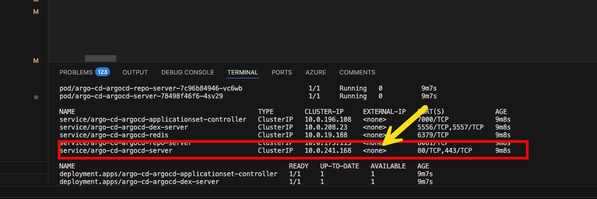
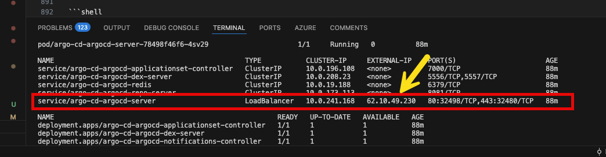

# Product Hands-on Lab - Platform engineering with Backstage and Azure Kubernetes Service

## Workshop Overview

Welcome to this Platform engineering with Backstage and Azure Kubernetes Service Workshop. This workshop will cover the topic of platform engineering using Backstage and Azure Kubernetes Service (AKS). The workshop will be a hands-on lab where participants will learn how to build and deploy applications using Backstage and AKS. Participants will also learn about the benefits of using a platform engineering approach to application development and deployment.

At its core, platform engineering is about constructing a solid and adaptable groundwork that simplifies and accelerates the development, deployment, and operation of software applications. The goal is to abstract the complexity inherent in managing infrastructure and operational concerns, enabling dev teams to focus on crafting code that adds direct value to the developers.

In order to comprehend real-world situations, you will be testing with serveral different toos and services in several labs. You will be able to learn how to deploy and manage Azure resources, as well as how to use Azure services to build and deploy applications with the help of AKS, GitHub and Backstage. Don't worry; you will be walked through the entire procedure in this step-by-step lab.

The tools in this lab to build out your Integrated Development Platform (IDP) include:

- [GitHub][GitHub] (as your Git repo)
- [Backstage](https://backstage.io/) (as your self-service portal)
- [ArgoCD](https://argoproj.github.io/cd/) (as your Platform Orchestrator)
- [Argo Workflows](https://argoproj.github.io/workflows/) (to trigger post deployment tasks)
- [Crossplane](https://crossplane.io/)(to provision Azure/GitHub resources)
- [Azure Kubernetes Service (AKS)](http://azure.microsoft.com/services/kubernetes-service/) (as your Control Plane cluster)
- [Azure Key Vault](https://azure.microsoft.com/en-us/services/key-vault/) (to store secrets)
- [Azure Container Registry](https://azure.microsoft.com/en-us/services/container-registry/) (to store container images)

<div class="tip" data-title="Tip">

> All tools in this lab are opinionated and used to show how to build out an Internal Development Platform (IDP). You can use other tools to build out your Internal Development Platform (IDP).

</div>

If you follow all instructions, you should have your own Internal Development Platform (IDP) running by the end of this lab!

## Pre-requisites

Before starting this lab, be sure to set your Azure environment :

- An Azure Subscription with the **Owner** role to create and manage the labs' resources and deploy the infrastructure as code
- Register the Azure providers on your Azure Subscription if not done yet: `Microsoft.ContainerService`,
`Microsoft.Network`,
`Microsoft.Storage`,
`Microsoft.Compute`,
`Microsoft.AppPlatform`,
`Microsoft.App`,
`Microsoft.KeyVault`,

<div class="tip" data-title="Tip">

> **NOTE:** If you are using a Microsoft Azure Government subscription, you will need check if the following providers exist in your subscription:
> - Microsoft.AppPlatform

</div>

To be able to do the lab content you will also need:

- Basic understanding of Azure resources which includes Azure Kubernetes Service (AKS), Azure Container Registry (ACR), Azure Key Vault.
- Basic understanding of Terraform and how to deploy resources using Terraform.
- Basic understanding of GitHub and how to create a GitHub App.
- Basic understanding of Backstage and how to deploy and configure Backstage.
- Basic understanding of Docker and how to create a Docker image.
- Basic understanding of Kubernetes and how to deploy applications to Kubernetes with ArgoCD and Crossplane.
- A [Github account][github-account] (Free, Team or Enterprise)
- Create a [fork][repo-fork] of the repository from the main branch to help you keep track of your potential changes

2 development options are available:

1. **Preferred method** : Local Devcontainer
2. Local Dev Environment with all the prerequisites detailed below

<div class="tip" data-title="Tips">

> To focus on the main purpose of the lab, we encourage the usage of devcontainers as they abstract the dev environment configuration, and avoid potential local dependencies conflict.
> You could decide to run everything without relying on a devcontainer : To do so, make sure you install all the prerequisites detailed below.

</div>

### 🥈 : Using a local Devcontainer

This repo comes with a Devcontainer configuration that will let you open a fully configured dev environment from your local Visual Studio Code, while still being completely isolated from the rest of your local machine configuration : No more dependency conflict.
Here are the required tools to do so :

- [Git client](https://git-scm.com/downloads)
- [Docker Desktop][docker-desktop] running
- [Visual Studio Code][vs-code] installed

After you forked the repo, start by cloning the Hands-on Lab [Platform Engineering with BackStage repo][repo-clone] you just forked on your local Machine and open the local folder in Visual Studio Code.
Once you have cloned the repository locally, make sure Docker Desktop is up and running and open the cloned repository in Visual Studio Code.  

You will be prompted to open the project in a Dev Container. Click on `Reopen in Container`.

If you are not prompted by Visual Studio Code, you can open the command palette (`Ctrl + Shift + P`) and search for `Reopen in Container` and select it:


### 🥉 : Using your own local environment

The following tools and access will be necessary to run the lab in good conditions on a local environment :  

- [Git client][git-client]
- [Visual Studio Code][vs-code] installed (you will use Dev Containers)
- [Azure CLI][az-cli-install] installed on your machine
- [Terraform][terraform-install] installed, this will be used for deploying the resources on Azure

Once you have set up your local environment, and after you forked the repo, you can clone the Hands-on Lab [Platform Engineering with BackStage repo][repo-clone] on your machine, and open the local folder in Visual Studio Code and head to the next step.

## 🔑 Sign in to Azure

<div class="task" data-title="Task">

> - Log into your Azure subscription using your pre-configured environment using Azure CLI and on the [Azure Portal][az-portal] using your credentials.

</div>

```bash
# Login to Azure : 

# Cloud setting : Optional | In case your Azure account has access to multiple clouds
# Azure Commercial
az cloud set --name AzureCloud
# Azure Government
az cloud set --name AzureUSGovernment
# Set ARM environment variable
export "ARM_ENVIRONMENT=usgovernment"

# Local Environment or Dev Container --tenant : Optional | In case your Azure account has access to multiple tenants
az login --tenant <yourtenantid or domain.com>

# Display your account details
az account show
# Select your Azure subscription
az account set --subscription <subscription-id>

# Register the following Azure providers if they are not already

# Azure Key Vault
az provider register --namespace 'Microsoft.KeyVault'
# Azure Container Registry
az provider register --namespace 'Microsoft.ContainerRegistry'
# Azure Kubernetes Service
az provider register --namespace 'Microsoft.ContainerService'
# Azure App Service
az provider register --namespace 'Microsoft.App'
# Azure App Service Environment
az provider register --namespace 'Microsoft.AppPlatform'
# Azure Storage
az provider register --namespace 'Microsoft.Storage'
# Azure Network
az provider register --namespace 'Microsoft.Network'
```

## Create a GitHub Organization

To be able to use GitHub in the lab, you will need to create a GitHub organization.

<div class="tip" data-title="Tip">

> Your team can collaborate on GitHub by using an organization account. Each person that uses GitHub signs into a user account. Multiple user accounts can collaborate on shared projects by joining the same organization account, which owns the repositories. A subset of these user accounts can be given the role of organization owner, which allows those people to granularly manage access to the organization’s resources using sophisticated security and administrative features.

</div>

To create a GitHub organization, follow these steps:

1. Go to GitHub and sign in to your account.
2. In the top right corner of the page, click on your profile picture, and then click on Your organizations.
3. In the top right corner of the page, click on the New organization button.

4. Fill in the following fields:
   - **Organization name:** `Backstage-<your-github-username>`
   - **Billing plan:** Free

5. Click on the **Create organization** button.

### Add People to the Organization

Now that you have created the organization, you will need to add yourself as a member of the organization. After the organization is created, you will be taken to the organization settings page. Here, you will see the **Organization name** and **Organization URL**. Copy these values and save them for later.

1. In the toolbar of the organization, click on **People**.
2. In the **People** section, click on the **Invite member** button.

3. Fill in the following fields:
   - **Email address:** <your email address>
   - **Role:** Owner
4. Click on the **Invite** button.


### Create a Team in the Organization

Finally, you will need to create a team in the organization.

1. In the left sidebar, click on **Teams**.
2. In the **Teams** section, click on the **New Team** button.

3. Fill in the following fields in the **Create a team** form:
   - **Team name:** Platform Engineering
   - **Description:** Platform Engineering team  
   - **Visibility:** Visible
   - **Team notifications:** Enabled
4. Click on the **Create Team** button.
5. Add yourself as a member of the team.
5. Fill in the following fields in the **Create a team** form:
   - **Team name:** Team A
   - **Description:** Team A  
   - **Visibility:** Visible
   - **Team notifications:** Enabled
6. Click on the **Create Team** button.
7. Add yourself as a member of the team.

<div class="tip" data-title="Tip">

> You can create multiple teams in the organization. Each team can have its own set of repositories and permissions.

</div>

We have now created a GitHub organization and a team in the organization. We will use this organization and team to manage our GitHub resources.  

## Create a GitHub App

To be able to use GitHub in the lab, you must create either a GitHub App or an OAuth App from the GitHub [developer settings](https://github.com/settings/developers). We will use the `backstage-cli` to create a GitHub App. This gives us a way to automate some of the work required to create a GitHub app.

#### Using the CLI (public GitHub only)

To create an OAuth App on GitHub in your Organization, follow these steps:

You can use the backstage-cli to create a GitHub App using a manifest file that we provide. This gives us a way to automate some of the work required to create a GitHub app.

```shell
yarn backstage-cli create-github-app <github org>
```

This command will guide you through the process of creating a GitHub App.

<div class="tip" data-title="Tip">

> You can also create a GitHub App using the GitHub UI. This is a good option if you are not comfortable using the command line.

</div>

<div class="task" data-title="Task">
 
> You will be asked to provide the following information:
</div>

```shell
Select 'A' for all permissions.
```


A new window will open in your browser where you can create the GitHub App.

<div class="tip" data-title="Tip">

> You will get a login prompt. Log in to your GitHub account.

</div>

<div class="task" data-title="Task">
 
> Fill in the form with the following values:
</div>

```shell
GitHub App name: Backstage-'<'your org name'>'
```


Once you've gone through the CLI command, it should produce a YAML file in the root of the project which you can then use as an include in your `github-app-config.yaml`.


#### Export the GitHub variables

<div class="task" data-title="Task">

> Open the `github-app-config.yaml` file in the root directory of your Backstage app, and export variables using the BASH cmd prompt.

</div>

```shell
export "GITHUB_APP_ID=<your-github-app-id>"
export "GITHUB_APP_ID=<your-github-app-id>" 
export "GITHUB_CLIENT_ID=<your-github-client-id>"
export "GITHUB_CLIENT_SECRET=<your-github-client-secret>"
export "GITHUB_WEBHOOK_SECRET =<your-github-webhook-secret>"
export "GITHUB_APP_PRIVATE_KEY=<your-github-app-private-key>" 
```

<div class="task" data-title="Task">

> You can delete the `github-app-config.yaml` file.

</div>

### Configuring GitHub App permissions

Next, we need to conmfigure permissions on our GitHub App. The GitHub App permissions can be configured in the GitHub App settings. Which is located at `https://github.com/organizations/{ORG}/settings/apps/{APP_NAME}/permissions` or clicking on the `Permissions & events` tab in the GitHub App settings.

<div class="task" data-title="Task">

> In the GitHub App settings, click on the `App Settings` button at the top right corner of the page.

</div>


First we need to configure the homepage and callback URL for the GitHub App.

<div class="task" data-title="Task">

> In the GitHub App settings, click on the `General` tab, and add the following values:

- Homepage URL: `http://localhost:3000`
- Callback URL: `http://localhost:7007/api/auth/github/handler/frame`
- Save the changes.

</div>

<div class="task" data-title="Task">

> In the GitHub App settings, click on the `Permissions & events` tab.

</div>


<div class="task" data-title="Task">

> Add the permissions required for the GitHub App to work with Backstage are:

</div>

**Repository permissions:**

- **Administration:** Read & write (for creating repositories)
- **Contents:** Read & write
- **Commit statuses:** Read-only
- **Metadata:** Read-only
- **Pull requests:** Read & write
- **Issues:** Read & write
- **Workflows:** Read & write
- **Variables:** Read & write
- **Secrets:** Read & write
- **Environments:** Read & write

**Organization permissions:**

- **Members:** Read-only

**Account permissions:**

- **Profile:** Read & write

## Create a GitHub PAT

To be able to use GitHub in the lab, you will need to create a GitHub Personal Access Token (PAT) with the following scopes:

- `repo` (Full control of private repositories)
- `workflow` (Update GitHub Action workflow files)
- `read:org` (Read-only access to organization, teams, and membership)
- `write:org` (Read and write access to organization membership, organization projects, and team membership)
- `admin:org` (Read and write access to organization membership, organization projects, and team membership)

In GitHub, in the top right corner, click on your profile image, and then select Settings. On the left sidebar, select Developer settings > Personal access tokens > Fine-grained tokens, select Generate new token.


On the New fine-grained personal access token page, provide the following information:

Set a descriptive name for the token, an expiration date to 30 days, and select the following permissions:

In Repository access select All repositories, then expand Repository permissions, and for Contents, from the Access list, select Read Only.

Then click on Generate token. If you need more information on this mechanism you can refer to the official documentation.

### Add the GitHub PAT to your environment

<div class="task" data-title="Task">

> We need to export the GitHub PAT to your environment. The following command will add the GitHub PAT to your environment variables.

</div>

```shell
export "GITHUB_TOKEN=<your-github-pat>"
```

[az-portal]: https://portal.azure.com
[github-account]: https://github.com/join
[repo-fork]: https://github.com/azurenoops/pe-backstage-azure-workshop/fork
[repo-clone]: https://github.com/azurenoops/pe-backstage-azure-workshop.git
[vs-code]: https://code.visualstudio.com/
[GitHub]: http://github.com
[docker-desktop]: https://www.docker.com/products/docker-desktop/

---

# Lab 1 - Backstage as your Internal Development Portal

In this lab, we will initialize the standalone local Backstage app for the moment. [Backstage.io](https://backstage.io/) is a platform to build custom `IDP (Internal Developer Portal)`. Spotify created it to give developers a single pane of glass to manage, develop, and explore the internal software ecosystem. This lab will take approximately `60 minutes` to complete.

Out of the box, Backstage includes:

- **Backstage Software Catalog** for managing all your software (microservices, libraries, data pipelines, websites, ML models, etc.)
- **Backstage Software Templates** for quickly spinning up new projects and standardizing your tooling with your organization’s best practices
- **Backstage TechDocs** for making it easy to create, maintain, find, and use technical documentation, using a “docs-like-code” approach
- **Backstage Kubernetes** helps monitor all our service’s deployments at a glance, even across clusters.
- **Backstage Search** is a universal search for backstage instances that can search against documentation, software templates, software catalogs, and APIs.
- Plus, a growing ecosystem of open-source plugins that further expand Backstage’s customizability and functionality

In the later labs, we will add an external database to it and deploy it to Azure on the Control Plane cluster. As well as, do some configurarion to make it work with Azure and GitHub.

## Step 1 - Validate your Pre-requisites

To get started, you will need to validate you have the following tools:

- [Node.js][nodejs] (LTS version)
- [Yarn][yarn]
- [Docker][docker-desktop]
- [Git][git-client]

[yarn]: https://yarnpkg.com/getting-started/install
[nodejs]: https://nodejs.org/en/download/
[docker-desktop]: https://www.docker.com/products/docker-desktop/
[git-client]: https://git-scm.com/downloads

Now that you cloned the repo, we can set up quickly with your own Backstage project you can create a Backstage App. We will run Backstage locally and configure the app.

A Backstage App is a monorepo setup with `lerna` that includes everything you need to run Backstage in your own environment.

## Step 2 - View the Backstage App

Take a look at the directory structure of your Backstage app.

<div class="task" data-title="Task">

> Open the `backstage` directory in VSCode.

</div>

This is what the directory structure should look like in VSCode:


## Step 3 - Configure Backstage

Let's have a look on some of the values in the different files and change them to your needs. The main Backstage configuration file, **`app-config.yaml`** in the root directory of your `Backstage` app. `Backstage` also supports environment-specific configuration overrides, by way of an **`app-config.<environment>.yaml`** file such as **`app-config.local.yaml`** for local developement.

### Change the Organization Name

<div class="task" data-title="Task">

> Open the **`app-config.local.yaml`** file in the root directory of your Backstage app (create if it doesn't exist), and change the organization name to a name of your choice.
</div>

```yaml
organization:
  name: <your organization name>
```

<div class="tip" data-title="Tips">

> The default .gitignore file created with the app excludes *.local.yaml from source control for you, so you can add passwords or tokens directly into the app-config.local.yaml.

</div>

Because we are still in the development mode, any changes to the **`app-config.local.yaml`** file will be reflected in the app as soon as you save the file. You can see the changes in the browser window.

<div class="warning" data-title="Warning">

> If you do not see the changes in the browser window, try to refresh the page.

</div>

### Update GitHub Org Data in Backstage

Next, we will update the entities.yaml file in the examples directory to include the GitHub Org data.

<div class="task" data-title="Task">

> Open the `examples/org.yaml` file in the root directory of your Backstage app, and add the following configuration to the `org.yaml` file.

</div>

```yaml
# https://backstage.io/docs/features/software-catalog/descriptor-format#kind-user
apiVersion: backstage.io/v1alpha1
kind: User
metadata:
  name: <your-github-username>
spec:
  memberOf: [Platform Engineering]
---
```

## Step 4 - Run Backstage

Start by running the app.

<div class="task" data-title="Task">

>Run the app by typing `yarn install` & `yarn dev`

</div>

```shell
yarn install
yarn dev
```

This may take a little while. When successful, the message webpack compiled successfully will appear in your terminal.

```shell
########### Output of the command ################
➜ cd backstage && yarn dev
yarn run v1.22.19
$ concurrently "yarn start" "yarn start-backend"
$ yarn workspace backend start
$ yarn workspace app start
$ backstage-cli package start
$ backstage-cli package start
[0] Loaded config from app-config.yaml
[0] <i> [webpack-dev-server] Project is running at:
[0] <i> [webpack-dev-server] Loopback: http://localhost:3000/, http://[::1]:3000/
[0] <i> [webpack-dev-server] Content not from webpack is served from '/Users/susovanpanja/work/medium/backstage/athena/packages/app/public' directory
[0] <i> [webpack-dev-server] 404s will fallback to '/index.html'
[0] <i> [webpack-dev-middleware] wait until bundle finished: /

... # Redacted full log
```

The yarn dev command will run both the frontend and backend as separate processes (named [0] and [1]) in the same
window. When the command finishes running, it should open up a browser window displaying your app. If not, you can open
a browser and directly navigate to the frontend at `http://localhost:3000`.

This will start the Backstage app and open a new tab in your browser. Accept the permissions and you should be redirected to the Backstage app.


After the accepting the permissions, you should see the Backstage home page with the GitHub Org data.


## Step 5 - Push changes to GitHub

Now that you have run Backstage successfully, you can push the code to GitHub. This is a good practice to follow when working with source code. Normally, we don't want to push changes directly to the main branch but for the purpose of this lab, we will push the changes directly to the main branch.

<div class="task" data-title="Task">

> Uncomment the following lines in the `.gitignore` file. This will ignore the `app-config.local.yaml` file. This is so that we don't push the file to GitHub.

```yaml
# Local configuration files
# *.local.yaml
```

<div class="task" data-title="Task">

> Go to `Source Control` tab in VSCode.

</div>


<div class="task" data-title="Task">

> Right click on the `Changes` and click on `Stage All Changes`.

</div>


<div class="task" data-title="Task">

> Then add in a commit message and click on `Commit`.
</div>


<div class="task" data-title="Task">

> Then click on the `Stage Changes` to push the changes to GitHub.
</div>


You have completed the first lab. You have now a new Backstage app, configured the app, and enabled GitHub authentication to Backstage. You have also enabled GitHub Org data to Backstage.

In the next lab, we will focus on paved paths and how to use Backstage to create a self-service infrastructure for your teams. We will also show you in later labs, how to use Everything as Code in Backstage. This will include Infrastructure as Code, Configuration as Code, and Documentation as Code.

---

# Lab 2 - Building Paved Paths with Backstage

In this lab, we will discuss how to implement paved paths in Backstage. Paved paths are predefined paths that provide a set of best practices and configurations for specific types of applications.

Paved paths can be used to create new projects based on predefined templates. These templates can include configuration files, code snippets, and other resources that help developers get started quickly with a new project.

## Step 1 - Define the Paved Path

Before we can create a paved path, we need to define the paved path. The paved path is a set of best practices and configurations for a specific type of application.

### Use Case - Onboarding a new team

In this use case, we will define a paved path for onboarding a new team. The paved path will include the following:

- A new GitHub repository for the team
- A new GitHub Actions pipeline for the team
- A new Azure Kubernetes Service (AKS) cluster for the team
- A Software template for onboading a new team

---

# Lab 3 - Building out your Platform

Mastering both Day 1 and Day 2 operations is crucial your platform, and DevOps engineering team to ensure smooth operations in platform engineering.

Day 1 operations involve the initial setup and configuration of the platform, while Day 2 operations focus on maintenance, updates, responding to incidents, and scaling. We will focus on Day 1 operations in this lab. Setting up the Control Plane cluster on Azure Kubernetes Service (AKS) using Terraform. The Platform Engineering team is responsible for both Day 1 and Day 2 operations of the platform.

To introduce you to the components, the following diagram shows the architecture of the Control Plane cluster. This lab will take approximately 60 minutes to complete.


In this lab, you will explore how to provision the Control Plane cluster using Terraform. The Control Plane is the foundation of the platform and is used to manage the day 2 operations of the platform. The Control Plane is composed of several components, including:

- **Azure Kubernetes Service:** A public or private Azure Kubernetes Service(AKS) cluster composed of a:
  - A system node pool in a dedicated subnet. The default node pool hosts only critical system pods and services. The worker nodes have node taint which prevents application pods from beings scheduled on this node pool.
  - A user node pool hosting user workloads and artifacts in a dedicated subnet.
- **User-defined Managed Identity:** a user-defined managed identity used by the AKS cluster to create additional resources like load balancers and managed disks in Azure.
- **Azure Virtual Machine:** Terraform modules can optionally create a jump-box virtual machine to manage the private AKS cluster.
- **Azure Bastion Host:** a separate Azure Bastion is deployed in the AKS cluster virtual network to provide SSH connectivity to both agent nodes and virtual machines.
- **Azure NAT Gateway:** a bring-your-own (BYO) Azure NAT Gateway to manage outbound connections initiated by AKS-hosted workloads. The NAT Gateway is associated to the SystemSubnet, UserSubnet, and PodSubnet subnets. The outboundType property of the cluster is set to userAssignedNatGateway to specify that a BYO NAT Gateway is used for outbound connections. NOTE: you can update the outboundType after cluster creation and this will deploy or remove resources as required to put the cluster into the new egress configuration. For more information, see Updating outboundType after cluster creation.
- **Azure Storage Account:** this storage account is used to store the boot diagnostics logs of both the service provider and service consumer virtual machines. Boot Diagnostics is a debugging feature that allows you to view console output and screenshots to diagnose virtual machine status.
- **Azure Container Registry:** an Azure Container Registry (ACR) to build, store, and manage container images and artifacts in a private registry for all container deployments.
- **Azure Key Vault:** an Azure Key Vault used to store secrets, certificates, and keys that can be mounted as files by pods using Azure Key Vault Provider for Secrets Store CSI Driver. For more information, see Use the Azure Key Vault Provider for Secrets Store CSI Driver in an AKS cluster and Provide an identity to access the Azure Key Vault Provider for Secrets Store CSI Driver.
- **Azure Log Analytics Workspace:** a centralized Azure Log Analytics workspace is used to collect the diagnostics logs and metrics from all the Azure resources:
  - Azure Kubernetes Service cluster
  - Azure Key Vault
  - Azure Network Security Group
  - Azure Container Registry
  - Azure Storage Account
  - Azure jump-box virtual machine
- **Azure Monitor workspace:** An Azure Monitor workspace is a unique environment for data collected by Azure Monitor. Each workspace has its own data repository, configuration, and permissions. Log Analytics workspaces contain logs and metrics data from multiple Azure resources, whereas Azure Monitor workspaces currently contain only metrics related to Prometheus. Azure Monitor managed service for Prometheus allows you to collect and analyze metrics at scale using a Prometheus-compatible monitoring solution, based on the Prometheus. This fully managed service allows you to use the Prometheus query language (PromQL) to analyze and alert on the performance of monitored infrastructure and workloads without having to operate the underlying infrastructure. The primary method for visualizing Prometheus metrics is Azure Managed Grafana. You can connect your Azure Monitor workspace to an Azure Managed Grafana to visualize Prometheus metrics using a set of built-in and custom Grafana dashboards.
- **NGINX Ingress Controller:** this lab compares the managed and unmanaged NGINX Ingress Controller. While the managed version is installed using the Application routing add-on, the unmanaged version is deployed using the Helm Terraform Provider. You can use the Helm provider to deploy software packages in Kubernetes. The provider needs to be configured with the proper credentials before it can be used.
- **Azure Managed Grafana:** an Azure Managed Grafana instance used to visualize the Prometheus metrics generated by the Azure Kubernetes Service(AKS) cluster deployed by the Bicep modules. Azure Managed Grafana is a fully managed service for analytics and monitoring solutions. It’s supported by Grafana Enterprise, which provides extensible data visualizations. This managed service allows to quickly and easily deploy Grafana dashboards with built-in high availability and control access with Azure security.
NGINX Ingress Controller: this lab compares the managed and unmanaged NGINX Ingress Controller. While the managed version is installed using the Application routing add-on, the unmanaged version is deployed using the Helm Terraform Provider. You can use the Helm provider to deploy software packages in Kubernetes. The provider needs to be configured with the proper credentials before it can be used.
- **Argo CD:** Argo CD follows the GitOps pattern of using Git repositories as the source of truth for defining the desired application state. The package is installed via Helm.
- **Crossplane:** Crossplane is installed via Helm with a configurable collection of Upbound Azure Providers. The ConfigProvider is created via a YAML manifest and configured to use the kubelet user-assigned managed identity to connect to Azure. This identity is assigned the Owner role over the Azure subscription. For more information, see Authentication using User-Assigned Managed Identities.
- **Cert-Manager:** the cert-manager package and Let's Encrypt certificate authority are used to issue a TLS/SSL certificate to the chat applications.
- **Prometheus:** the AKS cluster is configured to collect metrics to the Azure Monitor workspace and Azure Managed Grafana. Nonetheless, the kube-prometheus-stack Helm chart is used to install Prometheus and Grafana on the AKS cluster.

## Step 1 - Validate your Pre-requisites

To get started, you will need to validate you have the following tools:

- [Terraform][terraform-install]
- [Azure CLI][az-cli-install]
- [kubectl][kubectl-install]
- [Helm][helm-install]
- The deployment must be started by a user who has sufficient permissions to assign roles, such as a `User Access Administrator` or `Owner`.
- Your Azure account also needs `Microsoft.Resources/deployments/write` permissions at the subscription level.

[az-cli-install]: https://learn.microsoft.com/en-us/cli/azure/install-azure-cli
[terraform-install]: https://learn.hashicorp.com/tutorials/terraform/install-cli
[kubectl-install]: https://kubernetes.io/docs/tasks/tools/install-kubectl-linux/
[helm-install]: https://helm.sh/docs/intro/install/

## Step 2 - Provision the Control Plane

In this step, we will provision the Control Plane with Azure Kubernetes Service (AKS), ACR and various addons such as Crossplane, and ArgoCD using Terraform. The Control Plane is the foundation of the platform and is used to manage the day 2 operations of the platform. Since we are provisoning the Control Plane, this is Day 1 operations. In later labs, we will focus on Day 2 operations.

With the lab repository that you cloned in Lab 1, it comes with a pre-defined Terraform code and configuration. The code is located in the `support/lab2/terraform/control-plane` folder. The Terraform files contains all resources you need, including an AKS cluster, ACR, Crossplane, and ArgoCD. Beucause we want to make this close to real world, we will use a landing zone approach to deploy the Control Plane. The landing zone is a set of best practices and guidelines for deploying Azure resources.

<div class="tip" data-title="Tip">

> **NOTE:** For quicker setup of landing zones for future reference, You can use the [Azure Landing Zones](https://learn.microsoft.com/en-us/azure/cloud-adoption-framework/landing-zones/landing-zone-overview) and for Government customers, you can use the [Mission Landing Zone](https://learn.microsoft.com/en-us/azure/cloud-adoption-framework/landing-zones/landing-zone-overview#azure-government-landing-zones).
</div>

<div class="tip" data-title="Tip">

> **NOTE:** To run the following commands, you will need to have the a bash shell installed on your machine. If you are using Windows, you can use the Windows Subsystem for Linux (WSL) to run the commands.

</div>

<div class="task" data-title="Task">

> To provision the Control Plane, run the following command from your **root directory**:

</div>

```shell
cd support/lab3/terraform/control-plane
```

<div class="task" data-title="Task">

> Set your azure region to `eastus` by updating the variable in the `variables.tf` file located in the `support/lab3/terraform/control-plane` folder.
</div>

```shell
variable "location" {
  description = "Specifies the the location for the Azure resources."
  type        = string
  default     = "eastus"
}
```

<div class="tip" data-title="Tip">

> If you are in the **Azure Government** region, you can set the region to `usgovvirginia`.
</div>

<div class="task" data-title="Task">

> Update the resource group name in the `locals.tf` file located in the `support/lab3/terraform/control-plane` folder with your initials.
</div>

```shell
locals {
  ---taken out for brevity---

  resource_group_name          = "${var.resource_group_name}-<your-initals>"
  aks_cluster_name             = "${var.aks_cluster_name}-<your-initals>"
  acr_name                     = "${var.acr_name}<your-initals>"
  kv_name                      = "${var.kv_name}-<your-initals>"
  storage_account_name         = "${var.storage_account_name}<your-initals>"
  log_analytics_workspace_name = "${var.log_analytics_workspace_name}-<your-initals>"
  vnet_name                    = "${var.vnet_name}-<your-initals>"
  nat_gateway_name             = "${var.nat_gateway_name}-<your-initals>"
  bastion_name                 = "${var.bastion_name}-<your-initals>"

  ---taken out for brevity---
}
```

<div class="task" data-title="Task">

> Then run the following command to initialize Terraform:

</div>

```shell
terraform init
```

<div class="task" data-title="Task">

> Then run the following command to validate the Terraform configuration:

</div>

```shell
terraform validate
```

<div class="task" data-title="Task">

> Then run the following command to apply the Terraform configuration:

</div>

```shell
terraform apply -var-file="terraform.tfvars" --auto-approve
```

<div class="tip" data-title="Tips">

> **NOTE:** This control plane uses the `Application of Applications` pattern using GitOps and Crossplane.

</div>

Terraform completed installing the AKS cluster, installing ArgoCD, and configuring ArgoCD to install applications under the `gitops/bootstrap/control-plane/addons` directory from the git repo.


<div class="warning" data-title="Warning">

>**NOTE:** You can ignore the warnings related to deprecated attributes and invalid kubeconfig path.

</div>

Now that the AKS cluster is provisioned, you can access the ArgoCD UI to manage the applications deployed on the cluster. This will show you the status of the applications deployed on the cluster and allow you to manage the applications.

## Step 3 - Validate the Cluster is working

Let's validate that the cluster is working. To access the AKS cluster, you need to set the KUBECONFIG environment variable to point to the kubeconfig file generated by Terraform. But first. we need make sure we can get to the AKS cluster.

As the result, you should see the `kubeconfig` file generated by Terraform in the `support/lab2/terraform/control-plane` folder. We will use this file to access the AKS cluster. Let's validate that the cluster is working.

<div class="task" data-title="Task">

> Run the following command to access the AKS cluster:
</div>

```shell
az aks browse --resource-group <your resource group> --name <your aks cluster name>
```

This command will open the Kubernetes dashboard in your browser.

<div class="task" data-title="Task">

> Run the following commands to set the KUBECONFIG environment variable to point to the kubeconfig file generated by Terraform.

</div>

```shell
export KUBECONFIG=<path to file>/kubeconfig
```

<div class="tip" data-title="Tip">

> Remember to replace `<path to file>` with the full path to the `kubeconfig` file generated by Terraform.

</div>

To validate that the cluster is working, you can run the following command to get the list of pods running on the cluster.

<div class="task" data-title="Task">

> Run the following command.

</div>

```shell
kubectl get pods --all-namespaces
```

You should see the following pods running on the cluster:

```shell
NAMESPACE           NAME                                                              READY   STATUS    RESTARTS          AGE
argo-events         argo-events-controller-manager-654f58ccbb-r6z4p                   1/1     Running   0                 46h
argo-rollouts       argo-rollouts-69566b6478-ljn89                                    1/1     Running   0                 46h
argo-rollouts       argo-rollouts-69566b6478-sxr96                                    1/1     Running   0                 46h
argo-workflows      argo-workflows-server-c7cdc656c-ccg5w                             1/1     Running   0                 46h
argo-workflows      argo-workflows-workflow-controller-98d946f85-4vmzg                1/1     Running   0                 46h
argocd              argo-cd-argocd-application-controller-0                           1/1     Running   0                 46h
argocd              argo-cd-argocd-applicationset-controller-677fd74987-7rxw7         1/1     Running   0                 46h
argocd              argo-cd-argocd-dex-server-85f5db5458-sldwc                        1/1     Running   0                 46h
argocd              argo-cd-argocd-notifications-controller-6cf884fb7f-g4j4s          1/1     Running   0                 46h
argocd              argo-cd-argocd-redis-6c766746d8-s8smm                             1/1     Running   0                 46h
argocd              argo-cd-argocd-repo-server-7c96b84946-c9t7d                       1/1     Running   0                 46h
argocd              argo-cd-argocd-server-78498f46f6-f8944                            1/1     Running   0                 46h
crossplane-system   crossplane-6b5b8f9549-pf2qd                                       1/1     Running   0                 20h
crossplane-system   crossplane-rbac-manager-bcddfb7-ljzqj                             1/1     Running   0                 20h
crossplane-system   helm-provider-b4cc4c2c8db3-5764597587-vzkjj                       1/1     Running   0                 46h
crossplane-system   kubernetes-provider-63506a3443e0-555885778d-2mdfm                 1/1     Running   0                 46h
crossplane-system   provider-azure-authorization-f895924437f1-79d9475b6c-69l4j        1/1     Running   0                 46h
crossplane-system   provider-azure-compute-7e421911713b-f89ff4bcd-z4sg6               1/1     Running   0                 46h
crossplane-system   provider-azure-containerregistry-cc0ea28bc72c-5bc6c598df-rcv5v    1/1     Running   0                 46h
crossplane-system   provider-azure-containerservice-ff556ea47e39-6d7c5d5496-vkzll     1/1     Running   0                 46h
crossplane-system   provider-azure-insights-fccb10339123-8578d6b4cf-qkn7b             1/1     Running   0                 46h
crossplane-system   provider-azure-keyvault-ecb17f6d99ee-df474c649-g6rmv              1/1     Running   0                 46h
crossplane-system   provider-azure-managedidentity-2eb78f1d31af-78df94999-7l4nh       1/1     Running   0                 46h
crossplane-system   provider-azure-network-f8cbea533640-5555858556-dfn8k              1/1     Running   0                 46h
crossplane-system   provider-azure-operationalinsights-93f88e54a392-5766bc9754r7wwn   1/1     Running   0                 46h
crossplane-system   provider-azure-resources-b3fb49bf7242-566d5796d6-hbr5w            1/1     Running   0                 46h
crossplane-system   provider-azure-storage-054d1eea44b0-7c9bb4f8d8-gj7ft              1/1     Running   0                 46h
crossplane-system   upbound-provider-family-azure-dde405d96fb8-69b848f6ff-dzsdd       1/1     Running   0                 46h
kube-system         ama-metrics-7c58b86db7-htqmt                                      2/2     Running   160 (8m17s ago)   46h
kube-system         ama-metrics-7c58b86db7-zw6fq                                      2/2     Running   160 (8m17s ago)   46h
kube-system         ama-metrics-ksm-5bd68b9c-5tdpv                                    1/1     Running   0                 46h
kube-system         ama-metrics-node-4mtvs                                            2/2     Running   158 (3m32s ago)   46h
kube-system         ama-metrics-operator-targets-78794c6db8-w8hpt                     2/2     Running   2 (46h ago)       46h
kube-system         azure-ip-masq-agent-mknql                                         1/1     Running   0                 20h
kube-system         azure-npm-hg4jf                                                   1/1     Running   0                 46h
kube-system         azure-wi-webhook-controller-manager-566c779d5c-5ghf5              1/1     Running   0                 46h
kube-system         azure-wi-webhook-controller-manager-566c779d5c-hb8sc              1/1     Running   0                 46h
kube-system         cloud-node-manager-rxg9c                                          1/1     Running   0                 46h
kube-system         coredns-659fcb469c-mbp82                                          1/1     Running   0                 20h
kube-system         coredns-659fcb469c-pqk4p                                          1/1     Running   0                 20h
kube-system         coredns-autoscaler-5d468f7bb5-ppvk2                               1/1     Running   0                 46h
kube-system         csi-azuredisk-node-dfw7s                                          3/3     Running   0                 20h
kube-system         csi-azurefile-node-w84ph                                          3/3     Running   0                 20h
kube-system         konnectivity-agent-698c9ffbb8-r672k                               1/1     Running   0                 46h
kube-system         konnectivity-agent-698c9ffbb8-sxgmp                               1/1     Running   0                 46h
kube-system         kube-proxy-z6ldd                                                  1/1     Running   0                 46h
kube-system         metrics-server-5dfc656944-m5pqd                                   2/2     Running   0                 46h
kube-system         metrics-server-5dfc656944-rm2md                                   2/2     Running   0                 46h
kube-system         retina-agent-pw88n                                                1/1     Running   0                 46h
```

If you see the pods running, then the cluster is working. Next, we will access the ArgoCD UI to manage the applications deployed on the cluster.

## Step 4 - Accessing the Control Plane Cluster and ArgoCD UI

To access the Control Plane cluster, you will need to configure the kubectl context to point to the AKS cluster.

<div class="task" data-title="Task">

> Then run the following command to get the IP address of the ArgoCD web interface:
</div>

```shell
kubectl get svc -n argocd argo-cd-argocd-server
```

You should see the following output:

```shell
NAME                     TYPE           CLUSTER-IP     EXTERNAL-IP     PORT(S)        AGE
argo-cd-argocd-server   ClusterIP      10.0.89.227     <none>          8081/TCP         38m
```

<div class="warning" data-title="Warning">

> As you can see, the External IP has not been assigned yet. It may take a few minutes for the LoadBalancer to create a public IP for the ArgoCD UI after the Terraform apply. We will need to list the services again to get the public IP, if it is not assigned yet, we will need to assign it manually.
</div>

<div class="task" data-title="Task">

> To check the resources created, you can run the following command. Again, be sure to use the namespace name you created is `argocd`.
</div>

```shell
kubectl get all -n argocd
```

You should see the following output:



As you can see, the `Argo CD API server service(service/argo-cd-argocd-server)` is not exposed by default; this means it is configured with a Cluster IP and not a Load Balancer. To access the API server you will have to do the following:

- Expose the API server with a Load Balancer
- Use the kubectl proxy command to access the API server
- Use the kubectl port-forward command to access the API server

To expose the API server with a Load Balancer, you can run the following command:

```shell
kubectl patch svc argo-cd-argocd-server -n argocd -p '{"spec": {"type": "LoadBalancer"}}'
```

<div class="tip" data-title="Tips">

> **NOTE:** It will take a few minutes for the LoadBalancer to append an external IP to the service. If you want to check the status of the service, you can run the following command again.

```shell
kubectl get all -n argocd
```

</div>

Now you should see that the `argo-cd-argocd-server` service has an external IP assigned to it. You can use this IP to access the ArgoCD UI.



<div class="tip" data-title="Tip">

> **NOTE:** The external IP for the `argo-cd-argocd-server` service may be different from the one shown in the image since the IP address is assigned by Azure.

<div class="task" data-title="Task">

> Run the following command to get the initial admin password of the ArgoCD web interface:
</div>

```shell
kubectl get secrets argocd-initial-admin-secret -n argocd --template="{{index .data.password | base64decode}}"
```

<div class="tip" data-title="Tip">

> Make sure you copy the password and save it somewhere. You will need it to log in to the ArgoCD UI.

</div>

<div class="task" data-title="Task">

> Now let's use the kubectl port-forward command to access the API server:

</div>

```shell
kubectl port-forward svc/argo-cd-argocd-server -n argocd 8080:443
```

You should see the following output:

```shell
Forwarding from 127.0.0.1:8080 -> 8080
Forwarding from [::1]:8080 -> 8080
```

You can now access the ArgoCD UI using the following URL:

```shell
http://localhost:8080
```

<div class="tip" data-title="Tips">

> **NOTE:** The username for the ArgoCD UI login is `admin`. You can use the initial admin password to log in to the ArgoCD UI.

</div>

You can now access the ArgoCD UI using url and you will see the ArgoCD login page. You can now access the ArgoCD UI using the `admin` username and the initial `admin` password.


Once you log in to the ArgoCD UI, you will see the ArgoCD dashboard.


Now that you have access to the ArgoCD UI, you can manage the applications deployed on the cluster.

Let's add our local instance of Backstage to ArgoCD and the Control Plane cluster.

---

# Lab 4 - Using Everything as Code

In this lab, we will show you how to use **Everything as Code** as a basis for updating various parts of your platform. **Everything as Code** is a concept that allows you to define your infrastructure, configuration, and application code in a declarative way using code.

This allows you to version control your infrastructure and configuration, and automate the deployment of your platform and the applications that use it. We will do two things, first we will update Backstage to use Docs as Code and then we will deploy Backstage to Azure Kubernetes Service (AKS) using Terraform and Helm.

We will use the following tools to deploy Backstage to AKS:

- **Terraform:** Terraform is an open-source infrastructure as code software tool created by HashiCorp. It allows you to define and provision data center infrastructure using a declarative configuration language.
- **Helm:** Helm is a package manager for Kubernetes. It allows you to define, install, and upgrade Kubernetes applications using Helm charts.
- **GitOps:** GitOps is a set of practices that uses Git pull requests to manage infrastructure and application configurations. It allows you to use Git as a single source of truth for your infrastructure and application configurations.

Let's start by deploying Backstage to AKS using Terraform and Helm.

## Step 1 - Creating a Kubernetes Namespace

In this step, we will create a Kubernetes namespace for Backstage. A namespace is a way to divide cluster resources between multiple users or teams. It provides a way to organize and isolate resources within a cluster.

Namespaces in Kubernetes are used to organize and isolate resources within a cluster. They provide a way to divide cluster resources between multiple users or teams. Namespaces are useful for managing resources in a multi-tenant environment, where multiple teams or applications share the same cluster.

To create a namespace, we will use a Kubernetes manifest file. A manifest file is a YAML file that defines the desired state of a Kubernetes resource. In this case, we will create a manifest file that defines the `backstage` namespace.

```yaml
# kubernetes/namespace.yaml
apiVersion: v1
kind: Namespace
metadata:
  name: backstage
```

<div class="task" data-title="Task">

> go to the `support/lab4/backstage/kubernetes` folder

</div>

```shell
cd support/lab4/backstage/kubernetes
```

<div class="task" data-title="Task">

> Then run the following command to create the namespace:
</div>

```shell
kubectl apply -f namespace.yaml
```

## Step 2 - Creating the PostgreSQL database

In this step, we will create a PostgreSQL database for Backstage. Backstage uses PostgreSQL as its database. We will use the Bitnami PostgreSQL Helm chart to deploy PostgreSQL to AKS.

The Bitnami PostgreSQL Helm chart is a popular chart that provides a simple way to deploy PostgreSQL to Kubernetes. It includes a number of features such as replication, persistence, and monitoring. We are using the Helm chart instead of the Kubernetes manifest file to deploy PostgreSQL because it provides a number of features that are not available in the manifest file. For example, the Helm chart includes a number of configuration options that allow you to customize the deployment of PostgreSQL. This makes it easier to deploy PostgreSQL to Kubernetes.

<div class="tip" data-title="Tip">

> **NOTE:** If you want to deploy PostgreSQL using the Kubernetes manifest files, they are located in the `support/lab4/backstage/kubernetes/postgresql` folder.

</div>

To deploy PostgreSQL to AKS, we will use the following command:

```shell
helm repo add bitnami https://charts.bitnami.com/bitnami
```

<div class="task" data-title="Task">

> Then run the following command to deploy PostgreSQL to AKS:

```shell
helm install postgres bitnami/postgresql \
  --namespace backstage \
  --set postgresqlUsername=postgres \
  --set postgresqlPassword=postgres \
  --set persistence.enabled=true \
  --set persistence.size=2Gi
```
<div class="tip" data-title="Tip">

> **NOTE:** The `--set` flag is used to set the values for the Helm chart. In this case, we are setting the PostgreSQL password and enabling persistence for the database. The persistence size is set to 8Gi.

</div>

<div class="task" data-title="Task">

> Run the following command to check the status of the PostgreSQL deployment:

```shell
kubectl get pods -n backstage
```
You should see the following output:

```shell
NAME                            READY   STATUS    RESTARTS   AGE
postgres-postgresql-0           1/1     Running   0          2m
```

<div class="tip" data-title="Tip">

> **NOTE:** The `postgres-postgresql-0` pod is the PostgreSQL database pod. It should be in the `Running` state. If it is not, you can check the logs of the pod using the following command:

```shell
kubectl logs postgres-postgresql-0 -n backstage
```
</div>

You should see the logs of the PostgreSQL pod. If there are any errors, you can check the logs to troubleshoot the issue.

```shell
postgresql 15:13:48.96 INFO  ==> 
postgresql 15:13:48.96 INFO  ==> Welcome to the Bitnami postgresql container
postgresql 15:13:49.05 INFO  ==> Subscribe to project updates by watching https://github.com/bitnami/containers
postgresql 15:13:49.05 INFO  ==> Did you know there are enterprise versions of the Bitnami catalog? For enhanced secure software supply chain features, unlimited pulls from Docker, LTS support, or application customization, see Bitnami Premium or Tanzu Application Catalog. See https://www.arrow.com/globalecs/na/vendors/bitnami/ for more information.
postgresql 15:13:49.05 INFO  ==> 
postgresql 15:13:49.15 INFO  ==> ** Starting PostgreSQL setup **
postgresql 15:13:49.26 INFO  ==> Validating settings in POSTGRESQL_* env vars..
postgresql 15:13:49.35 INFO  ==> Loading custom pre-init scripts...
postgresql 15:13:49.35 INFO  ==> Initializing PostgreSQL database...
postgresql 15:13:49.46 INFO  ==> pg_hba.conf file not detected. Generating it...
postgresql 15:13:49.46 INFO  ==> Generating local authentication configuration
postgresql 15:13:54.66 INFO  ==> Starting PostgreSQL in background...
postgresql 15:13:55.86 INFO  ==> Changing password of postgres
postgresql 15:13:56.16 INFO  ==> Configuring replication parameters
postgresql 15:13:56.36 INFO  ==> Configuring synchronous_replication
postgresql 15:13:56.45 INFO  ==> Configuring fsync
postgresql 15:13:56.66 INFO  ==> Stopping PostgreSQL...
waiting for server to shut down.... done
server stopped
postgresql 15:13:56.86 INFO  ==> Loading custom scripts...
postgresql 15:13:56.87 INFO  ==> Enabling remote connections

postgresql 15:13:56.95 INFO  ==> ** PostgreSQL setup finished! **
postgresql 15:13:57.06 INFO  ==> ** Starting PostgreSQL **
2025-03-11 15:13:57.162 GMT [1] LOG:  pgaudit extension initialized
2025-03-11 15:13:57.254 GMT [1] LOG:  starting PostgreSQL 17.4 on x86_64-pc-linux-gnu, compiled by gcc (Debian 12.2.0-14) 12.2.0, 64-bit
2025-03-11 15:13:57.254 GMT [1] LOG:  listening on IPv4 address "0.0.0.0", port 5432
2025-03-11 15:13:57.254 GMT [1] LOG:  listening on IPv6 address "::", port 5432
2025-03-11 15:13:57.261 GMT [1] LOG:  listening on Unix socket "/tmp/.s.PGSQL.5432"
2025-03-11 15:13:57.273 GMT [132] LOG:  database system was shut down at 2025-03-11 15:13:56 GMT
2025-03-11 15:13:57.287 GMT [1] LOG:  database system is ready to accept connections
```

## Step 3 - Creating the Backstage instance

In this step, we will create a Backstage instance. Now that we have PostgreSQL up and ready to store data, we can create the Backstage instance. This follows similar steps as the PostgreSQL deployment.

### Creating a Backstage Docker image

In this step, we will create a Backstage Docker image. A Docker image is a lightweight, standalone, executable package that includes everything needed to run a piece of software, including the code, runtime, libraries, and environment variables. The Dockerfile is used to build the Docker image for our local instance of Backstage app. First we need to tighten up our app-config.yaml file to update our app.baseUrl so it will be ready to deploy our application outside of our local environment. This is to avoid CORS policy issues once deployed on AKS.

<div class="task" data-title="Task">

> > Open the `app-config.yaml` file in the root directory of your Backstage app, and add the following configuration to the `app-config.yaml` file.

On **Line 30** in `app-config.yaml`

```yaml
database:
    client: better-sqlite3 #<---- Delete this existing line
    connection: ':memory:' #<---- Delete this existing line
    # workingDirectory: /tmp # Use this to configure a working directory for the scaffolder, defaults to the OS temp-dir
    # config options: https://node-postgres.com/apis/client <---- Uncomment all lines below here
    #client: pg 
    # connection:
    # host: ${POSTGRES_HOST}
    # port: ${POSTGRES_PORT}
    # user: ${POSTGRES_USER}
    # password: ${POSTGRES_PASSWORD}
```

Now that we have our app-config.yaml file updated, we can start building our Docker image. The Dockerfile is used to build the Docker image for our local instance of Backstage app. The Dockerfile is a text file that contains all the commands to assemble an image. It is used to create a Docker image that can be run on any machine that has Docker installed.

```yaml
yarn install --immutable

# tsc outputs type definitions to dist-types/ in the repo root, which are then consumed by the build
yarn tsc

# Build the backend, which bundles it all up into the packages/backend/dist folder.
yarn build:backend
```

<div class="task" data-title="Task">

>Once the host build is complete, we are ready to build our image.
</div>

```shell
docker image build -t backstageimage:v1 -f packages/backend/Dockerfile .
```

<div class="tip" data-title="Tip">

> **NOTE:** The `-t` flag is used to tag the image with a name and version. In this case, we are tagging the image with the name `controlplaneacr<YOUR_INITALS>.azurecr.io/backstageimage:v1`. You can change the name and version to whatever you like.
</div>

<div class="task" data-title="Task">
> Run the following command to check the status of the Docker image:

```shell
docker images
```
You should see the following output:

```shell
REPOSITORY                                      TAG       IMAGE ID       CREATED         SIZE
backstageimage   v1        1234567890ab   2 minutes ago   1.23GB
```

<div class="tip" data-title="Tip">

> **NOTE:** The `backstageimage:v1` image should be in the `docker images` list. If it is not, you can check the logs of the Docker build to troubleshoot the issue.

</div>

Now, we need to push the Docker image to the Azure Container Registry (ACR) so that we can use it in our AKS cluster. To do this, we need to log in to the ACR and push the image.

<div class="task" data-title="Task">

> Run the following command to log in to the ACR:

```shell
az acr login --name controlplaneacr<YOUR_INITALS>
```

<div class="tip" data-title="Tip">

> **NOTE:** The `controlplaneacr<YOUR_INITALS>` is the name of the ACR that was created by Terraform. You can check the name of the ACR in the Azure Portal.
</div>

<div class="task" data-title="Task">

> Run the following command to push the Docker image to the ACR:

```shell
docker push controlplaneacr<YOUR_INITALS>.azurecr.io/backstageimage:v1
```

<div class="tip" data-title="Tip">

> **NOTE:** The `docker push` command is used to push the Docker image to the ACR. The image name should be in the format `<acr-name>/<image-name>:<tag>`. In this case, we are pushing the image to the `controlplaneacr<YOUR_INITALS>.azurecr.io/backstageimage:v1` image.

</div>

<div class="task" data-title="Task">

> Run the following command to check the status of the Docker image in the ACR:

```shell
az acr repository list --name controlplaneacr<YOUR_INITALS> --output table
```
You should see the following output:

```shell
Repository
----------------
backstageimage
```

<div class="tip" data-title="Tip">
> **NOTE:** The `backstageimage` image should be in the ACR. If it is not, you can check the logs of the Docker push to troubleshoot the issue.
</div>

### Creating a Backstage secret

In this step, we will create a Backstage secret. A secret is a Kubernetes object that stores sensitive data, such as passwords or tokens. Backstage uses a secret to store the PostgreSQL password.

To create a secret, we will use a Kubernetes manifest file. A manifest file is a YAML file that defines the desired state of a Kubernetes resource. In this case, we will create a manifest file that defines the `backstage` secrets.

```yaml
# kubernetes/backstage-secret.yaml
apiVersion: v1
kind: Secret
metadata:
  name: backstage-secrets
  namespace: backstage
type: Opaque
data:
  GITHUB_TOKEN: <add-github-token>
  GITHUB_APP_ID: <add-github-app-id>
  GITHUB_CLIENT_ID: <add-github-client-id>
  GITHUB_CLIENT_SECRET: <add-github-client-secret>
  POSTGRES_PASSWORD: <add-postgres-password>
  POSTGRES_USER: <add-postgres-user>
```

<div class="task" data-title="Task">

> Go to the `support/lab4/backstage/kubernetes` folder
</div>

```shell
cd support/lab4/backstage/kubernetes
```

<div class="task" data-title="Task">

> Then run the following command to create the secret:

```shell
kubectl apply -f backstage-secret.yaml
```
<div class="task" data-title="Task">

> Run the following command to check the status of the Secrets deployment:

```shell
kubectl get secrets -n backstage
```
You should see the following output:

```shell
NAME                            TYPE                                  DATA   AGE
backstage-secrets               Opaque                                6      2m
```

### Creating a Backstage deployment

In this step, we will create a Backstage deployment. A deployment is a Kubernetes object that manages a set of replicas of a pod. It ensures that the desired number of replicas are running at all times.

To create a deployment, we will use a Kubernetes manifest file. A manifest file is a YAML file that defines the desired state of a Kubernetes resource. In this case, we will create a manifest file that defines the `backstage` deployment.

```yaml
# kubernetes/backstage.yaml
apiVersion: apps/v1
kind: Deployment
metadata:
  name: backstage
  namespace: backstage
spec:
  replicas: 1
  selector:
    matchLabels:
      app: backstage
  template:
    metadata:
      labels:
        app: backstage
    spec:
      containers:
        - name: backstage
          image: backstage:1.0.0
          imagePullPolicy: IfNotPresent
          ports:
            - name: http
              containerPort: 7007
          envFrom:
            - secretRef:
                name: postgres-secrets
            - secretRef:
                name: backstage-secrets
# Uncomment if health checks are enabled in your app:
# https://backstage.io/docs/plugins/observability#health-checks
#          readinessProbe:
#            httpGet:
#              port: 7007
#              path: /healthcheck
#          livenessProbe:
#            httpGet:
#              port: 7007
#              path: /healthcheck
```

---

# Lab 5 - Applying Governance via Policy as Code

In this lab, you will explore adding governance to the control plane via Azure Policy, a service in Azure that you use to create, assign and manage policies. These policies enforce different rules and effects over your resources, so those resources stay compliant with your corporate standards and service level agreements.

There are few key concepts to understand before you start with the lab:

- The first object to create when working with Azure Policies, is a **Policy Definition**. It expresses what to evaluate and what action to take. For example, you could have a policy definition that restricts the regions available for resources.

- Some **Policy Definitions** are built-in and you can also create custom policies. The built-in policies are provided by Azure, and you can't modify them. Custom policies are created by you, and you can define the conditions under which they are enforced.

- Once you have a policy definition, you can assign it to a specific scope. The scope of a **Policy Assignment** can be a management group, a subscription, a resource group, or a resource. When you assign a policy, it starts to evaluate resources in the scope. Of course, you can exclude specific child scopes from the evaluation.

- When a policy is assigned, it's enforced. If a resource is not compliant with the policy, the policy's defined effect is applied. The effect could be to deny the request, audit the request, append a field to the request, or deploy a resource.

- In some cases, you might want to exempt a resource from a policy assignment. You can do this by creating a **Policy Exemption**. An exemption is a way to exclude a specific resource from a policy's evaluation.

In the Azure Portal, there are dedicated resource groups for each participant based on the participant number.

In your resource group, you will find:

- A virtual network
- An Azure Resource Manager template spec that deploys a network security group with few inbound rules. (you can ignore it for now)

---

# Lab 6 - Self-Service Infrastructure

---

# Closing the workshop

Once you're done with this lab you can delete the resource group you created at the beginning.

To do so, click on `delete resource group` in the Azure Portal to delete all the resources and audio content at once. The following Az-Cli command can also be used to delete the resource group :

```bash
# Delete the resource group with all the resources
az group delete --name <resource-group>
```

Also, for security purpose, remove the unused GitHub PAT token in your GitHub account.

---
