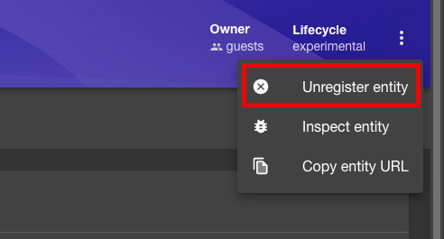

# Product Hands-on Lab - Platform engineering with Backstage

Welcome to this Platform engineering with Backstage Workshop. At its core, platform engineering is about constructing a solid and adaptable groundwork that simplifies and accelerates the development, deployment, and operation of software applications. The goal is to abstract the complexity inherent in managing infrastructure and operational concerns, enabling dev teams to focus on crafting code that adds direct value to the mission.

In order to comprehend real-world situations, you will be testing with serveral different toos and services in several labs. You will be able to learn how to deploy and manage Azure resources, as well as how to use Azure services to build and deploy applications with the help of AKS, GitHub and Backstage. Don't worry; you will be walked through the entire procedure in this step-by-step lab.

This lab leverages the [GitOps Bridge Pattern](https://github.com/gitops-bridge-dev/gitops-bridge?tab=readme-ov-file). The following diagram shows the high-level architecture of the solution from [platformengineering.org](https://platformengineering.org/):


The tools in this lab to build out your Integrated Development Platform (IDP) include:

- [GitHub][GitHub] (as your Git repo)
- [Backstage](https://backstage.io/) (as your self-service portal)
- [ArgoCD](https://argoproj.github.io/cd/) (as your Platform Orchestrator)
- [Argo Workflows](https://argoproj.github.io/workflows/) (to trigger post deployment tasks)
- [Crossplane](https://crossplane.io/)(to provision Azure/GitHub resources)
- [Azure Kubernetes Service (AKS)](http://azure.microsoft.com/services/kubernetes-service/) (as your Control Plane cluster)
- [Azure Key Vault](https://azure.microsoft.com/en-us/services/key-vault/) (to store secrets)
- [Azure Container Registry](https://azure.microsoft.com/en-us/services/container-registry/) (to store container images)

<div class="tip" data-title="Tip">

> All tools in this lab are opinionated and used to show how to build out an IDP. You can use other tools to build out your IDP.

</div>

If you follow all instructions, you should have your own IDP running by the end of this lab!

## Pre-requisites

Before starting this lab, be sure to set your Azure environment :

- An Azure Subscription with the **Owner** role to create and manage the labs' resources and deploy the infrastructure as code
- Register the Azure providers on your Azure Subscription if not done yet: `Microsoft.ContainerService`,
`Microsoft.Network`,
`Microsoft.Storage`,
`Microsoft.Compute`,
`Microsoft.AppPlatform`,
`Microsoft.App`,
`Microsoft.KeyVault`,

To be able to do the lab content you will also need:

- Basic understanding of Azure resources which includes Azure Kubernetes Service (AKS), Azure Container Registry (ACR), Azure Key Vault.
- Basic understanding of Terraform and how to deploy resources using Terraform.
- Basic understanding of GitHub and how to create a GitHub App.
- Basic understanding of Backstage and how to deploy and configure Backstage.
- Basic understanding of Docker and how to create a Docker image.
- Basic understanding of Kubernetes and how to deploy applications to Kubernetes with ArgoCD and Crossplane.
- A [Github account][github-account] (Free, Team or Enterprise)
- Create a [fork][repo-fork] of the repository from the main branch to help you keep track of your potential changes

2 development options are available:

- 🥈 **Preferred method** : Local Devcontainer
- 🥉 Local Dev Environment with all the prerequisites detailed below

<div class="tip" data-title="Tips">

> To focus on the main purpose of the lab, we encourage the usage of devcontainers as they abstract the dev environment configuration, and avoid potential local dependencies conflict.
> You could decide to run everything without relying on a devcontainer : To do so, make sure you install all the prerequisites detailed below.

</div>

### 🥈 : Using a local Devcontainer

This repo comes with a Devcontainer configuration that will let you open a fully configured dev environment from your local Visual Studio Code, while still being completely isolated from the rest of your local machine configuration : No more dependency conflict.
Here are the required tools to do so :

- [Git client](https://git-scm.com/downloads)
- [Docker Desktop][docker-desktop] running
- [Visual Studio Code][vs-code] installed

Start by cloning the Hands-on Lab [Platform engineering with BackStage repo][repo-clone] you just forked on your local Machine and open the local folder in Visual Studio Code.
Once you have cloned the repository locally, make sure Docker Desktop is up and running and open the cloned repository in Visual Studio Code.  

You will be prompted to open the project in a Dev Container. Click on `Reopen in Container`.

If you are not prompted by Visual Studio Code, you can open the command palette (`Ctrl + Shift + P`) and search for `Reopen in Container` and select it:


### 🥉 : Using your own local environment

The following tools and access will be necessary to run the lab in good conditions on a local environment :  

- [Git client][git-client]
- [Visual Studio Code][vs-code] installed (you will use Dev Containers)
- [Azure CLI][az-cli-install] installed on your machine
- [Terraform][terraform-install] installed, this will be used for deploying the resources on Azure

Once you have set up your local environment, you can clone the Hands-on Lab Platform engineering with BackStage repo you just forked on your machine, and open the local folder in Visual Studio Code and head to the next step.

## 🔑 Sign in to Azure

<div class="task" data-title="Task">

> - Log into your Azure subscription using your pre-configured environment using Azure CLI and on the [Azure Portal][az-portal] using your credentials.

</div>

```bash
# Login to Azure : 
# --tenant : Optional | In case your Azure account has access to multiple tenants

# Option 1 : Local Environment or Dev Container
az login --tenant <yourtenantid or domain.com>
# Option 2 : Github Codespace : you might need to specify --use-device-code parameter to ease the az cli authentication process
az login --use-device-code --tenant <yourtenantid or domain.com>

# Display your account details
az account show
# Select your Azure subscription
az account set --subscription <subscription-id>

# Register the following Azure providers if they are not already

# Azure Key Vault
az provider register --namespace 'Microsoft.KeyVault'
# Azure Container Registry
az provider register --namespace 'Microsoft.ContainerRegistry'
# Azure Kubernetes Service
az provider register --namespace 'Microsoft.ContainerService'
# Azure App Service
az provider register --namespace 'Microsoft.App'
# Azure App Service Environment
az provider register --namespace 'Microsoft.AppPlatform'
# Azure Storage
az provider register --namespace 'Microsoft.Storage'
# Azure Network
az provider register --namespace 'Microsoft.Network'
```

## Create a GitHub Organization

To be able to use GitHub in the lab, you will need to create a GitHub organization.

<div class="tip" data-title="Tip">

> Your team can collaborate on GitHub by using an organization account. Each person that uses GitHub signs into a user account. Multiple user accounts can collaborate on shared projects by joining the same organization account, which owns the repositories. A subset of these user accounts can be given the role of organization owner, which allows those people to granularly manage access to the organization’s resources using sophisticated security and administrative features.

</div>

To create a GitHub organization, follow these steps:

1. Go to GitHub and sign in to your account.
2. In the top right corner of the page, click on your profile picture, and then click on Your organizations.
3. In the top right corner of the page, click on the New organization button.

4. Fill in the following fields:
   - **Organization name:** `Backstage-<your-github-username>`
   - **Billing plan:** Free

5. Click on the **Create organization** button.

### Add People to the Organization

Now that you have created the organization, you will need to add yourself as a member of the organization. After the organization is created, you will be taken to the organization settings page. Here, you will see the **Organization name** and **Organization URL**. Copy these values and save them for later.

1. In the toolbar of the organization, click on **People**.
2. In the **People** section, click on the **Invite member** button.

3. Fill in the following fields:
   - **Email address:** <your email address>
   - **Role:** Owner
4. Click on the **Invite** button.


### Create a Team in the Organization

Finally, you will need to create a team in the organization.

1. In the left sidebar, click on **Teams**.
2. In the **Teams** section, click on the **New Team** button.

3. Fill in the following fields in the **Create a team** form:
   - **Team name:** Platform Engineering Team
   - **Description:** Platform Engineering team  
   - **Visibility:** Visible
   - **Team notifications:** Enabled
4. Click on the **Create Team** button.
5. Add yourself as a member of the team.
5. Fill in the following fields in the **Create a team** form:
   - **Team name:** Team A
   - **Description:** Team A  
   - **Visibility:** Visible
   - **Team notifications:** Enabled
6. Click on the **Create Team** button.
7. Add yourself as a member of the team.

<div class="tip" data-title="Tip">

> You can create multiple teams in the organization. Each team can have its own set of repositories and permissions.

</div>

We have now created a GitHub organization and a team in the organization. We will use this organization and team to manage our GitHub resources.  

[az-portal]: https://portal.azure.com
[github-account]: https://github.com/join
[repo-fork]: https://github.com/azurenoops/pe-backstage-azure-workshop/fork
[repo-clone]: https://github.com/azurenoops/pe-backstage-azure-workshop.git
[vs-code]: https://code.visualstudio.com/
[GitHub]: http://github.com

---

# Lab 1 - Install Backstage as your Internal Development Portal

In this lab, we will initialize the standalone local Backstage app for the moment. [Backstage.io](https://backstage.io/) is a platform to build custom `IDP (Internal Developer Portal)`. Spotify created it to give developers a single pane of glass to manage, develop, and explore the internal software ecosystem. This lab will take approximately `60 minutes` to complete.

Out of the box, Backstage includes:

- **Backstage Software Catalog** for managing all your software (microservices, libraries, data pipelines, websites, ML models, etc.)
- **Backstage Software Templates** for quickly spinning up new projects and standardizing your tooling with your organization’s best practices
- **Backstage TechDocs** for making it easy to create, maintain, find, and use technical documentation, using a “docs-like-code” approach
- **Backstage Kubernetes** helps monitor all our service’s deployments at a glance, even across clusters.
- **Backstage Search** is a universal search for backstage instances that can search against documentation, software templates, software catalogs, and APIs.
- Plus, a growing ecosystem of open-source plugins that further expand Backstage’s customizability and functionality

In the later labs, we will add an external database to it and deploy it to Azure on the Control Plane cluster. As well as, do some configurarion to make it work with Azure and GitHub.

## Step 1 - Validate your Pre-requisites

To get started, you will need to validate you have the following tools:

- [Node.js][nodejs] (LTS version)
- [Yarn][yarn]
- [Docker][docker-desktop]
- [Git][git-client]

[yarn]: https://yarnpkg.com/getting-started/install
[nodejs]: https://nodejs.org/en/download/
[docker-desktop]: https://www.docker.com/products/docker-desktop/
[git-client]: https://git-scm.com/downloads

Now that you cloned the repo, we can set up quickly with your own Backstage project you can create a Backstage App. We will run Backstage locally and configure the app.

A Backstage App is a monorepo setup with `lerna` that includes everything you need to run Backstage in your own environment.

## Step 2 - Create a Backstage App

To install the Backstage app, you need to run create-app from the @backstage package in the npm package registry. You can use npx for this, which, like npm, comes installed with Node.js.

<div class="task" data-title="Task">

> Open VSCode and open a Bash (bash) terminal.

</div>


<div class="task" data-title="Task">

> If the Backstage cli is not installed, you can install it by running the following command, If the cli is already installed, you can skip this step.

</div>

```shell
npm install -g @backstage/cli
``` 

<div class="task" data-title="Task">

> If you are prompted to install the latest version of the Backstage cli, type `y` and hit enter.

</div>

```shell
Need to install the following packages:
@backstage/create-app@0.5.24
Ok to proceed? (y) 
```

</div>

<div class="task" data-title="Task">

> Now, in the PowerShell (pwsh) terminal in VSCode, run the following command:

</div>

```shell
npx @backstage/create-app@latest
```

The wizard will ask you for the name of the app. Here you can enter the name of your Backstage application, which will also be the name of the directory. The default is backstage, which is fine for the purposes of the lab.


<div class="tip" data-title="Tip">

> The name is used for the folder name, so enter a name friendly to folders or a Git repository — perhaps lowercase with dash separators. We’ll configure the application name that appears in the UI separately later.

</div>

This is the output of the command:

```shell
Creating the app...

 Checking if the directory is available:
  checking      backstage ✔ 

 Creating a temporary app directory:

 Preparing files:
  copying       .dockerignore ✔ 
  copying       .eslintignore ✔ 
  templating    .eslintrc.js.hbs ✔ 
  templating    .gitignore.hbs ✔ 
  copying       .prettierignore ✔ 
  copying       README.md ✔ 
  copying       app-config.local.yaml ✔ 
  copying       app-config.production.yaml ✔ 
  templating    app-config.yaml.hbs ✔ 
  templating    backstage.json.hbs ✔ 
  templating    catalog-info.yaml.hbs ✔ 
  copying       lerna.json ✔ 
  templating    package.json.hbs ✔ 
  copying       playwright.config.ts ✔ 
  copying       tsconfig.json ✔ 
  copying       yarn.lock ✔ 
  copying       README.md ✔ 
  copying       entities.yaml ✔ 
  copying       org.yaml ✔ 
  copying       template.yaml ✔ 
  copying       catalog-info.yaml ✔ 
  copying       index.js ✔ 
  copying       package.json ✔ 
  copying       README.md ✔ 
  templating    .eslintrc.js.hbs ✔ 
  copying       Dockerfile ✔ 
  copying       README.md ✔ 
  templating    package.json.hbs ✔ 
  copying       index.test.ts ✔ 
  copying       index.ts ✔ 
  copying       types.ts ✔ 
  copying       app.ts ✔ 
  copying       auth.ts ✔ 
  copying       catalog.ts ✔ 
  copying       proxy.ts ✔ 
  copying       scaffolder.ts ✔ 
  templating    search.ts.hbs ✔ 
  copying       techdocs.ts ✔ 
  copying       .eslintignore ✔ 
  templating    .eslintrc.js.hbs ✔ 
  templating    package.json.hbs ✔ 
  copying       android-chrome-192x192.png ✔ 
  copying       apple-touch-icon.png ✔ 
  copying       favicon-16x16.png ✔ 
  copying       favicon-32x32.png ✔ 
  copying       favicon.ico ✔ 
  copying       index.html ✔ 
  copying       manifest.json ✔ 
  copying       robots.txt ✔ 
  copying       safari-pinned-tab.svg ✔ 
  copying       app.test.ts ✔ 
  copying       App.test.tsx ✔ 
  copying       App.tsx ✔ 
  copying       apis.ts ✔ 
  copying       index.tsx ✔ 
  copying       setupTests.ts ✔ 
  copying       LogoFull.tsx ✔ 
  copying       LogoIcon.tsx ✔ 
  copying       Root.tsx ✔ 
  copying       index.ts ✔ 
  copying       EntityPage.tsx ✔ 
  copying       SearchPage.tsx ✔ 

 Moving to final location:
  moving        backstage ✔ 

 Installing dependencies:
  determining   yarn version ✔ 
  executing     yarn install ✔ 
  executing     yarn tsc ✔ 

🥇  Successfully created backstage


 All set! Now you might want to:
  Run the app: cd backstage && yarn dev
  Set up the software catalog: https://backstage.io/docs/features/software-catalog/configuration
  Add authentication: https://backstage.io/docs/auth/
```

This will create a new Backstage app in a folder called `backstage` in your root project directory with the same name, copy several files, and run yarn install to install any dependencies for the project.

The create-app script will go through a few steps of creating the directory, copying files, then building the Backstage app. The last step installs package dependencies and compiles the app, so this may take a few minutes. You should now have a new directory called `backstage` in your root directory, which contains following files and
folders:

```shell
backstage/
├── README.md
├── app-config.local.yaml
├── app-config.production.yaml
├── app-config.yaml
├── backstage.json
├── catalog-info.yaml
├── dist-types
│   ├── packages
│   └── tsconfig.tsbuildinfo
├── examples
│   ├── entities.yaml
│   ├── org.yaml
│   └── template
├── lerna.json
├── package.json
├── packages
│   ├── README.md
│   ├── app
│   └── backend
├── playwright.config.ts
├── plugins
│   └── README.md
├── tsconfig.json
└── yarn.lock
```

* **app-config.yaml**: Main configuration file for the app.
* **catalog-info.yaml**: Catalog Entities descriptors.
* **lerna.json**: Contains information about workspaces and other lerna configuration needed for the monorepo setup.
* **package.json**: Root package.json for the project. Note: Be sure that you don't add any npm dependencies here as
  they
  probably should be installed in the intended workspace rather than in the root.
* **packages/**: Lerna leaf packages or "workspaces". Everything here is going to be a separate package, managed by
  lerna.
* **packages/app/**: An fully functioning Backstage frontend app, that acts as a good starting point for you to get to
  know
  Backstage.
* **packages/backend/**: The backend for Backstage. This is where you can add your own backend logic.
* **playwright.config.ts**: Configuration file for Playwright, a testing framework for web applications.
* **tsconfig.json**: TypeScript configuration file.
* **yarn.lock**: Yarn lock file for the project.
* **README.md**: Readme file for the project.
* **examples/**: Contains example entities and templates for the catalog.
* **plugins/**: Contains plugins for the app.

<div class="task" data-title="Task">

> Open the `backstage` directory in VSCode.

</div>

This is what the directory structure should look like in VSCode:


## Step 3 - Run Backstage

As soon as the app is created, start by running the app.

<div class="task" data-title="Task">

>Run the app by typing `yarn dev`

</div>

```shell
yarn dev
```

This may take a little while. When successful, the message webpack compiled successfully will appear in your terminal.

```shell
########### Output of the command ################
➜ cd backstage && yarn dev
yarn run v1.22.19
$ concurrently "yarn start" "yarn start-backend"
$ yarn workspace backend start
$ yarn workspace app start
$ backstage-cli package start
$ backstage-cli package start
[0] Loaded config from app-config.yaml
[0] <i> [webpack-dev-server] Project is running at:
[0] <i> [webpack-dev-server] Loopback: http://localhost:3000/, http://[::1]:3000/
[0] <i> [webpack-dev-server] Content not from webpack is served from '/Users/susovanpanja/work/medium/backstage/athena/packages/app/public' directory
[0] <i> [webpack-dev-server] 404s will fallback to '/index.html'
[0] <i> [webpack-dev-middleware] wait until bundle finished: /

... # Redacted full log
```

The yarn dev command will run both the frontend and backend as separate processes (named [0] and [1]) in the same
window. When the command finishes running, it should open up a browser window displaying your app. If not, you can open
a browser and directly navigate to the frontend at `http://localhost:3000`.

In a standard installation, Backstage doesn’t use any kind of authentication. Instead, a guest identity is created, and all users share this identity. This means that anyone with access to the URL of your installation can go in and make changes. And because all users share the same identity, it’s impossible to know who made those changes and why.


<div class="tip" data-title="Tip">

> Depending on how many times you use the app, the app may login automaticaly where you will not see the `Guest login`. In later labs, we will add authentication to the app.

</div>

When you click `Enter`, It should open up a new tab in the browser and should look like this (it will take some time to load the UI):


The application is prefilled with demo data, so you can start exploring right away.

## Step 4 - Configure Backstage

Let's have a look on some of the values in the different files and change them to your needs. The main Backstage configuration file, **`app-config.yaml`** in the root directory of your `Backstage` app. `Backstage` also supports environment-specific configuration overrides, by way of an **`app-config.<environment>.yaml`** file such as **`app-config.local.yaml`** for local developement.

To make it a bit cleaner for local development, we will copy the contents from **`app-config.yaml`** to **`app-config.local.yaml`** in the root directory of your `Backstage` app. This file will contain all the configuration settings for your `Backstage` app, including the organization name, the app title, and the backend URL.

<div class="task" data-title="Task">

> Open the **`app-config.yaml`** file in the root directory of your Backstage app, and copy the contents to **`app-config.local.yaml`** file.

</div>

In the end, you should be left with two files like shown below:

```yaml
app-config.yaml
# Backstage override configuration for your local development environment
app:
  title: Scaffolded Backstage App
  baseUrl: http://localhost:3000

organization:
  name: My Company

backend:
  # Used for enabling authentication, secret is shared by all backend plugins
  # See https://backstage.io/docs/auth/service-to-service-auth for
  # information on the format
  # auth:
  #   keys:
  #     - secret: ${BACKEND_SECRET}
  baseUrl: http://localhost:7007
  listen:
    port: 7007
    # Uncomment the following host directive to bind to specific interfaces
    # host: 127.0.0.1
  csp:
    connect-src: ["'self'", 'http:', 'https:']
    # Content-Security-Policy directives follow the Helmet format: https://helmetjs.github.io/#reference
    # Default Helmet Content-Security-Policy values can be removed by setting the key to false
  cors:
    origin: http://localhost:3000
    methods: [GET, HEAD, PATCH, POST, PUT, DELETE]
    credentials: true
  # This is for local development only, it is not recommended to use this in production
  # The production database configuration is stored in app-config.production.yaml
  database:
    client: better-sqlite3
    connection: ':memory:'
  # workingDirectory: /tmp # Use this to configure a working directory for the scaffolder, defaults to the OS temp-dir

integrations:
  github:
    - host: github.com
      # This is a Personal Access Token or PAT from GitHub. You can find out how to generate this token, and more information
      # about setting up the GitHub integration here: https://backstage.io/docs/integrations/github/locations#configuration
      token: ${GITHUB_TOKEN}
    ### Example for how to add your GitHub Enterprise instance using the API:
    # - host: ghe.example.net
    #   apiBaseUrl: https://ghe.example.net/api/v3
    #   token: ${GHE_TOKEN}

proxy:
  ### Example for how to add a proxy endpoint for the frontend.
  ### A typical reason to do this is to handle HTTPS and CORS for internal services.
  # endpoints:
  #   '/test':
  #     target: 'https://example.com'
  #     changeOrigin: true

# Reference documentation http://backstage.io/docs/features/techdocs/configuration
# Note: After experimenting with basic setup, use CI/CD to generate docs
# and an external cloud storage when deploying TechDocs for production use-case.
# https://backstage.io/docs/features/techdocs/how-to-guides#how-to-migrate-from-techdocs-basic-to-recommended-deployment-approach
techdocs:
  builder: 'local' # Alternatives - 'external'
  generator:
    runIn: 'docker' # Alternatives - 'local'
  publisher:
    type: 'local' # Alternatives - 'googleGcs' or 'awsS3'. Read documentation for using alternatives.

auth:
  # see https://backstage.io/docs/auth/ to learn about auth providers
  providers:
    # See https://backstage.io/docs/auth/guest/provider
    guest: {}

scaffolder:
  # see https://backstage.io/docs/features/software-templates/configuration for software template options

catalog:
  import:
    entityFilename: catalog-info.yaml
    pullRequestBranchName: backstage-integration
  rules:
    - allow: [Component, System, API, Resource, Location]
  locations:
    # Local example data, file locations are relative to the backend process, typically `packages/backend`
    - type: file
      target: ../../examples/entities.yaml

    # Local example template
    - type: file
      target: ../../examples/template/template.yaml
      rules:
        - allow: [Template]

    # Local example organizational data
    - type: file
      target: ../../examples/org.yaml
      rules:
        - allow: [User, Group]

    ## Uncomment these lines to add more example data
    # - type: url
    #   target: https://github.com/backstage/backstage/blob/master/packages/catalog-model/examples/all.yaml

    ## Uncomment these lines to add an example org
    # - type: url
    #   target: https://github.com/backstage/backstage/blob/master/packages/catalog-model/examples/acme-corp.yaml
    #   rules:
    #     - allow: [User, Group]
  # Experimental: Always use the search method in UrlReaderProcessor.
  # New adopters are encouraged to enable it as this behavior will be the default in a future release.
  useUrlReadersSearch: true

kubernetes:
  # see https://backstage.io/docs/features/kubernetes/configuration for kubernetes configuration options

# see https://backstage.io/docs/permissions/getting-started for more on the permission framework
permission:
  # setting this to `false` will disable permissions
  enabled: true

   ```

```yaml
app-config.local.yaml
# Backstage override configuration for your local development environment
app:
  title: Scaffolded Backstage App
  baseUrl: http://localhost:3000

organization:
  name: My Company

backend:
  # Used for enabling authentication, secret is shared by all backend plugins
  # See https://backstage.io/docs/auth/service-to-service-auth for
  # information on the format
  # auth:
  #   keys:
  #     - secret: ${BACKEND_SECRET}
  baseUrl: http://localhost:7007
  listen:
    port: 7007
    # Uncomment the following host directive to bind to specific interfaces
    # host: 127.0.0.1
  csp:
    connect-src: ["'self'", 'http:', 'https:']
    # Content-Security-Policy directives follow the Helmet format: https://helmetjs.github.io/#reference
    # Default Helmet Content-Security-Policy values can be removed by setting the key to false
  cors:
    origin: http://localhost:3000
    methods: [GET, HEAD, PATCH, POST, PUT, DELETE]
    credentials: true
  # This is for local development only, it is not recommended to use this in production
  # The production database configuration is stored in app-config.production.yaml
  database:
    client: better-sqlite3
    connection: ':memory:'
  # workingDirectory: /tmp # Use this to configure a working directory for the scaffolder, defaults to the OS temp-dir

integrations:
  github:
    - host: github.com
      # This is a Personal Access Token or PAT from GitHub. You can find out how to generate this token, and more information
      # about setting up the GitHub integration here: https://backstage.io/docs/integrations/github/locations#configuration
      token: ${GITHUB_TOKEN}
    ### Example for how to add your GitHub Enterprise instance using the API:
    # - host: ghe.example.net
    #   apiBaseUrl: https://ghe.example.net/api/v3
    #   token: ${GHE_TOKEN}

proxy:
  ### Example for how to add a proxy endpoint for the frontend.
  ### A typical reason to do this is to handle HTTPS and CORS for internal services.
  # endpoints:
  #   '/test':
  #     target: 'https://example.com'
  #     changeOrigin: true

# Reference documentation http://backstage.io/docs/features/techdocs/configuration
# Note: After experimenting with basic setup, use CI/CD to generate docs
# and an external cloud storage when deploying TechDocs for production use-case.
# https://backstage.io/docs/features/techdocs/how-to-guides#how-to-migrate-from-techdocs-basic-to-recommended-deployment-approach
techdocs:
  builder: 'local' # Alternatives - 'external'
  generator:
    runIn: 'docker' # Alternatives - 'local'
  publisher:
    type: 'local' # Alternatives - 'googleGcs' or 'awsS3'. Read documentation for using alternatives.

auth:
  # see https://backstage.io/docs/auth/ to learn about auth providers
  providers:
    # See https://backstage.io/docs/auth/guest/provider
    guest: {}

scaffolder:
  # see https://backstage.io/docs/features/software-templates/configuration for software template options

catalog:
  import:
    entityFilename: catalog-info.yaml
    pullRequestBranchName: backstage-integration
  rules:
    - allow: [Component, System, API, Resource, Location]
  locations:
    # Local example data, file locations are relative to the backend process, typically `packages/backend`
    - type: file
      target: ../../examples/entities.yaml

    # Local example template
    - type: file
      target: ../../examples/template/template.yaml
      rules:
        - allow: [Template]

    # Local example organizational data
    - type: file
      target: ../../examples/org.yaml
      rules:
        - allow: [User, Group]

    ## Uncomment these lines to add more example data
    # - type: url
    #   target: https://github.com/backstage/backstage/blob/master/packages/catalog-model/examples/all.yaml

    ## Uncomment these lines to add an example org
    # - type: url
    #   target: https://github.com/backstage/backstage/blob/master/packages/catalog-model/examples/acme-corp.yaml
    #   rules:
    #     - allow: [User, Group]
  # Experimental: Always use the search method in UrlReaderProcessor.
  # New adopters are encouraged to enable it as this behavior will be the default in a future release.
  useUrlReadersSearch: true

kubernetes:
  # see https://backstage.io/docs/features/kubernetes/configuration for kubernetes configuration options

# see https://backstage.io/docs/permissions/getting-started for more on the permission framework
permission:
  # setting this to `false` will disable permissions
  enabled: true

```

### Change the Organization Name

<div class="task" data-title="Task">

> Open the **`app-config.local.yaml`** file in the root directory of your `Backstage` app (create if it doesn't exist), and change the organization name to a name of your choice.

</div>

```yaml
organization:
  name: <your organization name>
```

<div class="tip" data-title="Tips">

> The default .gitignore file created with the app excludes *.local.yaml from source control for you, so you can add passwords or tokens directly into the app-config.local.yaml.

</div>

Because we are still in the development mode, any changes to the **`app-config.local.yaml`** file will be reflected in the app as soon as you save the file. You can see the changes in the browser window.

<div class="warning" data-title="Warning">

> If you do not see the changes in the browser window, try to refresh the page.

</div>

### Clearing Out Sample Data

After we change the org name, we are left with a Backstage App with sample data (entities) that we clearly do not want to carry forward.

The first steps are to delete the two Components that we created: `demo and tutorial`. We do this by navigating to the component and using the menu (upper-right) item Unregister entity.



One interesting side effect of unregistering the Components is that the associated Location Entities (URLs) are also unregistered.


For completeness, we delete the GitHub Repository backing the tutorial Component.

At this point, however, we still have the initial sample data (entities) in our `Backstage` App. To get rid of most of the sample data (we will leave the Documentation Template Template in place for now), we update `app-config.yaml` as follows and delete the `catalog-info.yaml` file in the root directory.

```yaml
catalog:
  locations:
    - type: url
      target: https://github.com/backstage/software-templates/blob/main/scaffolder-templates/docs-template/template.yaml
      rules:
        - allow: [Template]
```

Starting the `Backstage` App with these changes, we can see that the sample data is no longer present; include Users and Groups. At this point there are only two entities: the **Documentation Template Template** and the **Location** associated with it.


## Step 5 - Create a GitHub App

To be able to use GitHub in the lab, you must create either a GitHub App or an OAuth App from the GitHub [developer settings](https://github.com/settings/developers). We will use the `backstage-cli` to create a GitHub App. This gives us a way to automate some of the work required to create a GitHub app.

### Create Environment Variables

Since we are using Backstage locally, secrets are used in the `app-config.local.yaml` file. This file is not checked into source control, so you can safely store your secrets here. In this lab, we will use `environments.sh` to manage our secrets.

<div class="task" data-title="Task">

> Create a `environments.sh` file in the root directory of your Backstage app.

</div>


<div class="task" data-title="Task">

> Now, add it to the `.gitignore` file in the same folder

</div>


This file will contain all the secrets for your local Backstage app, including the GitHub Client ID and Client Secret.

We can set the environment variables and start the Backstage App using the following commands.

```shell
$ source environments.sh
$ yarn dev
```

Going forward, when we start the Backstage App, we will use these commands. Now, let's create the GitHub App.

#### Using the CLI (public GitHub only)

To create an OAuth App on GitHub in your Organization, follow these steps:

You can use the backstage-cli to create a GitHub App using a manifest file that we provide. This gives us a way to automate some of the work required to create a GitHub app.

```shell
yarn backstage-cli create-github-app <github org>
```

This command will guide you through the process of creating a GitHub App.

<div class="tip" data-title="Tip">

> You can also create a GitHub App using the GitHub UI. This is a good option if you are not comfortable using the command line.

</div>

<div class="task" data-title="Task">
 
> You will be asked to provide the following information:
</div>

```shell
Select 'A' for all permissions.
```


A new window will open in your browser where you can create the GitHub App.

<div class="tip" data-title="Tip">

> You will get a login prompt. Log in to your GitHub account.

</div>

<div class="task" data-title="Task">
 
> Fill in the form with the following values:
</div>

```shell
GitHub App name: Backstage-'<'your org name'>'
```


Once you've gone through the CLI command, it should produce a YAML file in the root of the project which you can then use as an include in your `github-app-config.yaml`.


<div class="task" data-title="Task">

> Open the `github-app-config.yaml` file in the root directory of your Backstage app, and copy the contents to `environments.sh` file using the PWSH cmd prompt.

</div>

```shell
export "GITHUB_APP_ID=<your-github-app-id>" & echo "GITHUB_APP_ID=<your-github-app-id>" >> environments.sh
export "GITHUB_CLIENT_ID=<your-github-client-id>" & echo "GITHUB_APP_PRIVATE_KEY=<your-github-app-private-key>" >> environments.sh
export "GITHUB_CLIENT_SECRET=<your-github-client-secret>" & echo "GITHUB_CLIENT_SECRET=<your-github-client-secret>" >> environments.sh
```

<div class="tip" data-title="Tip">

> You will get errors if you do not have the `GITHUB_APP_ID`, `GITHUB_CLIENT_ID`, and `GITHUB_CLIENT_SECRET` in your `environments.sh` file and you have not exported them.

</div>

<div class="task" data-title="Task">

> You can delete the `github-app-config.yaml` file. We will use the `environments.sh` file to manage our secrets.

</div>

### Configuring GitHub App permissions

Next, we need to conmfigure permissions on our GitHub App. The GitHub App permissions can be configured in the GitHub App settings. Which is located at `https://github.com/organizations/{ORG}/settings/apps/{APP_NAME}/permissions` or clicking on the `Permissions & events` tab in the GitHub App settings.

<div class="task" data-title="Task">

> In the GitHub App settings, click on the `App Settings` button at the top right corner of the page.

</div>


<div class="task" data-title="Task">

> In the GitHub App settings, click on the `Permissions & events` tab.

</div>


<div class="task" data-title="Task">

> Add the permissions required for the GitHub App to work with Backstage are:

</div>

**Repository permissions:**

- **Contents:** Read-only
- **Commit statuses:** Read-only

**Organization permissions:**

- **Members:** Read-only

**Account permissions:**

- **Administration:** Read & write (for creating repositories)
- **Contents:** Read & write
- **Metadata:** Read-only
- **Pull requests:** Read & write
- **Issues:** Read & write
- **Workflows:** Read & write
- **Variables:** Read & write
- **Secrets:** Read & write
- **Environments:** Read & write

<div class="tip" data-title="Tip">

> App permissions is not managed by Backstage. They’re created with some simple default permissions which you are free to change as you need, but you will need to update them in the GitHub web console, not in Backstage right now. The permissions that are defaulted are metadata:read and contents:read.

</div>

## Step 6 - Add GitHub Authentication to Backstage

There are multiple authentication providers available for you to use with Backstage. In this section of the lab, we will add GitHub authentication to Backstage. This will allow users to sign in to Backstage using GitHub authentication provider that can authenticate users using GitHub or GitHub Enterprise OAuth.

<div class="tip" data-title="Tip">

> We are using GitHub authentication provider for the lab. You can use other authentication providers as well, such as Google, Microsoft Entra ID, and Okta.

</div>

<div class="task" data-title="Task">

> Open the `app-config.local.yaml` file in the root directory of your Backstage app, and add the following configuration to the `auth` section.

</div>

```yaml
auth:
  environment: development
  providers:
    github:
      development:
        clientId: ${GITHUB_CLIENT_ID}
        clientSecret: ${GITHUB_CLIENT_SECRET}
        ## uncomment if using GitHub Enterprise
        # enterpriseInstanceUrl: ${GITHUB_ENTERPRISE_INSTANCE_URL}
        ## uncomment to set lifespan of user session
        # sessionDuration: { hours: 24 } # supports `ms` library format (e.g. '24h', '2 days'), ISO duration, "human duration" as used in code
        signIn:
          resolvers:
            # See https://backstage.io/docs/auth/github/provider#resolvers for more resolvers
            - resolver: usernameMatchingUserEntityName
```

This configuration will add GitHub authentication to Backstage.

<div class="tip" data-title="Tip">

> The clientId and clientSecret are the values that you copied to the `environment.sh` file. The `${}` syntax is used to reference the environment variables in the `environment.sh` file.

</div>

The GitHub Auth provider is a structure with these configuration keys:

- **clientId:** The client ID that you generated on GitHub, e.g. b59241722e3c3b4816e2
- **clientSecret:** The client secret tied to the generated client ID.
- **enterpriseInstanceUrl (optional):** The base URL for a GitHub Enterprise instance, e.g. https://ghe.<company>.com. Only needed for GitHub Enterprise.
- **callbackUrl (optional):** The callback URL that GitHub will use when initiating an OAuth flow, e.g. https://your-intermediate-service.com/handler. Only needed if Backstage is not the immediate receiver (e.g. one OAuth app for many backstage instances).
- **signIn:** The configuration for the sign-in process, including the resolvers that should be used to match the user from the auth provider with the user entity in the Backstage catalog (typically a single resolver is sufficient).

#### GitHub Resolvers

This provider includes several resolvers out of the box that you can use:

- **emailMatchingUserEntityProfileEmail:** Matches the email address from the auth provider with the User entity that has a matching spec.profile.email. If no match is found it will throw a NotFoundError.
- **emailLocalPartMatchingUserEntityName:** Matches the local part of the email address from the auth provider with the User entity that has a matching name. If no match is found it will throw a NotFoundError.
- **usernameMatchingUserEntityName:** Matches the username from the auth provider with the User entity that has a matching name. If no match is found it will throw a NotFoundError.

<div class="tip" data-title="Tip">

> If you want to more about resolvers, you can check the [documentation](https://backstage.io/docs/auth/github/provider#resolvers).

</div>

### Add Backend Installation

We need to install the backend module for GitHub authentication. This module is not installed by default, therefore you have to add **@backstage/plugin-auth-backend-module-github-provider** to your backend package.

<div class="task" data-title="Task">

> We will first need to install the package by running this command from your Backstage root directory:

</div>

```typescript
yarn --cwd packages/backend add @backstage/plugin-auth-backend-module-github-provider
```

<div class="task" data-title="Task">

> Then we will need to this line in the backend `packages/backend/src/index.ts` file in the backstage root directory:

</div>

```typescript
backend.add(import('@backstage/plugin-auth-backend-module-github-provider'));
```

### Adding the GitHub provider to the Backstage frontend

We need to add the GitHub provider to the Backstage frontend. This will allow users to sign in to Backstage using GitHub authentication provider that can authenticate users using GitHub or GitHub Enterprise OAuth.

<div class="task" data-title="Task">

> We will first need to install the package by running this command from packages/app/src/App.tsx:

</div>

```typescript
import { githubAuthApiRef } from '@backstage/core-plugin-api';

const app = createApp({
 components: {
    SignInPage: props => (
      <SignInPage
        {...props}
        auto
        provider={{
          id: 'github-auth-provider',
          title: 'GitHub',
          message: 'Sign in using GitHub',
          apiRef: githubAuthApiRef,
        }}
      />
    ),
  },
  // ..
});
```

<div class="tip" data-title="Tip">  

> You can configure sign-in to use a redirect flow with no pop-up by adding enableExperimentalRedirectFlow: true to the root of your app-config.yaml

</div>

### Validate GitHub Login

Now if you have done everything correctly,, that you have added the GitHub authentication to your Backstage app, you can validate the app by running the app.

<div class="task" data-title="Task">

> Run the following command from your **Backstage root directory**:
</div>

```shell
yarn dev
```

This will start the Backstage app and open a new tab in your browser. You should see the Backstage app with the GitHub authentication provider.


Accept the permissions and you should be redirected to the Backstage app.


After the accepting the permissions, you should see the Backstage app could not find any entities. This is because we have not added any entities to the Backstage app yet.


We will add entities and organization data to the Backstage app in the next step.

## Step 7 - Add GitHub Org Data

In this step, we will add GitHub Org data to Backstage. This will allow users to see the GitHub Org data in Backstage.

We will use an GitHub PAT (Personal Access Token) to access the GitHub API on behalf of the user. This is used to create a new user in Backstage if the user does not exist. 

### Create a GitHub PAT

To be able to use GitHub in the lab, you will need to create a GitHub Personal Access Token (PAT) with the following scopes:

- `repo` (Full control of private repositories)
- `workflow` (Update GitHub Action workflow files)
- `read:org` (Read-only access to organization, teams, and membership)
- `write:org` (Read and write access to organization membership, organization projects, and team membership)
- `admin:org` (Read and write access to organization membership, organization projects, and team membership)
- `admin:public
_key` (Full control of user public keys)
- `admin:repo_hook` (Full control of repository hooks)
- `admin:org_hook` (Full control of organization hooks)

In GitHub, in the top right corner, click on your profile image, and then select Settings. On the left sidebar, select Developer settings > Personal access tokens > Fine-grained tokens, select Generate new token.

On the New fine-grained personal access token page, provide the following information:

Set a descriptive name for the token, an expiration date to 30 days, and select the following permissions:

In Repository access select All repositories, then expand Repository permissions, and for Contents, from the Access list, select Read Only.

Then click on Generate token. If you need more information on this mechanism you can refer to the official documentation.

### Add the GitHub PAT to your environment

<div class="task" data-title="Task">

> Open the `environment.sh` file in the root directory of your Backstage app, and add the following configuration to the `environment.sh` file.
</div>

```shell
echo "GITHUB_TOKEN=<your-github-pat>" >> environment.sh
export "GITHUB_TOKEN=<your-github-pat>"
```

This will add the GitHub PAT to your environment.

### Add the GitHub PAT to Backstage

Now, we will add the GitHub PAT to the Backstage app configuration.

<div class="task" data-title="Task">

> Open the `app-config.local.yaml` file in the root directory of your Backstage app, and add the following configuration to the `integrations` section.
</div>

```yaml
integrations:
  github:
    - host: github.com
      # This is a Personal Access Token or PAT from GitHub. You can find out how to generate this token, and more information
      # about setting up the GitHub integration here: https://backstage.io/docs/integrations/github/locations#configuration
      token: ${GITHUB_TOKEN}
```

This will add the GitHub PAT to Backstage.

<div class="tip" data-title="Tip">

> Please note that the credentials file is highly sensitive and should NOT be checked into any kind of version control. Instead use your preferred secure method of distributing secrets.

</div>

### Add GitHub Org Data to Backstage

Now, we will add GitHub Org data to Backstage. This will allow users to see the GitHub Org data in Backstage.

<div class="task" data-title="Task">

> Start by installing the GitHub Org plugin by running the following command from your Backstage root directory:
</div>

```shell
yarn --cwd packages/backend add @backstage/plugin-catalog-backend-module-github-org
```

<div class="task" data-title="Task">

> Then we will need to this line in the backend `packages/backend/src/index.ts` file in the backstage root directory:
</div>

```typescript
backend.add(import('@backstage/plugin-catalog-backend-module-github-org'));
```

<div class="task" data-title="Task">

> Open the `app-config.local.yaml` file in the root directory of your Backstage app, and add the following configuration to the `catalog` section.

</div>

```yaml
catalog:
  providers:
    githubOrg:
      id: development
      githubUrl: https://github.com
      orgs: ['<Your GitHub Org>']
      schedule:
        initialDelay: { seconds: 30 }
        frequency: { hours: 1 }
        timeout: { minutes: 50 }
```

Next, we will update the entities.yaml file in the examples directory to include the GitHub Org data.

<div class="task" data-title="Task">

> Open the `examples/org.yaml` file in the root directory of your Backstage app, and add the following configuration to the `org.yaml` file.

</div>

```yaml
---
# https://backstage.io/docs/features/software-catalog/descriptor-format#kind-group
apiVersion: backstage.io/v1alpha1
kind: Group
metadata:
  name: Platform Engineering
spec:
  type: team
  children: []
---
# https://backstage.io/docs/features/software-catalog/descriptor-format#kind-user
apiVersion: backstage.io/v1alpha1
kind: User
metadata:
  name: <your-github-username>
spec:
  memberOf: [Platform Engineering]
---
```

### Validate GitHub Org Data

Now, we will validate the GitHub Org data in Backstage.

<div class="task" data-title="Task">

> Run the following command from your **Backstage root directory**:

</div>

```shell
yarn dev
```

This will start the Backstage app and open a new tab in your browser. You should see the Backstage app with the GitHub Org data.


You have completed the first lab. You have created a new Backstage app, explored the app, configured the app, and added GitHub authentication to Backstage. You have also added GitHub Org data to Backstage.

In the next lab, we will deploy the Control Plane cluster on Azure Kubernetes Service (AKS) using Terraform.

---

# Lab 2 - Deploy Control Plane cluster on Azure

In this lab, we will deploy the Control Plane cluster on Azure Kubernetes Service (AKS). We will use Terraform to define the infrastructure as code for the deployment of Backstage on Azure. This lab will take approximately 30 minutes to complete.

## Step 1 - Validate your Pre-requisites

To get started, you will need to validate you have the following tools:

- [Terraform][terraform-install]
- [Azure CLI][az-cli-install]
- [kubectl][kubectl-install]
- [Helm][helm-install]

[az-cli-install]: https://learn.microsoft.com/en-us/cli/azure/install-azure-cli
[terraform-install]: https://learn.hashicorp.com/tutorials/terraform/install-cli
[kubectl-install]: https://kubernetes.io/docs/tasks/tools/install-kubectl-linux/
[helm-install]: https://helm.sh/docs/intro/install/


## Step 2 - Provision the Control Plane Cluster

With the repository that you cloned in Lab 1, it comes with a pre-defined Terraform code and configuration. The code is located in the `terraform/aks` folder. The Terraform files contains all resources you need, including an AKS cluster, Crossplane, and ArgoCD.

<div class="task" data-title="Task">

> To provision the Control Plane cluster, run the following command from your **Backstage root directory**:

</div>

```shell
cd terraform/aks
```

<div class="task" data-title="Task">

> Then run the following command to initialize Terraform:

</div>

```shell
terraform init
```

<div class="task" data-title="Task">

> Then run the following command to validate the Terraform configuration:

</div>

```shell
terraform validate
```

<div class="task" data-title="Task">

> Then run the following command to plan the Terraform configuration:

</div>

```shell
terraform plan -var gitops_addons_org=https://github.com/azurenoops -var infrastructure_provider=crossplane 
```

<div class="task" data-title="Task">

> Then run the following command to apply the Terraform configuration:

</div>

```shell
terraform apply --auto-approve
```

<div class="tip" data-title="Tips">

> Note: This control plane uses the `Application of Applications` pattern using GitOps and Crossplane. The `gitops/bootstrap/control-plane/addons` directory contains the ArgoCD application configuration for the addons.

</div>

Terraform completed installing the AKS cluster, installing ArgoCD, and configuring ArgoCD to install applications under the `gitops/bootstrap/control-plane/addons` directory from the git repo.


Now that the AKS cluster is provisioned, you can access the ArgoCD UI to manage the applications deployed on the cluster. This will show you the status of the applications deployed on the cluster and allow you to manage the applications.

## Step 3 - Validate the Cluster is working

To access the AKS cluster, you need to set the KUBECONFIG environment variable to point to the kubeconfig file generated by Terraform.

<div class="task" data-title="Task">

> To set the KUBECONFIG environment variable, run the following command:

</div>

```shell
export KUBECONFIG=<your_path_to_this_repo>/pe-backstage-azure-workshop/terraform//aks/kubeconfig
echo $KUBECONFIG
```

To run the following commands, you will need to have the a bash shell installed on your machine. If you are using Windows, you can use the Windows Subsystem for Linux (WSL) to run the commands.

<div class="task" data-title="Task">
 
> To validate that the cluster is working, you can run the following command to get the list of pods running on the cluster

</div>

```shell
kubectl get pods --all-namespaces
```
You should see the following pods running on the cluster:

```shell
NAMESPACE           NAME                                                              READY   STATUS    RESTARTS          AGE
argo-events         argo-events-controller-manager-654f58ccbb-r6z4p                   1/1     Running   0                 46h
argo-rollouts       argo-rollouts-69566b6478-ljn89                                    1/1     Running   0                 46h
argo-rollouts       argo-rollouts-69566b6478-sxr96                                    1/1     Running   0                 46h
argo-workflows      argo-workflows-server-c7cdc656c-ccg5w                             1/1     Running   0                 46h
argo-workflows      argo-workflows-workflow-controller-98d946f85-4vmzg                1/1     Running   0                 46h
argocd              argo-cd-argocd-application-controller-0                           1/1     Running   0                 46h
argocd              argo-cd-argocd-applicationset-controller-677fd74987-7rxw7         1/1     Running   0                 46h
argocd              argo-cd-argocd-dex-server-85f5db5458-sldwc                        1/1     Running   0                 46h
argocd              argo-cd-argocd-notifications-controller-6cf884fb7f-g4j4s          1/1     Running   0                 46h
argocd              argo-cd-argocd-redis-6c766746d8-s8smm                             1/1     Running   0                 46h
argocd              argo-cd-argocd-repo-server-7c96b84946-c9t7d                       1/1     Running   0                 46h
argocd              argo-cd-argocd-server-78498f46f6-f8944                            1/1     Running   0                 46h
crossplane-system   crossplane-6b5b8f9549-pf2qd                                       1/1     Running   0                 20h
crossplane-system   crossplane-rbac-manager-bcddfb7-ljzqj                             1/1     Running   0                 20h
crossplane-system   helm-provider-b4cc4c2c8db3-5764597587-vzkjj                       1/1     Running   0                 46h
crossplane-system   kubernetes-provider-63506a3443e0-555885778d-2mdfm                 1/1     Running   0                 46h
crossplane-system   provider-azure-authorization-f895924437f1-79d9475b6c-69l4j        1/1     Running   0                 46h
crossplane-system   provider-azure-compute-7e421911713b-f89ff4bcd-z4sg6               1/1     Running   0                 46h
crossplane-system   provider-azure-containerregistry-cc0ea28bc72c-5bc6c598df-rcv5v    1/1     Running   0                 46h
crossplane-system   provider-azure-containerservice-ff556ea47e39-6d7c5d5496-vkzll     1/1     Running   0                 46h
crossplane-system   provider-azure-insights-fccb10339123-8578d6b4cf-qkn7b             1/1     Running   0                 46h
crossplane-system   provider-azure-keyvault-ecb17f6d99ee-df474c649-g6rmv              1/1     Running   0                 46h
crossplane-system   provider-azure-managedidentity-2eb78f1d31af-78df94999-7l4nh       1/1     Running   0                 46h
crossplane-system   provider-azure-network-f8cbea533640-5555858556-dfn8k              1/1     Running   0                 46h
crossplane-system   provider-azure-operationalinsights-93f88e54a392-5766bc9754r7wwn   1/1     Running   0                 46h
crossplane-system   provider-azure-resources-b3fb49bf7242-566d5796d6-hbr5w            1/1     Running   0                 46h
crossplane-system   provider-azure-storage-054d1eea44b0-7c9bb4f8d8-gj7ft              1/1     Running   0                 46h
crossplane-system   upbound-provider-family-azure-dde405d96fb8-69b848f6ff-dzsdd       1/1     Running   0                 46h
kube-system         ama-metrics-7c58b86db7-htqmt                                      2/2     Running   160 (8m17s ago)   46h
kube-system         ama-metrics-7c58b86db7-zw6fq                                      2/2     Running   160 (8m17s ago)   46h
kube-system         ama-metrics-ksm-5bd68b9c-5tdpv                                    1/1     Running   0                 46h
kube-system         ama-metrics-node-4mtvs                                            2/2     Running   158 (3m32s ago)   46h
kube-system         ama-metrics-operator-targets-78794c6db8-w8hpt                     2/2     Running   2 (46h ago)       46h
kube-system         azure-ip-masq-agent-mknql                                         1/1     Running   0                 20h
kube-system         azure-npm-hg4jf                                                   1/1     Running   0                 46h
kube-system         azure-wi-webhook-controller-manager-566c779d5c-5ghf5              1/1     Running   0                 46h
kube-system         azure-wi-webhook-controller-manager-566c779d5c-hb8sc              1/1     Running   0                 46h
kube-system         cloud-node-manager-rxg9c                                          1/1     Running   0                 46h
kube-system         coredns-659fcb469c-mbp82                                          1/1     Running   0                 20h
kube-system         coredns-659fcb469c-pqk4p                                          1/1     Running   0                 20h
kube-system         coredns-autoscaler-5d468f7bb5-ppvk2                               1/1     Running   0                 46h
kube-system         csi-azuredisk-node-dfw7s                                          3/3     Running   0                 20h
kube-system         csi-azurefile-node-w84ph                                          3/3     Running   0                 20h
kube-system         konnectivity-agent-698c9ffbb8-r672k                               1/1     Running   0                 46h
kube-system         konnectivity-agent-698c9ffbb8-sxgmp                               1/1     Running   0                 46h
kube-system         kube-proxy-z6ldd                                                  1/1     Running   0                 46h
kube-system         metrics-server-5dfc656944-m5pqd                                   2/2     Running   0                 46h
kube-system         metrics-server-5dfc656944-rm2md                                   2/2     Running   0                 46h
kube-system         retina-agent-pw88n                                                1/1     Running   0                 46h
```

## Step 4 - Accessing the Control Plane Cluster and ArgoCD UI

To access the Control Plane cluster, We will use kubectl to access the cluster. You can use the following commands to get the initial admin password, the IP address of the ArgoCD web interface and forward the port to access the ArgoCD UI.

<div class="task" data-title="Task">

> Then you can run the following command to get the initial admin password of the ArgoCD web interface.

</div>

```shell
kubectl get secrets argocd-initial-admin-secret -n argocd --template="{{index .data.password | base64decode}}"
```

<div class="tip" data-title="Tip">

> Make sure you copy the password and save it somewhere. You will need it to log in to the ArgoCD UI.

</div>

When you run the above command, you will get the initial admin password for the ArgoCD UI. You can use this password to log in to the ArgoCD UI.

<div class="task" data-title="Task">

> Then run the following command to get the IP address of the ArgoCD web interface.

</div>

```shell
kubectl get svc -n argocd argo-cd-argocd-server
```

It may take a few minutes for the LoadBalancer to create a public IP for the ArgoCD UI after the Terraform apply. In case something goes wrong and you don't find a public IP, 

<div class="task" data-title="Task">

> Connect to the ArgoCD server doing a port forward with kubectl and access the UI on https://localhost:8080.

</div>

```shell
kubectl port-forward svc/argocd-server -n argocd 8080:443
```

You can now access the ArgoCD UI using the IP address and the initial admin password. You can use the following URL to access the ArgoCD UI:

```shell
https://localhost:8080
```

<div class="tip" data-title="Tips">

> Note: The username for the ArgoCD UI login is `admin`

</div>


Now that you logged in to the ArgoCD UI using the initial admin password. You should see the ArgoCD UI with the list of applications deployed on the cluster.


<div class="tip" data-title="Tips">

> Note: You can ignore the warnings related to deprecated attributes and invalid kubeconfig path.

</div>

Now that you have access to the ArgoCD UI, you can manage the applications deployed on the cluster.

## Step 5 - Adding Backstage to ArgoCD

To view the Kubernetes resources in Backstage, we need to add the Kubernetes plugin to Backstage. This will allow users to see the Kubernetes resources in Backstage.


Next, let's build out paved path templates to be used in Backstage.

---

# Lab 3 - Building Paved Paths with Backstage

In this lab, we will discuss how to implement paved paths in Backstage. Paved paths are predefined paths that provide a set of best practices and configurations for specific types of applications.

Paved paths can be used to create new projects based on predefined templates. These templates can include configuration files, code snippets, and other resources that help developers get started quickly with a new project.

## Step 1 - Define the Paved Path

Before we can create a paved path, we need to define the paved path. The paved path is a set of best practices and configurations for a specific type of application.

### Use Case - Onboarding a new team

In this use case, we will define a paved path for onboarding a new team. The paved path will include the following:

- A new GitHub repository for the team
- A new GitHub Actions pipeline for the team
- A new Azure Kubernetes Service (AKS) cluster for the team
- A Software template for onboading a new team

---

# Lab 4 - Everything as Code

In this lab, we will show you how to use Everything as Code in Backstage. **Everything as Code** is a concept that allows you to define your infrastructure, configuration, and application code in a declarative way using code.

We will be doing a couple of things in this lab:

1. Define Infrastructure as Code for deployment of Backstage on Azure
2. Define Configuration as Code for the management of Backstage configuration
3. Define Documentation as Code for the management of Backstage documentation

## Step 1 - Deploying Backstage to AKS with Infrastructure as Code

In this step, we will define the infrastructure as code for the deployment of Backstage on Azure. We will use Terraform to define the infrastructure as code.

We will use the docker file that comes with the Backstage app to create a Docker image and deploy it to Azure. We will then create a Kubernetes cluster on Azure and deploy the Docker image to the cluster.


---

# Lab 5 - Applying Governance via Policy as Code

In this lab, you will explore adding governance to the control plane via Azure Policy, a service in Azure that you use to create, assign and manage policies. These policies enforce different rules and effects over your resources, so those resources stay compliant with your corporate standards and service level agreements.

There are few key concepts to understand before you start with the lab:

- The first object to create when working with Azure Policies, is a **Policy Definition**. It expresses what to evaluate and what action to take. For example, you could have a policy definition that restricts the regions available for resources.

- Some **Policy Definitions** are built-in and you can also create custom policies. The built-in policies are provided by Azure, and you can't modify them. Custom policies are created by you, and you can define the conditions under which they are enforced.

- Once you have a policy definition, you can assign it to a specific scope. The scope of a **Policy Assignment** can be a management group, a subscription, a resource group, or a resource. When you assign a policy, it starts to evaluate resources in the scope. Of course, you can exclude specific child scopes from the evaluation.

- When a policy is assigned, it's enforced. If a resource is not compliant with the policy, the policy's defined effect is applied. The effect could be to deny the request, audit the request, append a field to the request, or deploy a resource.

- In some cases, you might want to exempt a resource from a policy assignment. You can do this by creating a **Policy Exemption**. An exemption is a way to exclude a specific resource from a policy's evaluation.

In the Azure Portal, there are dedicated resource groups for each participant based on the participant number.

In your resource group, you will find:

- A virtual network
- An Azure Resource Manager template spec that deploys a network security group with few inbound rules. (you can ignore it for now)

---

# Lab 6 - Self-Service Infrastructure

In this lab, you will explore how to use Backstage to create a self-service infrastructure for your teams. You will create a new Backstage app and add a new template to the app. **Self-Service Infrastructure** is a concept that allows teams to create and manage their own infrastructure without the need for IT intervention.

We will be doing a couple of things in this lab:

1. 

---

# Closing the workshop

Once you're done with this lab you can delete the resource group you created at the beginning.

To do so, click on `delete resource group` in the Azure Portal to delete all the resources and audio content at once. The following Az-Cli command can also be used to delete the resource group :

```bash
# Delete the resource group with all the resources
az group delete --name <resource-group>
```

Also, for security purpose, remove the unused GitHub PAT token in your GitHub account.

---